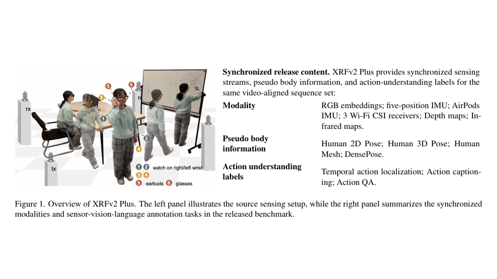
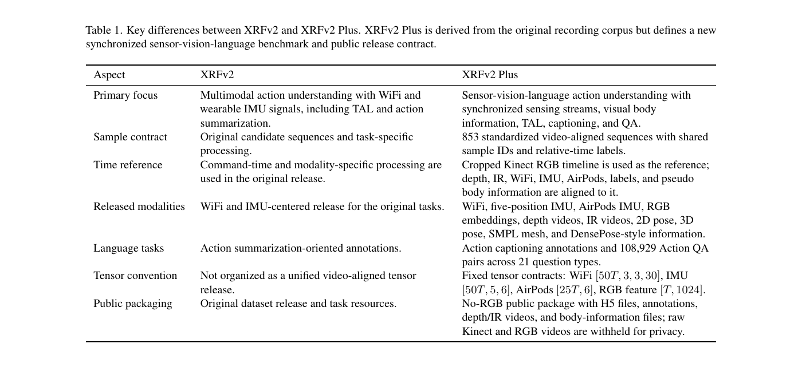
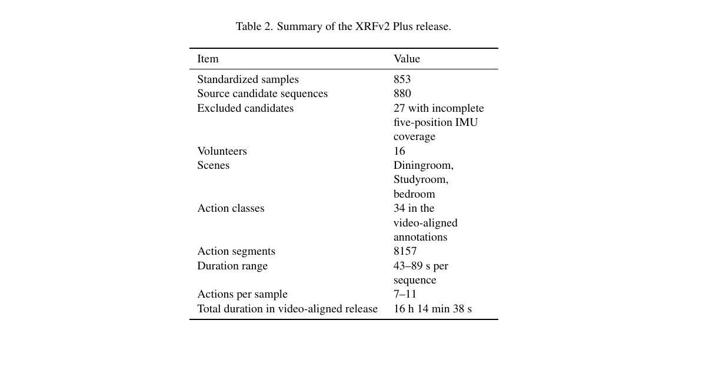
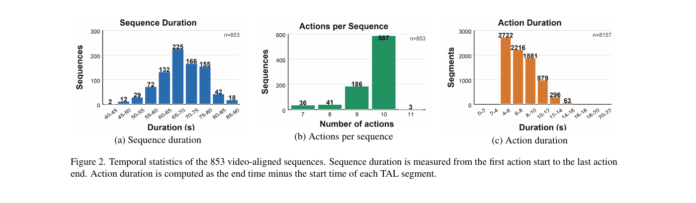
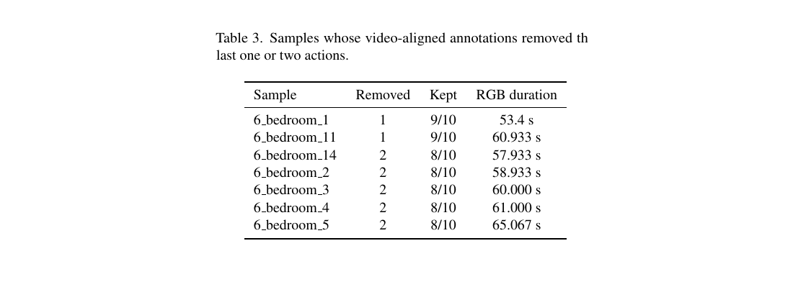
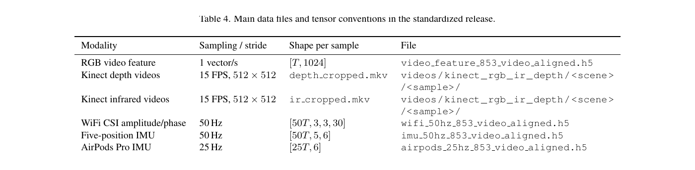
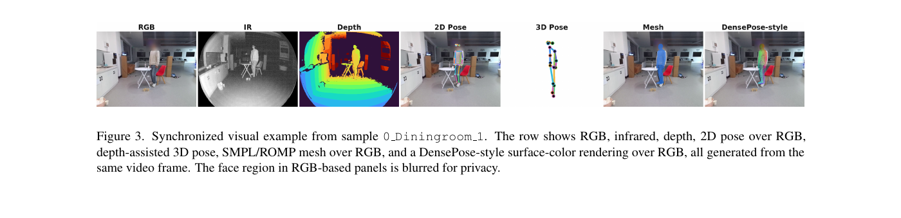
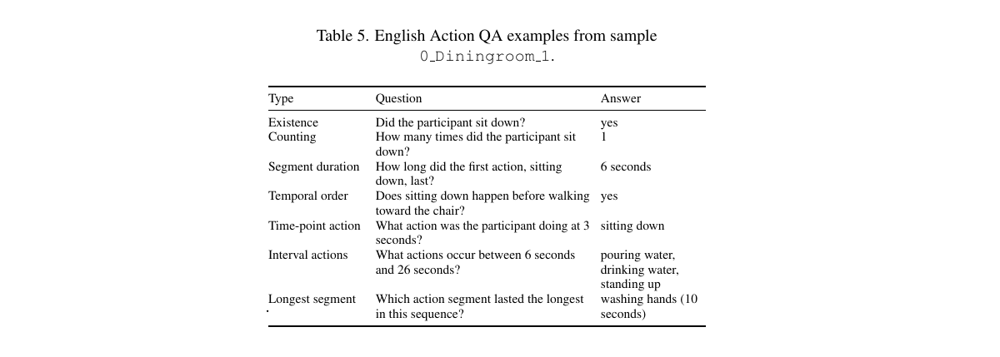
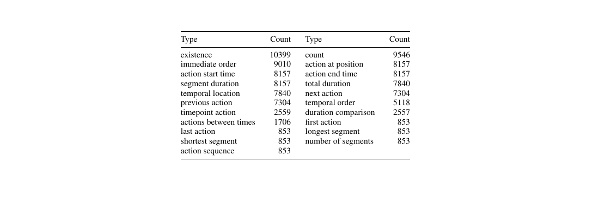

# Overview

XRFv2 Plus is a synchronized multimodal dataset update for sensor-vision-language action understanding. It is built from the original XRF V2 recording corpus, but reorganizes the release around a common cropped-video timeline so that sensing streams, body representations, temporal labels, captions, and action QA share the same sequence IDs and relative-time axis.

The public update was released on June 6, 2026. The README reports that the Kaggle release was verified through version 4 on June 5, 2026, 23:39 CST.

<figure class="markdown-figure">
  
  <figcaption>Overview of the XRFv2 Plus synchronized release content, cropped from the update manuscript.</figcaption>
</figure>

## What Is New

| Category | Release content |
| --- | --- |
| Sensing streams | WiFi CSI, five-position IMU, AirPods IMU, RGB video embeddings, Kinect depth videos, Kinect infrared videos |
| Body information | Human 2D pose, depth-assisted 3D pose, SMPL mesh, DensePose-style surface information |
| Action labels | Temporal action localization, action captioning, action question answering |
| Time convention | All labels and synchronized tensors use relative time within each sequence |

<figure class="markdown-figure">
  
  <figcaption>Key differences between the original XRF V2 release and the XRFv2 Plus synchronized sensor-vision-language benchmark.</figcaption>
</figure>

## Release Summary

| Item | Value |
| --- | --- |
| Standardized samples | 853 |
| Original candidates | 880 |
| Excluded candidates | 27 with incomplete five-position IMU coverage |
| Volunteers | 16 |
| Scenes | Diningroom, Studyroom, bedroom |
| Action classes | 34 |
| Action segments | 8,157 |
| Sequence duration range | 43-89 seconds |
| Actions per sequence | 7-11 |
| Total video-aligned duration | 16 h 14 min 38 s |

<figure class="markdown-figure">
  
  <figcaption>Release summary from the manuscript, including standardized samples, scenes, actions, and total video-aligned duration.</figcaption>
</figure>

<figure class="markdown-figure">
  
  <figcaption>Temporal statistics for the 853 video-aligned sequences and 8,157 TAL segments.</figcaption>
</figure>

<figure class="markdown-figure">
  
  <figcaption>Samples where video-aligned annotations removed the last one or two actions due to shortened RGB video coverage.</figcaption>
</figure>

## Modalities

For a sequence of duration T seconds, the release provides synchronized tensors and files including WiFi CSI amplitude/phase at 50 Hz, five-position IMU at 50 Hz, AirPods Pro IMU at 25 Hz, one 1024-D RGB video feature per second, COCO-17 2D pose, depth-camera 3D pose, compact ROMP/SMPL mesh parameters, DensePose-style IUV information, and cropped Kinect depth/infrared videos at 15 FPS and 512 x 512 resolution.

The five-position IMU order is fixed as left wrist, right wrist, phone case in the left pants pocket, phone case in the right pants pocket, and glasses temple.

<figure class="markdown-figure">
  
  <figcaption>Main data files and tensor conventions for the standardized XRFv2 Plus release.</figcaption>
</figure>

<figure class="markdown-figure">
  
  <figcaption>Synchronized visual example showing RGB, infrared, depth, 2D pose, 3D pose, mesh, and DensePose-style outputs generated from the same frame.</figcaption>
</figure>

## Annotation Tasks

XRFv2 Plus includes ActivityNet-style temporal action localization labels, Chinese-only, English-only, and bilingual caption files, and action QA files. The QA release contains 108,929 QA pairs across 21 question types, including existence, counting, segment duration, temporal order, and time-point action questions.

<figure class="markdown-figure">
  
  <figcaption>English action QA examples from sample 0_Diningroom_1.</figcaption>
</figure>

<figure class="markdown-figure">
  
  <figcaption>Distribution of action QA types across the XRFv2 Plus release.</figcaption>
</figure>

## Release Batches

The README lists four public Kaggle versions: version 1 for the fast no-video release, version 2 for 853 cropped Kinect depth videos, version 3 for 853 cropped Kinect infrared videos, and version 4 for the DensePose H5 file. Raw Kinect recordings and cropped RGB videos are not included in the Kaggle release for privacy reasons.

## Resources

- GitHub: https://github.com/airslab2020/XRFV2
- Kaggle: https://www.kaggle.com/datasets/airslab2020/xrfv2-multimodal-tal-caption-qa-no-rgb
- Zenodo: https://doi.org/10.5281/zenodo.20564312
- Original XRF V2 paper page: ../../papers/xrf-v2-a-dataset-for-action-summarization-with-wi-fi-signals-and-imus-in-phones-watches-earbuds-and-glasses/index.html

## Citation

```bibtex
@misc{wang2026xrfv2plus,
  author    = {Wang, Fei},
  title     = {XRFv2 Plus: A Multimodal Sensor-Vision-Language Dataset for Action Understanding},
  year      = {2026},
  publisher = {Zenodo},
  doi       = {10.5281/zenodo.20564312},
  url       = {https://doi.org/10.5281/zenodo.20564312}
}
```
