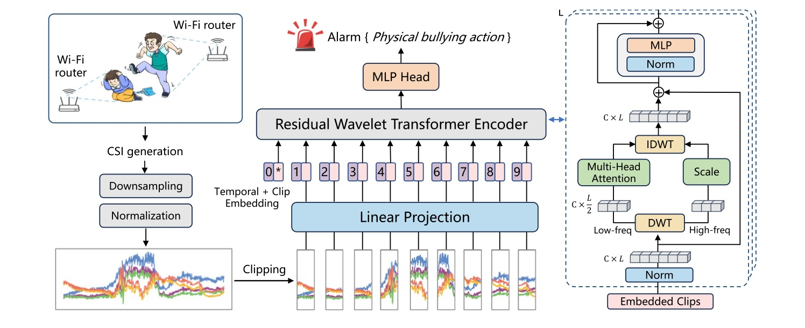
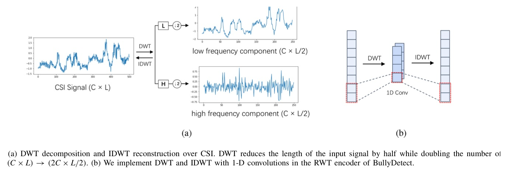
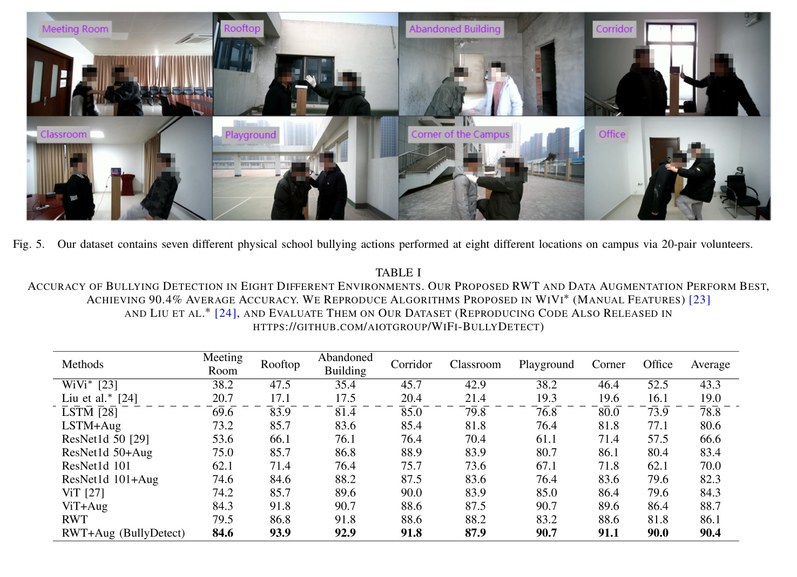
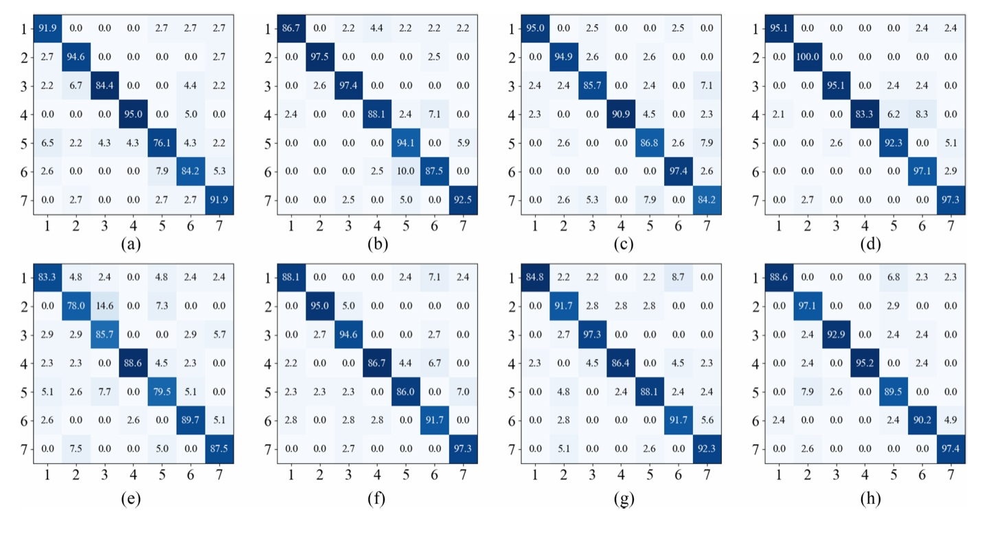
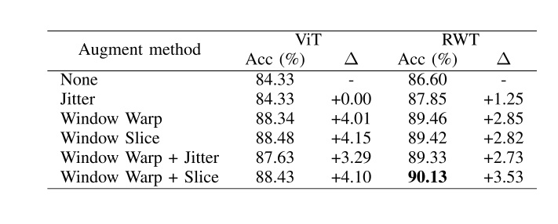

# Overview

BullyDetect addresses a sensitive but practical campus-safety problem: physical bullying often happens in locations where cameras have blind spots, poor illumination, or privacy constraints. The paper proposes using commodity Wi-Fi channel state information (CSI) as a non-visual sensing signal for detecting physical bullying actions.

The system combines signal processing and deep learning in a single model. It reshapes CSI into a temporal representation, divides the signal into clips, and feeds those clips into a Residual Wavelet Transformer (RWT). The RWT inserts discrete wavelet transform (DWT) and inverse DWT into the Transformer encoder so that noise removal and action-feature learning are optimized together rather than handled by a fixed preprocessing pipeline.

<figure class="markdown-figure">
  
  <figcaption>BullyDetect pipeline. CSI clips are encoded by an RWT module that uses wavelet decomposition inside the attention block before issuing a bullying alert.</figcaption>
</figure>

## Why It Matters

Camera-based violence detection can work in visible areas, but school bullying may occur in corridors, rooftops, abandoned buildings, or other low-visibility places. Wearable sensors can be removed, require compliance, and are expensive to deploy at school scale. Wi-Fi offers a different tradeoff: broad coverage, no worn device, no visual identity exposure, and automatic alerting.

The key research challenge is that CSI mixes human-motion cues with environmental noise and multipath effects. Bullying actions also vary in speed, intensity, start time, participants, and location. BullyDetect therefore focuses on both model architecture and augmentation, not only classification.

## Method

The input CSI is collected from commodity Intel 5300 Wi-Fi cards and reshaped into a 2D matrix whose channels combine transmitter, receiver, and subcarrier dimensions, while the temporal axis records the sampled signal. BullyDetect uses the amplitude of CSI for feature learning.

The RWT encoder decomposes embedded CSI clips into low-frequency and high-frequency components with Haar wavelets. Low-frequency components pass through multi-head self-attention, while high-frequency components are retained as residual information and scaled before reconstruction with IDWT. This design makes the wavelet operation differentiable through convolution and transposed convolution, allowing the end-to-end objective to decide what should be preserved for bullying detection.

<figure class="markdown-figure">
  
  <figcaption>Wavelet processing in RWT. DWT separates low- and high-frequency CSI components, and IDWT reconstructs the representation after attention-based learning.</figcaption>
</figure>

## Temporal Augmentation

BullyDetect uses two time-domain augmentation methods to model variation in bullying behavior. Window warp randomly accelerates or decelerates a selected segment, simulating different action speeds. Window slice crops a temporal segment and stretches it back, simulating differences in action start time and movement extent. The paper also combines both augmentations by randomly applying one of them during training.

These augmentations are model-agnostic and are tested as plug-and-play modules for LSTM, ResNet-1D, ViT, and RWT variants.

## Dataset

The dataset was collected with one transmitter and one receiver placed on opposite sides of a 3 m detection area. The transmitter sends packets at 1000 packets per second through one antenna, while the receiver monitors the channel with three antennas across 30 OFDM subcarriers. Each sample lasts 5 seconds, producing CSI with shape 1 x 3 x 30 x 5000.

Five volunteers were arranged into ten pairs and alternated aggressor/victim roles, producing 20 role combinations. The dataset covers eight campus environments and seven physical bullying actions: pushing, kicking, slapping, grabbing, punching, kneeing, and hitting with a stick. In total, the paper collects 11,200 CSI samples, split into 8,960 training samples and 2,240 test samples.

<figure class="markdown-figure">
  
  <figcaption>Dataset environments and main results. The evaluation spans meeting rooms, rooftops, abandoned buildings, corridors, classrooms, playgrounds, campus corners, and offices.</figcaption>
</figure>

## Detection Performance

The best model, RWT with augmentation, reaches 90.4 percent average accuracy across eight environments. It outperforms reproduced manual-feature Wi-Fi violence detectors and common temporal deep models. The gains are especially important in difficult settings because the system needs to detect multiple action classes, not only binary motion.

| Method | Avg. accuracy |
|---|---:|
| WiVi manual features | 43.3% |
| Liu et al. manual features | 19.0% |
| LSTM | 78.8% |
| LSTM + Aug | 80.6% |
| ResNet1d 50 | 66.6% |
| ResNet1d 50 + Aug | 83.4% |
| ViT | 84.3% |
| ViT + Aug | 88.7% |
| RWT | 86.1% |
| RWT + Aug (BullyDetect) | 90.4% |

## Environment And Action Analysis

The confusion matrices show that strong and distinctive movements, such as kicking and hitting with a stick, are easier to identify. The model sometimes confuses grabbing with kneeing because kneeing often contains a grabbing phase before the knee movement. Environment also matters: open or less cluttered areas perform better, while meeting rooms and classrooms are more difficult because tables and chairs create stronger multipath interference.

<figure class="markdown-figure">
  
  <figcaption>Action-level confusion matrices across environments. The analysis exposes both the robustness of the detector and the action pairs that are most easily confused.</figcaption>
</figure>

## Ablations And Deployment Clues

The paper reports several practical findings:

| Study | Key result |
|---|---|
| RWT encoder depth | Replacing more ViT layers with RWT layers improves accuracy: ViT 88.34%, RWT-4 89.59%, RWT-8 90.04%. |
| High-frequency scale | Best accuracy occurs near high-frequency ratio 0.9; too little loses useful detail, too much keeps noise. |
| Model scale | RWT s-32 gives the best accuracy/scale balance and uses fewer GFLOPs/parameters than ViT at the same scale. |
| New environments | One sample for fine-tuning reaches 65.87% in a new environment; two samples reach 75.54%. |
| Less training data | RWT still outperforms reproduced WiVi when only 10%, 25%, 50%, or 75% of training data is used. |

The augmentation table reinforces the same theme: temporal variation is central to this task. Window warp and window slice both improve ViT and RWT, and their combination gives the best RWT result.

<figure class="markdown-figure">
  
  <figcaption>Data augmentation ablation. Window warp and window slice are more effective than simple jitter, and the combined augmentation gives the best RWT accuracy.</figcaption>
</figure>

## Takeaways

BullyDetect is a strong example of privacy-aware wireless sensing for safety monitoring. Its technical value comes from aligning denoising and recognition in one differentiable architecture, while its deployment value comes from using existing Wi-Fi infrastructure in places where cameras and wearables are limited.

The system is not a complete campus safety solution by itself. Real deployment would need careful alert thresholds, false-positive handling, privacy governance, and human review. The paper suggests a sliding-window deployment mode, where detections over multiple 5-second windows can trigger an alert only when there is enough evidence of sustained bullying behavior.

## Resources

- [Official paper / publisher page](https://doi.org/10.1109/JIOT.2024.3486071)
- [Code and dataset repository](https://github.com/AIOTGROUP/WiFi-BullyDetect)
- [Cover image](./assets/paper-method.jpg)

## Citation

```bibtex
@article{lan2025bullydetect,
  title = {BullyDetect: Detecting School Physical Bullying With Wi-Fi and Deep Wavelet Transformer},
  author = {Lan, Bo and Wang, Fei and Xia, Lekun and Nai, Fan and Nie, Shiqiang and Ding, Han and Han, Jinsong},
  journal = {IEEE Internet of Things Journal},
  volume = {12},
  number = {5},
  pages = {5160--5169},
  year = {2025},
  doi = {10.1109/JIOT.2024.3486071}
}
```
