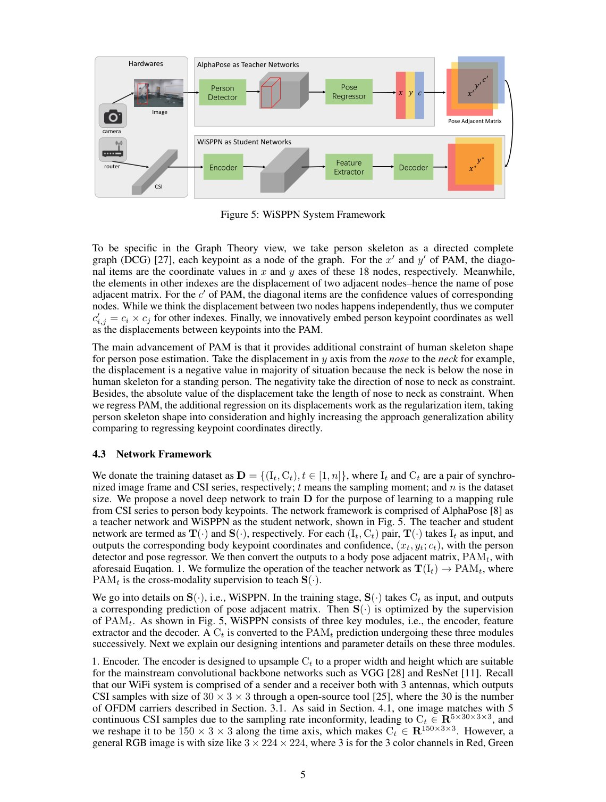
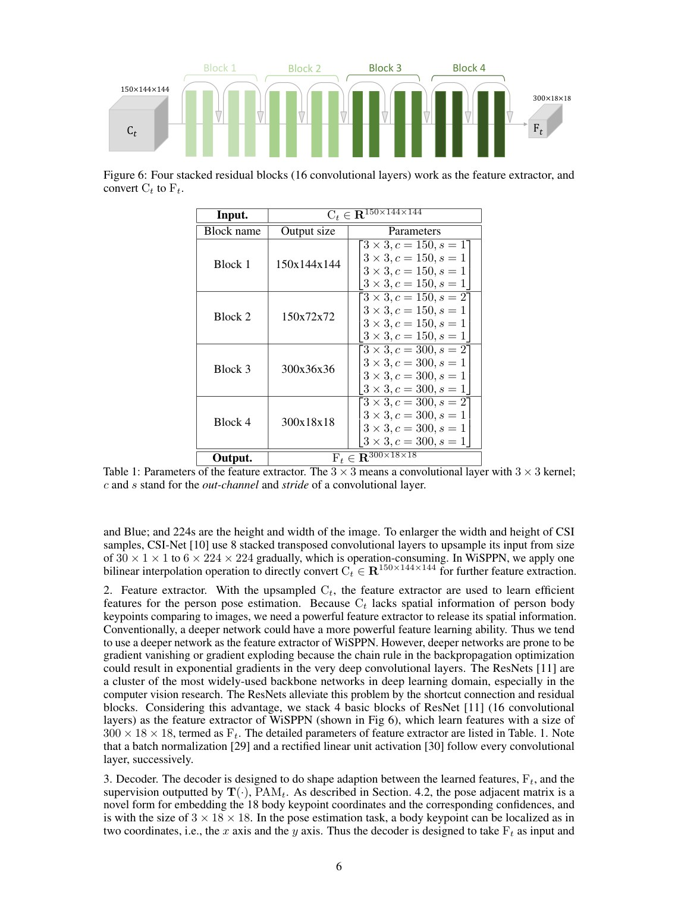
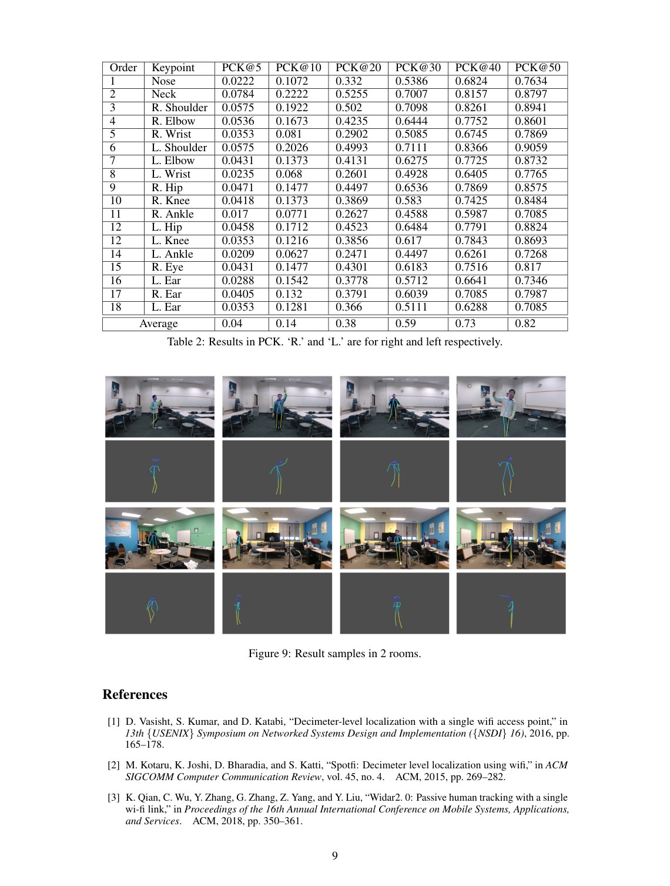

# Overview

This paper asks a direct question: can Wi-Fi devices work like cameras for fine-grained human pose estimation? Wi-Fi has advantages in privacy, cost, darkness, and occlusion, but it does not directly contain pixel-level body keypoints. Mapping CSI signals to pose therefore requires carefully synchronized supervision.

The work builds a Wi-Fi and camera data collection system and proposes WiSPPN, a fully convolutional network for estimating single-person pose from Wi-Fi signals.

## Main Contributions

- Frames single-person pose estimation as a Wi-Fi sensing task.
- Collects synchronized Wi-Fi CSI and video data to obtain paired signal and keypoint supervision.
- Uses AlphaPose to extract camera-based pose annotations for training.
- Proposes WiSPPN to map Wi-Fi signals to pose heatmaps or keypoint representations.
- Evaluates on more than 80,000 images across 16 sites and 8 people.

## System Design

The setup uses a 3-antenna Wi-Fi sender and a 3-antenna receiver. A synchronized camera records person videos, and the timestamps align Wi-Fi measurements with pose labels. This pairing is crucial because Wi-Fi does not provide direct coordinate supervision by itself.

WiSPPN learns the mapping from CSI-derived features to pose representation. The model is inspired by dense prediction in computer vision but adapted to the wireless signal domain.

## Evaluation Highlights

The evaluation covers multiple sites and participants, providing evidence that Wi-Fi can support fine-grained pose estimation rather than only coarse activity recognition. The paper concludes that Wi-Fi sensors can achieve comparable fine-grained sensing behavior to cameras in this single-person setting, while offering different deployment advantages.

## Takeaways

This work is an early step toward the Person-in-WiFi research line. It establishes the feasibility of Wi-Fi pose estimation and creates a bridge between visual pose supervision and RF sensing models.

## Paper Screenshots: Method, Principle, And Results

The screenshots below are cropped from the paper PDF and are placed next to the reading notes so the page shows the actual method diagrams, principle illustrations, and result evidence rather than only prose.

<figure class="markdown-figure">
  
  <figcaption>WiSPPN teacher-student framework using camera supervision and CSI. The figure explains how AlphaPose labels are transferred to Wi-Fi pose learning.</figcaption>
</figure>

<figure class="markdown-figure">
  
  <figcaption>Residual feature extractor for Wi-Fi pose estimation. This screenshot shows the network block that maps CSI tensors to pose features.</figcaption>
</figure>

<figure class="markdown-figure">
  
  <figcaption>Per-keypoint PCK results. The table shows which body joints are easier or harder to estimate from Wi-Fi.</figcaption>
</figure>

## Resources

- [Official paper / publisher page](https://arxiv.org/pdf/1904.00277)
- [Cover image](./assets/cover.svg)

## Citation

```bibtex
@inproceedings{can-wifi-estimate-person-pose,
  title = {Can WiFi estimate person pose?},
  author = {F Wang and S Panev and Z Dai and J Han and D Huang},
  booktitle = {arXiv preprint arXiv:1904.00277, 2019},
  year = {2019}
}
```
