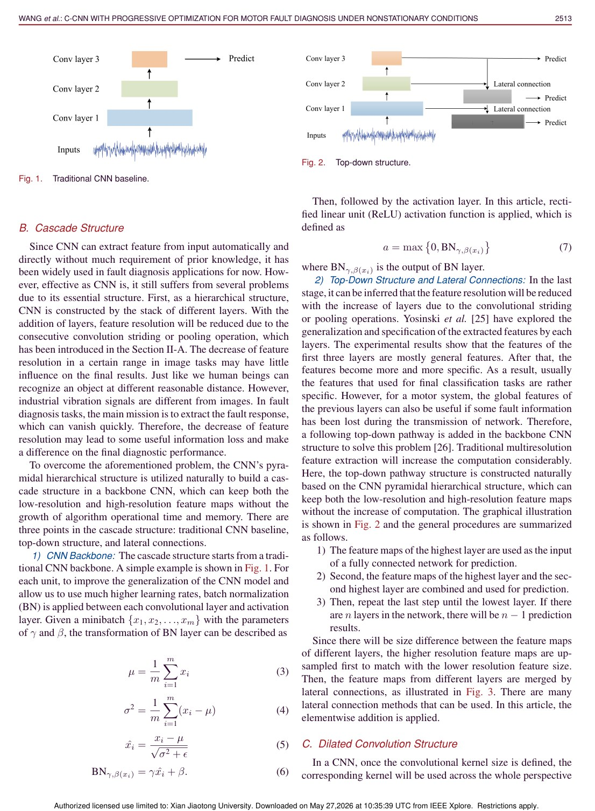
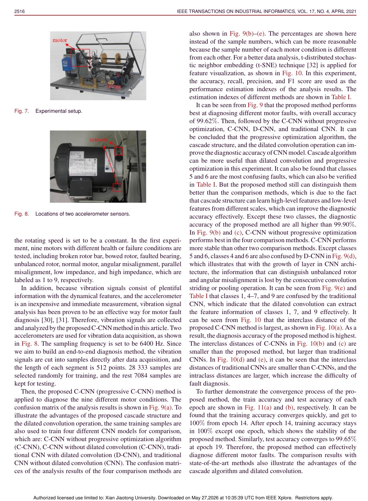
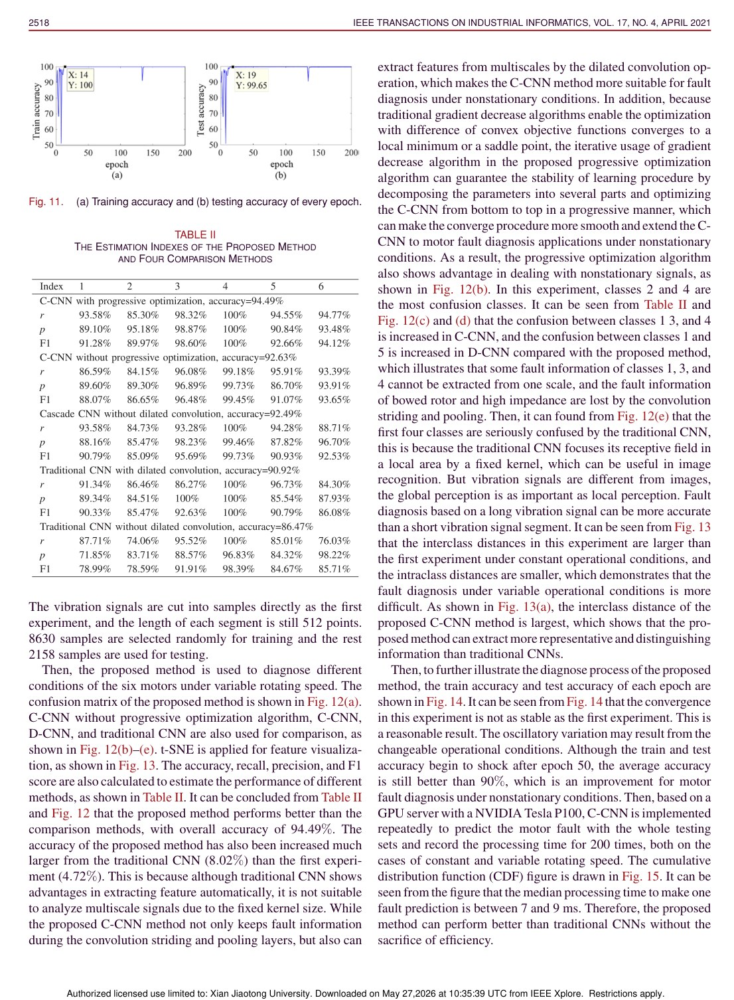

# Overview

Motor fault diagnosis under nonstationary conditions is challenging because vibration signals change with operating speed and load. Traditional CNNs can extract features automatically, but repeated pooling or striding reduces feature resolution, and fixed kernel sizes may fail to capture the diverse temporal patterns of nonstationary faults.

This paper proposes a cascade convolutional neural network with progressive optimization. The design starts from the physical characteristics of nonstationary vibration signals and adapts the CNN architecture accordingly.

## Main Contributions

- Builds a cascade CNN structure to reduce information loss from hierarchical downsampling.
- Uses dilated convolutions to capture multi-scale fault features under nonstationary conditions.
- Proposes progressive optimization to divide the network parameter search into more manageable stages.
- Evaluates the method on motor fault diagnosis under constant-speed and variable-speed settings.
- Shows improved diagnosis performance over conventional CNN and comparison methods.

## Method Design

The cascade structure preserves information from earlier feature maps instead of letting resolution collapse too quickly. Dilated convolutions enlarge the receptive field without the same loss of temporal detail, allowing the model to observe fault patterns at different scales. Progressive optimization then trains the model in stages, helping the cascade architecture converge to a stronger solution.

## Evaluation Highlights

The paper conducts two motor fault diagnosis experiments: one under constant speed and another under variable speed. This matters because a method that works only under stable operating conditions may not transfer to real industrial motors. The reported results show that C-CNN maintains strong performance across both settings, supporting the claim that cascade structure and multi-scale extraction are useful for nonstationary signals.

## Takeaways

C-CNN is a signal-aware architecture. It does not simply apply a standard CNN to vibration data; it modifies the network to better preserve temporal information and capture scale variation in motor fault signatures.

## Paper Screenshots: Method, Principle, And Results

The screenshots below are cropped from the paper PDF and are placed next to the reading notes so the page shows the actual method diagrams, principle illustrations, and result evidence rather than only prose.

<figure class="markdown-figure">
  
  <figcaption>Cascade CNN, cascade structure, and dilated convolution design. These diagrams show how information loss is reduced and multi-scale features are extracted.</figcaption>
</figure>

<figure class="markdown-figure">
  
  <figcaption>Motor fault diagnosis experimental setup and accelerometer placement. This grounds the method in the physical acquisition scenario.</figcaption>
</figure>

<figure class="markdown-figure">
  
  <figcaption>Training/testing accuracy and comparison metrics. The screenshot summarizes the convergence and performance evidence for progressive optimization.</figcaption>
</figure>

## Resources

- [Official paper / publisher page](https://doi.org/10.1109/tii.2020.3003353)
- [Cover image](./assets/cover.svg)

## Citation

```bibtex
@inproceedings{cascade-convolutional-neural-network-with-progressive-optimization-for-motor-fault-diagnosis-under-nonstationary-conditions,
  title = {Cascade Convolutional Neural Network With Progressive Optimization for Motor Fault Diagnosis Under Nonstationary Conditions},
  author = {Fei Wang and Ruonan Liu# and Qinghua Hu and Xuefeng Chen},
  booktitle = {IEEE Transactions on Industrial Informatics, 2021},
  year = {2021}
}
```
