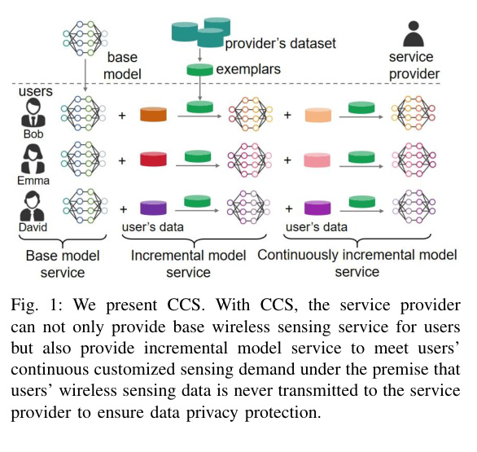
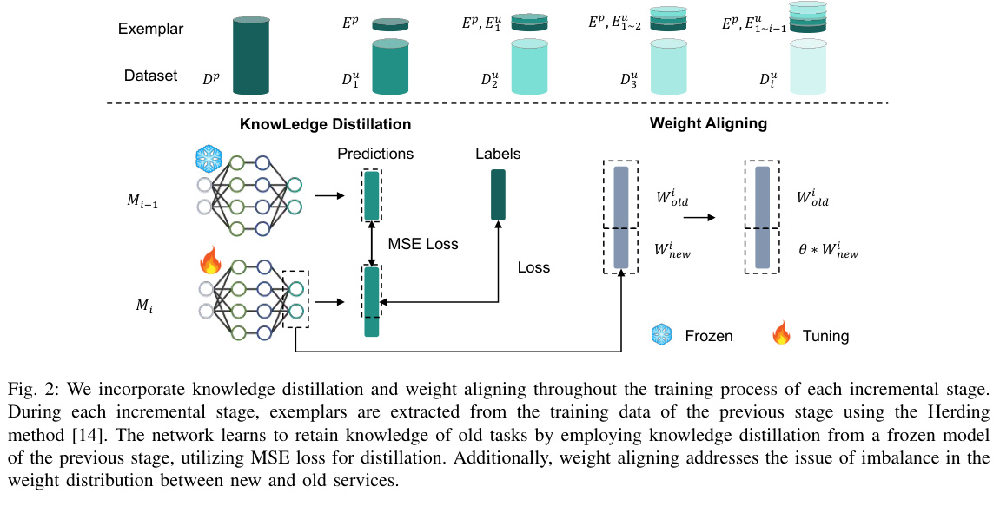
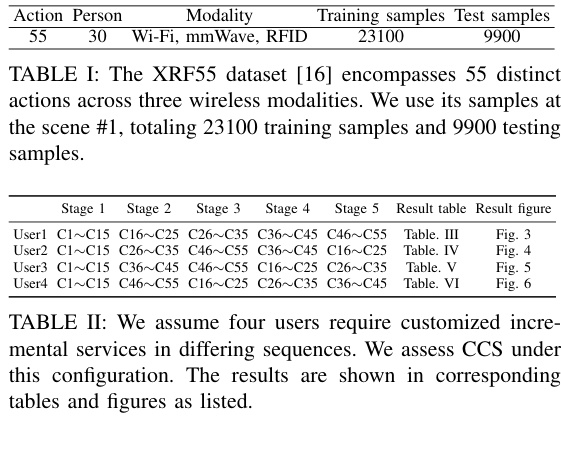
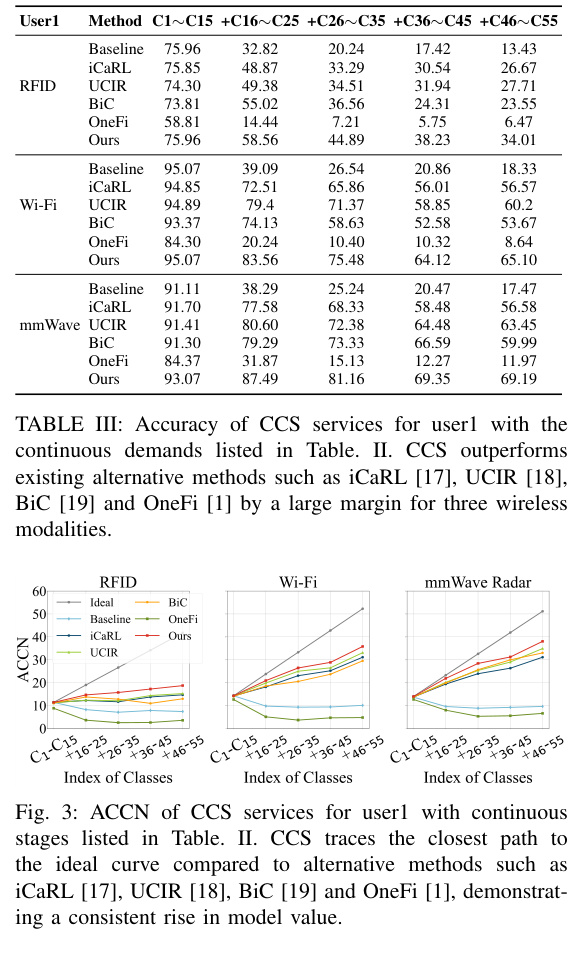
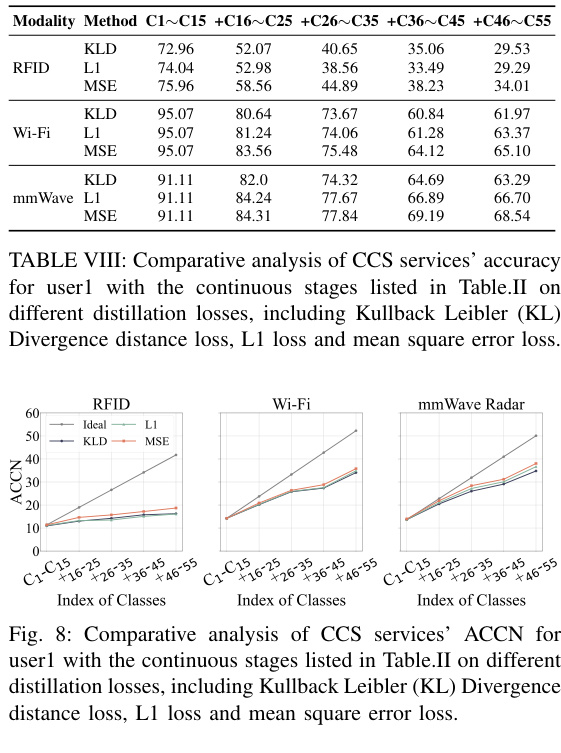
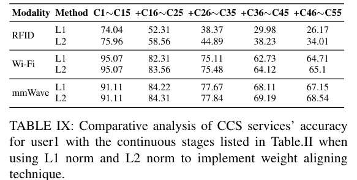

# Overview

Wireless sensing is moving from proof-of-concept demos toward service deployment. In that setting, a provider may distribute a base sensing model to many users, and each user may later request new capabilities such as fall detection, additional activity classes, or other customized services. Sending raw local wireless data back to the provider would raise privacy and bandwidth concerns.

CCS, short for continuous customized service, treats wireless sensing as a local model-update service. The user keeps wireless data on the local device, while the provider supplies compact exemplars and update logic so the model can learn new classes without forgetting old services.

<figure class="markdown-figure">
  
  <figcaption>CCS service scenario. The provider offers a base model, then supports incremental and continuously incremental model services while user data stays local.</figcaption>
</figure>

## Main Contributions

- Frames wireless sensing deployment as a continuous service problem rather than a one-time model release.
- Enables local model updates without transmitting users' raw wireless sensing data to the service provider.
- Uses compact exemplars from the provider side to help preserve previous service capabilities.
- Combines knowledge distillation and weight alignment to reduce catastrophic forgetting during incremental updates.
- Evaluates the idea on XRF55 across Wi-Fi, millimeter-wave radar, and RFID modalities.

## Method

The core difficulty is catastrophic forgetting. When a model is updated with a user's new data, it can lose the capabilities it had before. CCS initializes each new-stage model from the previous-stage model, freezes the previous model as a teacher, and distills its predictions into the updated model.

The method also uses Herding to select compact exemplars from the provider's previous-stage data. These exemplars are sent to the local update process as a small memory of old services. Finally, CCS applies weight alignment to rebalance the classifier head, because newly added classes can otherwise dominate the weight distribution.

<figure class="markdown-figure">
  
  <figcaption>Knowledge distillation preserves old-service behavior, while weight alignment balances prediction weights for old and new services.</figcaption>
</figure>

## Dataset And Protocol

The experiments use scene 1 of XRF55, covering 55 action classes and 30 people across Wi-Fi, mmWave radar, and RFID. The split contains 23,100 training samples and 9,900 testing samples.

CCS simulates four users with different service-request sequences. Each run starts with classes C1-C15 as the base service, then adds four groups of 10 classes in different orders. During stages 2-5, exemplars are selected from the previous stage at one sample per person per action. For example, stage 2 uses 1 x 30 x 15 = 450 exemplars, about 7 percent of the first-stage training data.

<figure class="markdown-figure">
  
  <figcaption>XRF55 protocol. CCS evaluates different customized demand sequences over 55 actions and three wireless modalities.</figcaption>
</figure>

## Evaluation Highlights

The paper reports both classification accuracy and ACCN, where ACCN multiplies the number of recognizable action categories by accuracy. This metric captures a useful service tradeoff: average accuracy may drop as more classes are added, but the service value can still increase because the model recognizes more actions.

For user 1, CCS reaches the following final-stage accuracies after learning all 55 classes:

| Modality | Final-stage accuracy |
| --- | ---: |
| RFID | 34.01 |
| Wi-Fi | 65.10 |
| mmWave radar | 69.19 |

Across these modalities, CCS remains higher than iCaRL, UCIR, BiC, and OneFi at the final stage. The ACCN curves also stay closer to the ideal increasing curve, meaning the model gains service coverage without collapsing old capabilities.

<figure class="markdown-figure">
  
  <figcaption>User 1 results. CCS keeps stronger accuracy and ACCN as new service classes are added across all three wireless modalities.</figcaption>
</figure>

## Ablation Findings

The ablations show that each piece matters. Removing the exemplar memory, knowledge distillation, or weight alignment reduces final-stage performance. The paper reports that the no-exemplar setting is especially damaging, and that removing knowledge distillation or weight alignment also lowers ACCN.

For the distillation loss, MSE gives the best or most stable choice among KL divergence, L1, and MSE, especially in Wi-Fi and mmWave settings. For weight alignment, L2 normalization outperforms L1 normalization at all tested stages, improving final-stage accuracy by 7.84 percent, 0.39 percent, and 1.39 percent for RFID, Wi-Fi, and mmWave respectively.

<figure class="markdown-figure">
  
  <figcaption>Distillation-loss ablation. MSE is selected because it produces the strongest overall behavior across modalities.</figcaption>
</figure>

<figure class="markdown-figure">
  
  <figcaption>Weight-alignment ablation. L2 normalization gives better final-stage accuracy than L1 normalization.</figcaption>
</figure>

## Takeaways

CCS is valuable because it shifts the wireless sensing discussion from "can a model recognize this action" to "how does a deployed sensing service keep improving for different users." Its design is deliberately service-oriented: local updates protect user data, exemplars preserve old capabilities, distillation controls forgetting, and weight alignment keeps new services from overwhelming old ones.

## Resources

- [arXiv paper](https://arxiv.org/abs/2412.04821)
- [Service scenario crop](./assets/paper-service.jpg)
- [Method crop](./assets/paper-method.jpg)
- [Results crop](./assets/paper-results.jpg)

## Citation

```bibtex
@article{fu2024ccs,
  title = {CCS: Continuous Learning for Customized Incremental Wireless Sensing Services},
  author = {Fu, Qunhang and Wang, Fei and Zhu, Mengdie and Ding, Han and Han, Jinsong and Han, Tony Xiao},
  journal = {arXiv preprint arXiv:2412.04821},
  year = {2024}
}
```
