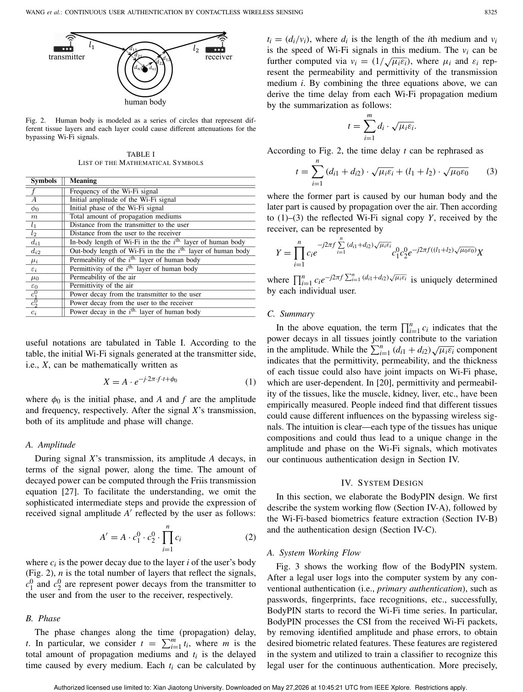
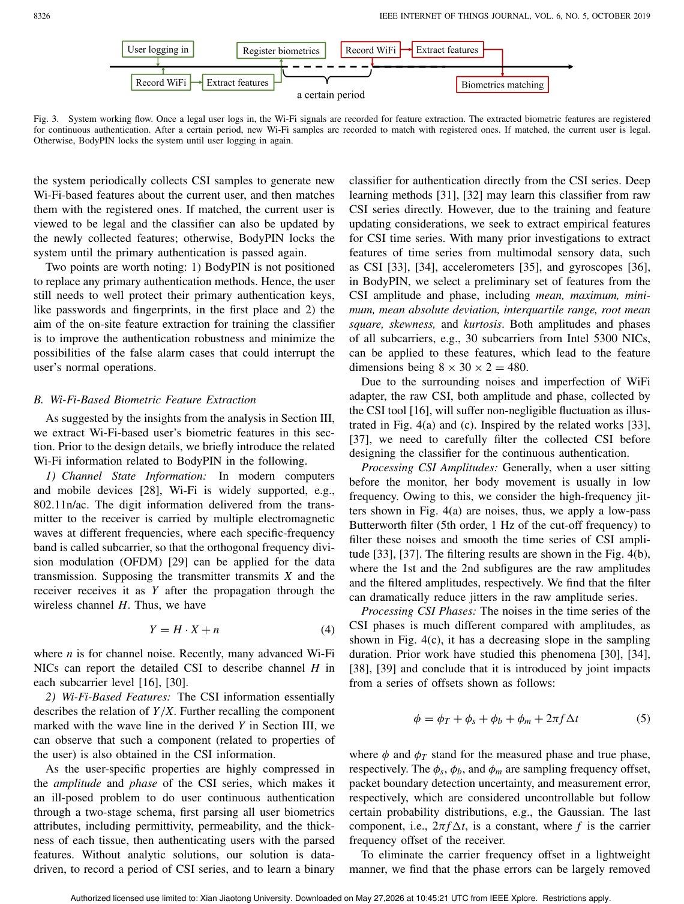
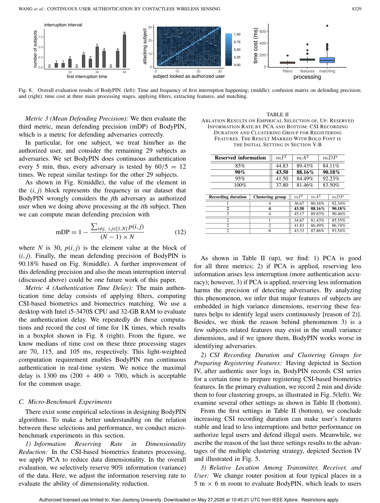

# Overview

Continuous authentication asks whether the current user is still the legitimate user after login. Camera, fingerprint, or behavior-based approaches can be intrusive or unreliable. BodyPIN explores a contactless wireless alternative using commodity Wi-Fi: the human body affects bypassing Wi-Fi signals, and those effects can contain identity-related information.

The key design goal is convenience. Unlike activity-based wireless identification, BodyPIN does not ask the user to walk, gesture, or perform a special action. It monitors the user's identity passively while the computer system is in use.

## Main Contributions

- Proposes BodyPIN, a continuous authentication system using contactless Wi-Fi sensing.
- Uses a bio-electromagnetics human model to reason about body effects on Wi-Fi signals.
- Extracts Wi-Fi features that represent identity-related signal components.
- Implements the system with commodity Wi-Fi NICs and no dedicated wireless hardware.
- Evaluates authentication performance and robustness across practical settings.

## Method Design

BodyPIN analyzes amplitude and phase information from Wi-Fi CSI. The system extracts biometric features linked to how a user's body affects signal propagation, then performs continuous matching against the legal user's profile. If authentication fails because the user leaves or an adversary appears, the system can lock access.

The method is different from gait-based identification: it targets the body-induced signal component rather than activity patterns.

## Evaluation Highlights

The paper reports promising authentication performance with a lightweight commodity-hardware prototype. It also studies practical factors such as environmental variation and system overhead, positioning BodyPIN as a continuous security layer rather than a one-time login method.

## Takeaways

BodyPIN is important because it shifts Wi-Fi user authentication from action recognition to passive biometric sensing. That makes the interaction burden lower and the security model better aligned with continuous computer use.

## Paper Screenshots: Method, Principle, And Results

The screenshots below are cropped from the paper PDF and are placed next to the reading notes so the page shows the actual method diagrams, principle illustrations, and result evidence rather than only prose.

<figure class="markdown-figure">
  
  <figcaption>Bio-electromagnetic body model. The figure explains how different body tissues influence bypassing Wi-Fi signals.</figcaption>
</figure>

<figure class="markdown-figure">
  
  <figcaption>BodyPIN continuous-authentication workflow. The screenshot shows registration, feature extraction, and matching after login.</figcaption>
</figure>

<figure class="markdown-figure">
  
  <figcaption>Overall authentication results and confusion matrix. This page summarizes the evidence for continuous identity verification.</figcaption>
</figure>

## Resources

- [Official paper / publisher page](https://ieeexplore.ieee.org/stamp/stamp.jsp?arnumber=8715810)
- [Cover image](./assets/cover.svg)

## Citation

```bibtex
@inproceedings{continuous-user-authentication-by-contactless-wireless-sensing,
  title = {Continuous User Authentication by Contactless Wireless Sensing},
  author = {Fei Wang and Zhejiang Li# and Jinsong Han#},
  booktitle = {IEEE Internet of Things Journal, 2019},
  year = {2019}
}
```
