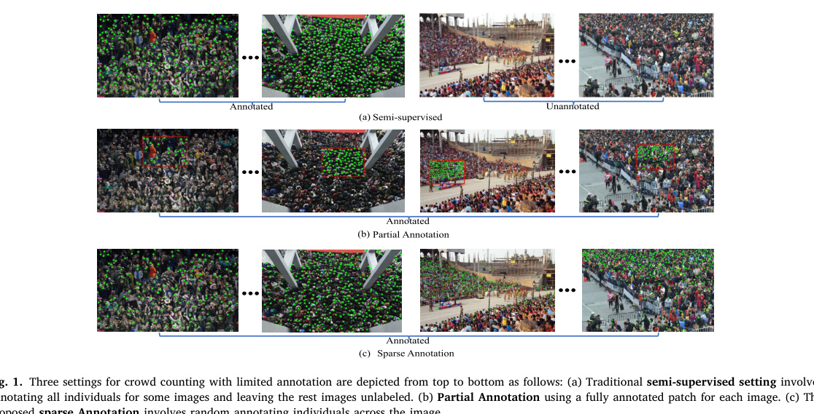
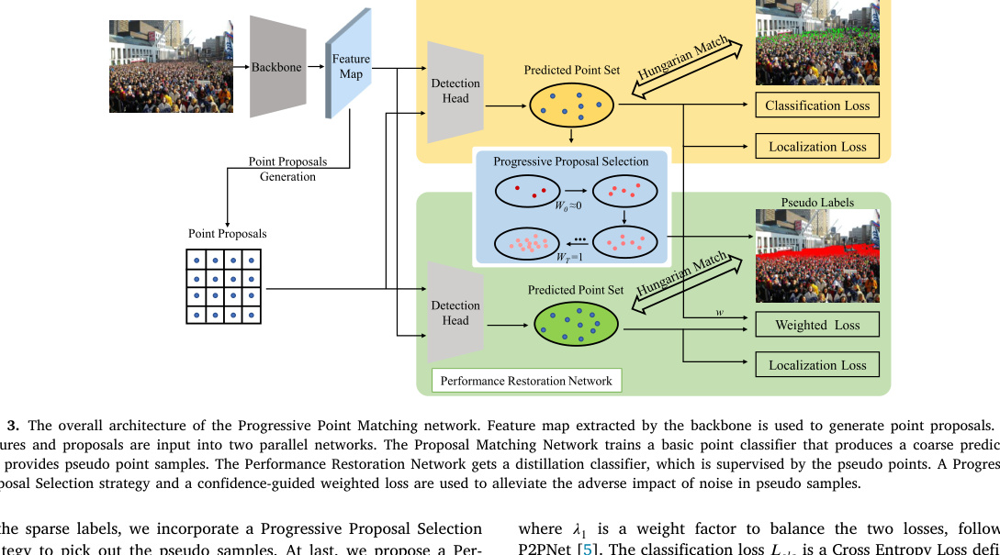
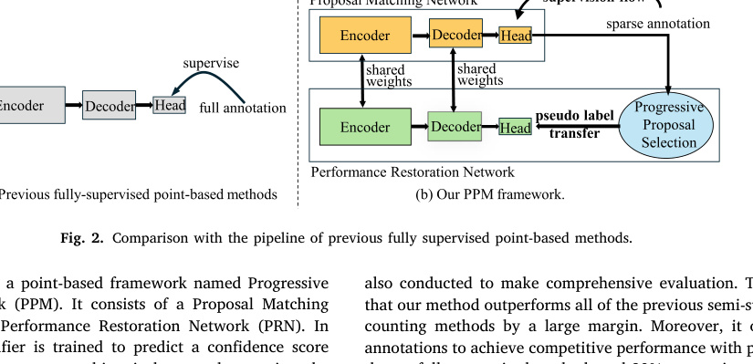
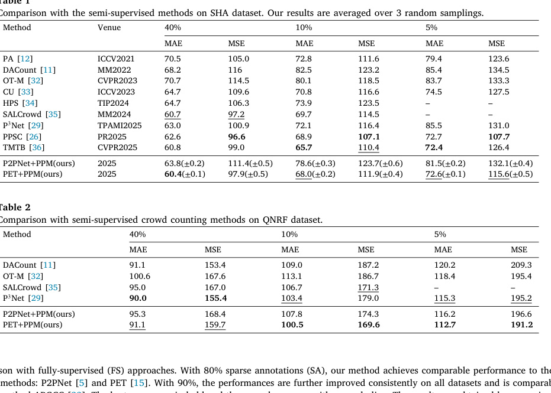
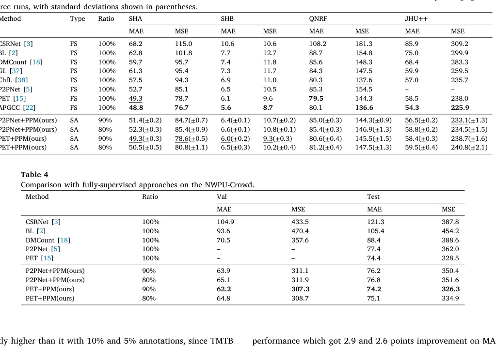
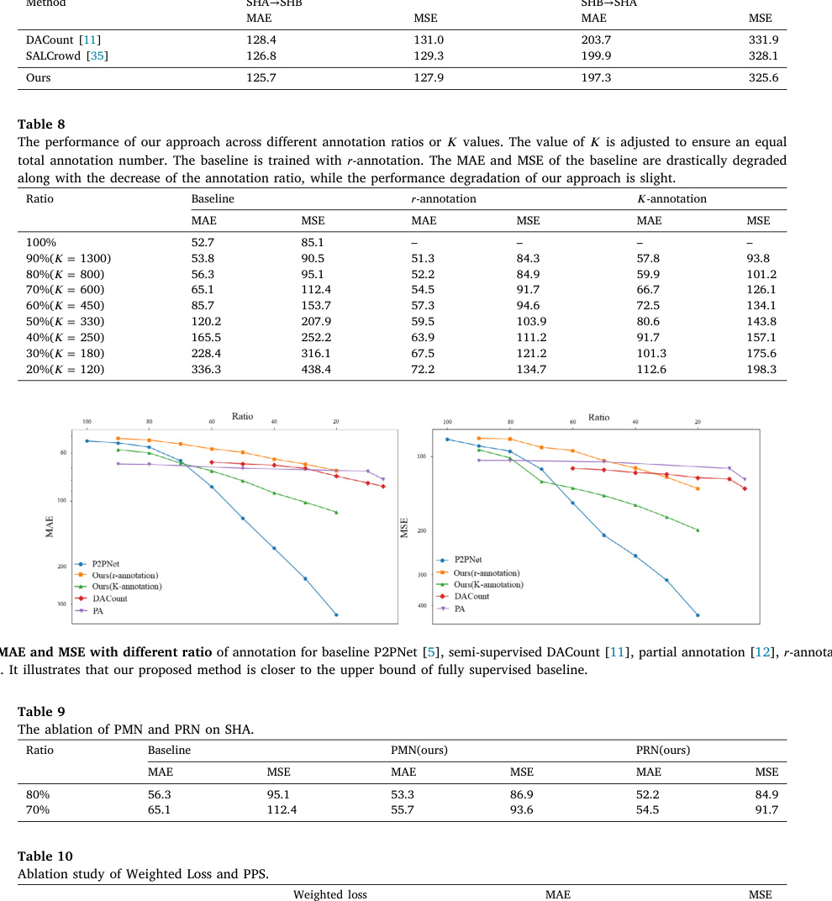
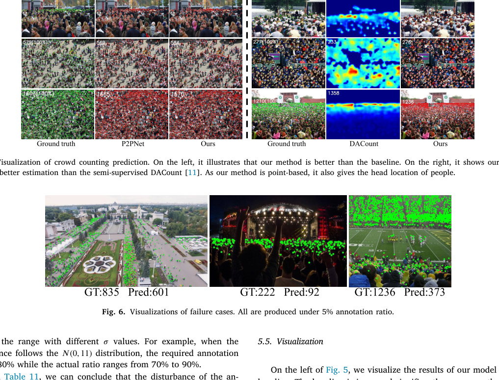

# Overview

Crowd counting usually requires point labels for every visible head in an image. That can be painfully expensive in dense scenes: the paper notes that UCF-QNRF contains 1,535 images with an average of 815 heads per image, requiring more than 2,000 human hours for full annotation.

This work proposes **Sparse Annotation (SA)** for crowd counting. Instead of fully labeling a subset of images or a contiguous patch in every image, sparse annotation randomly labels individuals across each image. This preserves image-level diversity and also samples distant regions, scale changes, and perspective variation more evenly than patch-based partial annotation.

<figure class="markdown-figure">
  
  <figcaption>Annotation settings. Sparse annotation labels people across each image, aiming to reduce redundancy while keeping diverse scale and region information.</figcaption>
</figure>

## Main Contributions

- Introduces sparsely annotated crowd counting as a supervision setting between partial annotation and full point annotation.
- Defines two sparse-annotation variants: ratio-based annotation and K-annotation.
- Proposes Progressive Point Matching (PPM), a point-based framework designed for sparse labels.
- Uses a Proposal Matching Network to obtain coarse point predictions and pseudo samples.
- Uses a Performance Restoration Network with progressive proposal selection and confidence-guided weighted loss to refine the point classifier.
- Evaluates on ShanghaiTech_A, ShanghaiTech_B, UCF_QNRF, JHU-Crowd++, and NWPU-Crowd.

## Method

The method avoids density-map supervision because sparse labels cannot reliably reconstruct full crowd-density maps. Instead, it uses a point-based pipeline. A VGG-16 backbone extracts feature maps, point proposals are generated over the feature map, and Hungarian matching assigns proposals to the sparse ground-truth points.

PPM has two branches. The **Proposal Matching Network (PMN)** trains a basic point classifier from sparse annotation and produces pseudo point samples. The **Performance Restoration Network (PRN)** learns from confident pseudo points and refines the classifier. A progressive proposal selection strategy gradually relaxes the pseudo-label threshold as training improves, while confidence-guided weighting reduces the harm from noisy pseudo labels.

<figure class="markdown-figure">
  
  <figcaption>Progressive Point Matching. PMN learns coarse proposals from sparse labels, while PRN refines prediction using pseudo points, progressive selection, and weighted loss.</figcaption>
</figure>

## Why Sparse Annotation Helps

Traditional semi-supervised crowd counting fully annotates only some images, leaving many images unused at the label level. Partial annotation labels one complete patch per image, but that patch may contain people with similar scale and perspective. Sparse annotation spreads labels across the image, so a fixed annotation budget can cover more spatial diversity.

<figure class="markdown-figure">
  
  <figcaption>Pipeline comparison. PPM adds a second restoration branch and pseudo-label transfer path tailored to sparse annotation.</figcaption>
</figure>

## Evaluation Highlights

Against semi-supervised methods on ShanghaiTech_A, PET+PPM reaches **60.4 MAE** with 40 percent annotation and remains competitive at 10 percent and 5 percent annotation. On UCF_QNRF, PET+PPM reaches **100.5 MAE** with 10 percent annotation and **112.7 MAE** with 5 percent annotation, improving over recent semi-supervised baselines in low-label settings.

<figure class="markdown-figure">
  
  <figcaption>Semi-supervised comparison. PPM improves point-based baselines under sparse supervision and is strongest in low-label regimes on QNRF.</figcaption>
</figure>

With higher sparse-annotation ratios, the method approaches fully supervised systems. Using 80 percent sparse annotations, PET+PPM reports **50.5 MAE** on ShanghaiTech_A and **81.2 MAE** on QNRF. With 90 percent sparse annotations, PET+PPM reaches **49.3 MAE** on ShanghaiTech_A and **80.6 MAE** on QNRF, which is close to strong fully supervised point-based methods.

<figure class="markdown-figure">
  
  <figcaption>High-ratio sparse annotation results. At 80-90 percent annotation, sparse annotation recovers much of the fully supervised performance while saving labels.</figcaption>
</figure>

## Annotation-Performance Tradeoff

The paper studies performance across annotation ratios. The baseline degrades sharply when the annotation ratio falls, while PPM with ratio-based sparse annotation degrades more smoothly. At 80 percent annotation, the method can outperform the fully supervised P2PNet baseline on ShanghaiTech_A, saving about 20 percent labeling effort in that setting.

<figure class="markdown-figure">
  
  <figcaption>Annotation-ratio and ablation evidence. Sparse annotation plus PPM provides a controllable tradeoff between annotation labor and crowd-counting accuracy.</figcaption>
</figure>

## Qualitative Results

Because PPM is point-based, it produces both count estimates and head locations. The visual comparisons show that PRN improves over the baseline and that PPM can localize people where density-map semi-supervised methods only estimate counts.

<figure class="markdown-figure">
  
  <figcaption>Qualitative results and failure cases. The model improves counting and localization, but very low annotation ratios can still miss many detections.</figcaption>
</figure>

## Takeaways

The central contribution is the annotation setting as much as the model. Sparse annotation gives practitioners a clean knob for balancing cost and performance, and PPM shows how a point-based architecture can exploit those incomplete labels without fabricating dense supervision. The paper also notes that the idea may extend to other point-supervision tasks such as cell counting or object counting, with task-specific redesign.

## Resources

- [Official paper](https://www.sciencedirect.com/science/article/pii/S0031320326009659)
- [Annotation setting crop](./assets/paper-annotation-settings.jpg)
- [Method crop](./assets/paper-method.jpg)
- [Results crop](./assets/paper-full-supervised-results.jpg)

## Citation

```bibtex
@article{zhang2026crowd,
  title = {Crowd Counting with Sparse Annotation},
  author = {Zhang, Shiwei and Wang, Zhengzheng and Liu, Qing and Wang, Fei and Ke, Wei and Zhang, Tong},
  journal = {Pattern Recognition},
  volume = {180},
  pages = {114000},
  year = {2026},
  doi = {10.1016/j.patcog.2026.114000}
}
```
