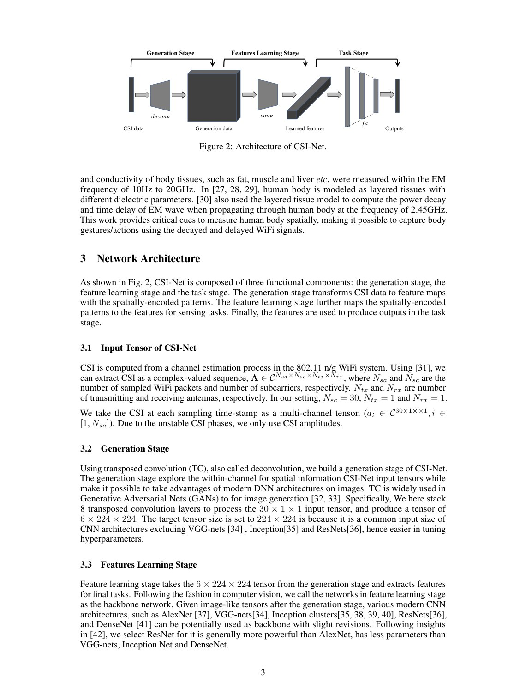
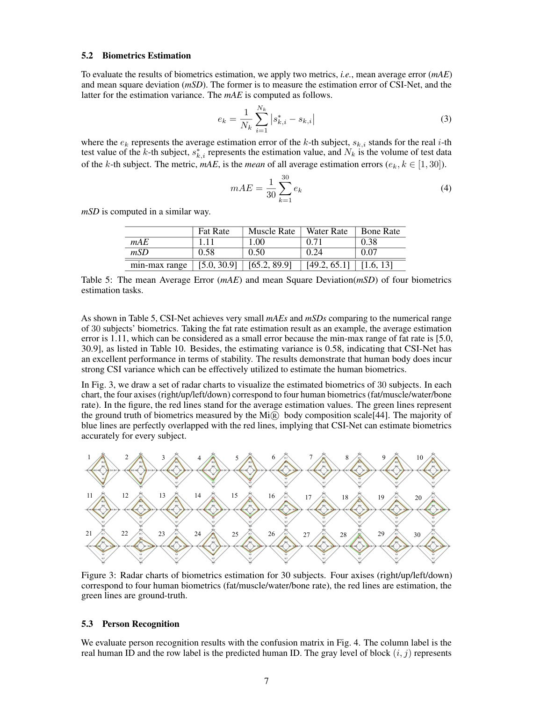
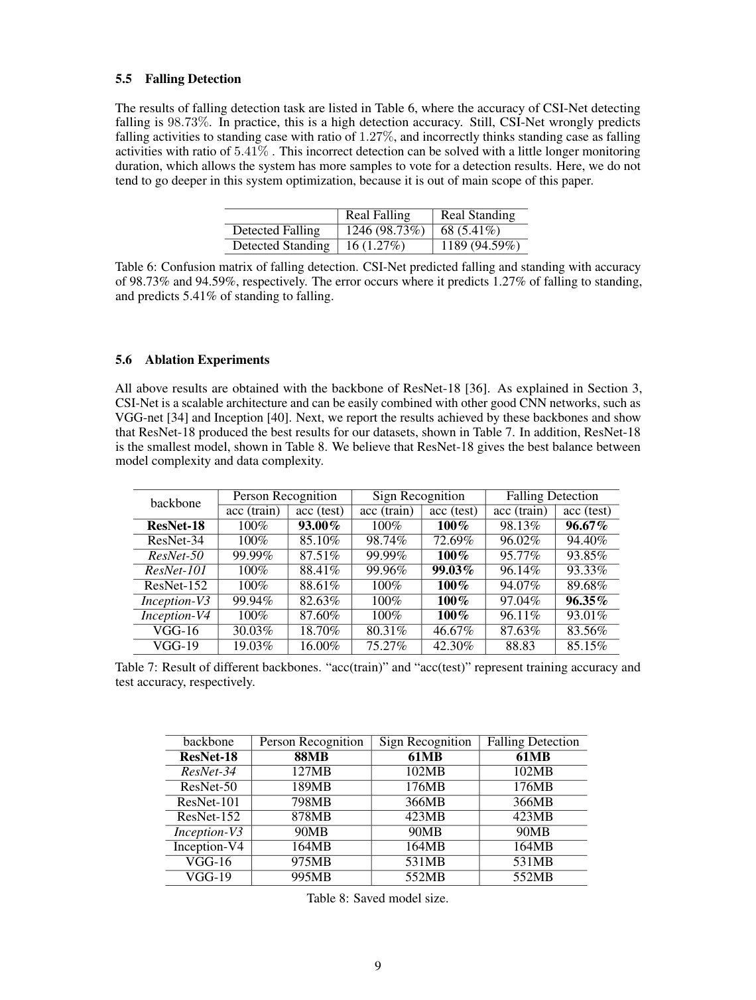

# Overview

CSI-Net explores whether one Wi-Fi representation model can support multiple human sensing tasks. Earlier CSI-based systems often relied on handcrafted features such as dynamic time warping, statistics, or task-specific preprocessing. That makes it difficult to design person-specific features for biometrics and person-invariant features for activities.

The paper proposes a unified CNN-based network for CSI representation learning. It applies the same general approach to body characterization and pose recognition tasks.

## Main Contributions

- Proposes CSI-Net, a unified deep neural network for Wi-Fi CSI representation learning.
- Studies body characterization through biometrics estimation and person recognition.
- Studies pose recognition through hand-sign recognition and fall detection.
- Shows that human presence and body characteristics introduce useful CSI variation.
- Releases code through the GitHub repository noted in the paper.

## Method Design

CSI-Net is built around convolutional representation learning for CSI data. Instead of manually aligning or summarizing sequences, the network learns discriminative patterns from the signal. This makes it possible to use the same feature-learning machinery for identity-related and activity-related tasks.

The paper also discusses a wireless signal model explaining why human bodies cause CSI variance and why that variance can carry useful sensing information.

## Evaluation Highlights

The evaluation covers four tasks: biometrics estimation, person recognition, hand-sign recognition, and fall detection. The results show strong performance across these tasks, supporting the paper's claim that CSI-Net can serve as a unified representation learner rather than a single-task model.

## Takeaways

CSI-Net is an early and broad demonstration of Wi-Fi deep representation learning. Its value lies in showing that commodity Wi-Fi signals can support both body-characteristic sensing and pose/action recognition under a shared model family.

## Paper Screenshots: Method, Principle, And Results

The screenshots below are cropped from the paper PDF and are placed next to the reading notes so the page shows the actual method diagrams, principle illustrations, and result evidence rather than only prose.

<figure class="markdown-figure">
  
  <figcaption>CSI-Net architecture with generation, feature learning, and task stages. The figure explains why one representation can serve multiple sensing tasks.</figcaption>
</figure>

<figure class="markdown-figure">
  
  <figcaption>Biometrics estimation and person-recognition evaluation. The page shows how body characterization is measured from CSI.</figcaption>
</figure>

<figure class="markdown-figure">
  
  <figcaption>Fall detection and pose-recognition result summary. These results show CSI-Net across both body-characteristic and activity tasks.</figcaption>
</figure>

## Resources

- [Official paper / publisher page](https://arxiv.org/pdf/1810.03064)
- [Cover image](./assets/cover.svg)

## Citation

```bibtex
@inproceedings{csi-net-unified-human-body-characterization-and-pose-recognition,
  title = {Csi-net: Unified human body characterization and pose recognition},
  author = {F Wang and J Han and S Zhang and X He and D Huang},
  booktitle = {arXiv preprint arXiv:1810.03064, 2018},
  year = {2018}
}
```
