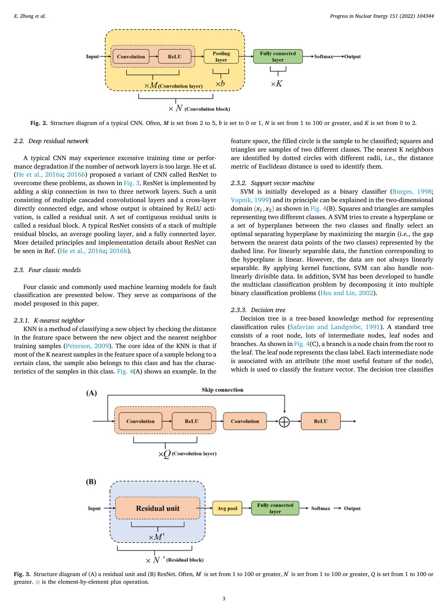
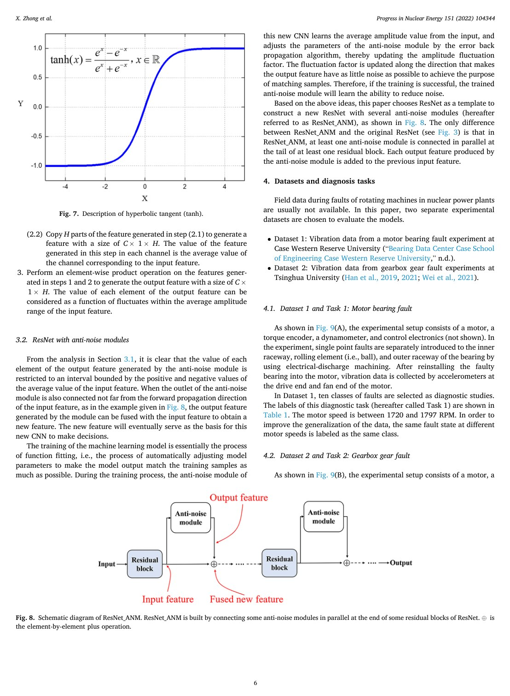
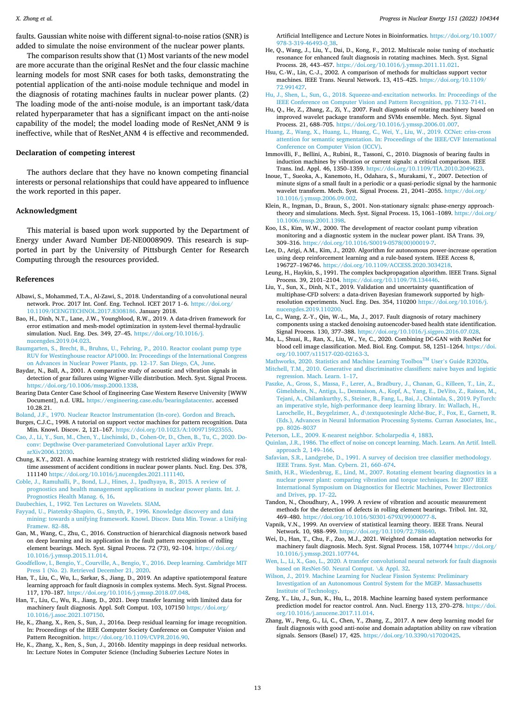

# Overview

Rotating machines such as pumps, fans, compressors, and motors are critical to nuclear power plant safety. Machine-learning-based fault diagnosis can reduce manual inspection burden, but plant environments introduce noise from electromagnetic fields, radiation, and coupled mechanical components. Noise can corrupt vibration features and reduce diagnosis reliability.

This paper proposes a plug-and-play anti-noise module that can be inserted into a ResNet fault diagnosis network. The module is designed to identify noise-related feature components and suppress them at the neural feature level.

## Main Contributions

- Introduces an anti-noise module for rotating-machine fault diagnosis in nuclear power plant settings.
- Loads the module into ResNet to create models with feature-level noise reduction capability.
- Compares nine module-loading variants against the original ResNet and classical machine-learning baselines.
- Evaluates on bearing and gearbox fault diagnosis tasks with simulated noise.
- Studies how different signal-to-noise ratios affect diagnostic performance.

## Method Design

The anti-noise module estimates amplitude fluctuation factors and average amplitude values, then uses element-wise operations to model noise-related features. By adding reverse noise expressions into subsequent analysis, the model attempts to filter noise without requiring a separate preprocessing stage.

The design is plug-and-play because it can be placed at different depths of a residual network. The paper studies these loading modes to understand where anti-noise modeling is most effective.

## Evaluation Highlights

Two rotating-machine datasets are used: one for bearing faults and one for gearbox faults. Gaussian white noise with different SNR levels simulates plant noise. The experiments compare ResNet variants with KNN, SVM, decision tree, and naive Bayes models using wavelet-packet features. The results show that anti-noise modules improve robustness under noisy conditions and that loading position matters.

## Takeaways

The work is useful because it adapts deep fault diagnosis to a safety-critical environment where clean laboratory signals are not enough. Its practical value lies in making neural diagnosis models more tolerant of plant noise without redesigning the entire architecture.

## Paper Screenshots: Method, Principle, And Results

The screenshots below are cropped from the paper PDF and are placed next to the reading notes so the page shows the actual method diagrams, principle illustrations, and result evidence rather than only prose.

<figure class="markdown-figure">
  
  <figcaption>ResNet background and anti-noise diagnosis motivation. This page introduces the neural baseline that the plug-and-play anti-noise module extends.</figcaption>
</figure>

<figure class="markdown-figure">
  
  <figcaption>Anti-noise module operations. The screenshot shows how feature-level statistics are used to suppress noise-related components.</figcaption>
</figure>

<figure class="markdown-figure">
  
  <figcaption>Noise robustness summary under simulated SNR conditions. The page connects the method to nuclear-plant noise resilience.</figcaption>
</figure>

## Resources

- [Official paper / publisher page](https://www.sciencedirect.com/science/article/pii/S0149197022002190)
- [Cover image](./assets/cover.svg)

## Citation

```bibtex
@inproceedings{development-of-a-plug-and-play-anti-noise-module-for-fault-diagnosis-of-rotating-machines-in-nuclear-power-plants,
  title = {Development of a plug-and-play anti-noise module for fault diagnosis of rotating machines in nuclear power plants},
  author = {X Zhong and F Wang and H Ban},
  booktitle = {Progress in Nuclear Energy 151, 104344, 2022},
  year = {2022}
}
```
