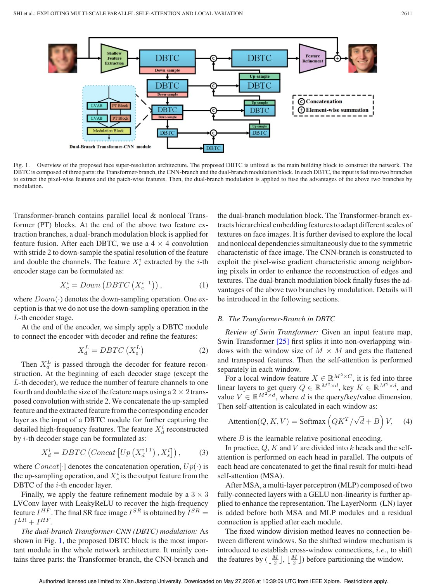
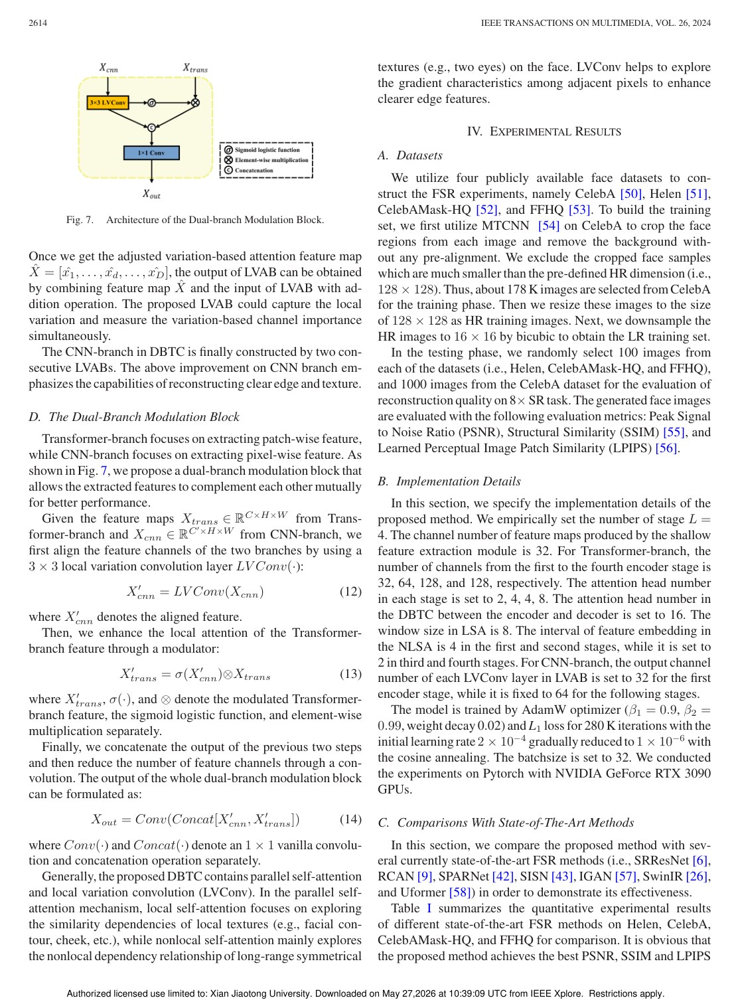
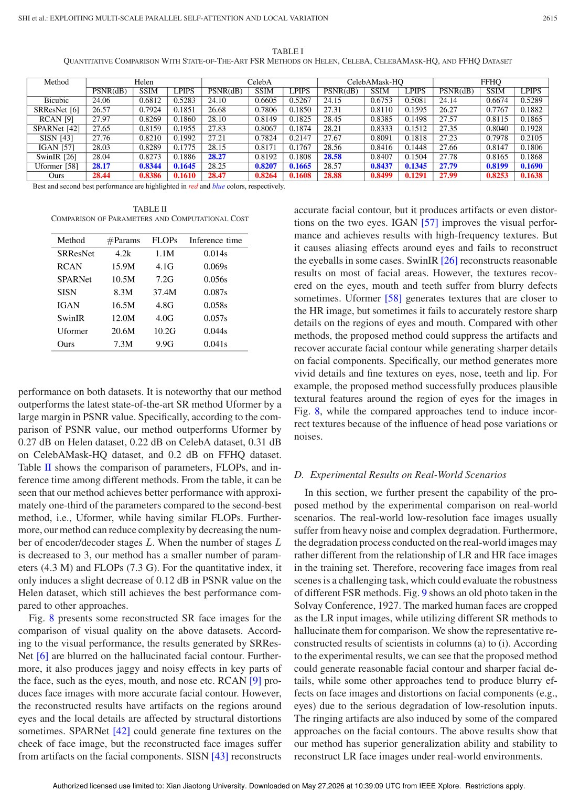

# Overview

Face super-resolution aims to recover high-resolution face images from low-resolution inputs. CNN-based methods are strong at local texture modeling, while Transformer-based methods can capture longer-range dependencies. The paper argues that neither direction alone is sufficient: facial reconstruction needs both nonlocal structure and fine local variation.

The proposed method uses a dual-branch Transformer-CNN design. One branch extracts multi-scale embeddings and parallel self-attention features, while the other branch models local pixel variation to recover edges, contours, and high-frequency details.

## Main Contributions

- Proposes a dual-branch Transformer-CNN structure for face super-resolution.
- Uses parallel self-attention to capture local and nonlocal dependencies at multiple scales.
- Introduces a local-variation-based attention block in the CNN branch.
- Fuses Transformer and CNN features through a modulation design.
- Demonstrates stronger reconstruction quality than prior state-of-the-art methods across standard and real-world settings.

## Method Design

The Transformer branch focuses on relationships between patches and long-range facial structure. This helps reconstruct globally consistent face components. The CNN branch focuses on local variation, directly emphasizing differences among neighboring pixels. This is important for details such as edges, eyes, mouth boundaries, and facial contours.

The two branches are not independent outputs. Their features are fused so that global self-attention can guide structural consistency while local variation features sharpen high-frequency reconstruction.

## Evaluation Highlights

The paper evaluates the approach on face super-resolution benchmarks and real-world low-quality faces. The reported experiments include comparisons with existing CNN and Transformer methods as well as ablation studies for the Transformer branch, CNN branch, and dual-branch fusion. The conclusion is that both branches contribute complementary information.

## Takeaways

This work is a representative example of hybrid vision architecture design. Rather than choosing between CNN locality and Transformer nonlocality, it uses each where it is strongest and combines them for face-specific reconstruction.

## Paper Screenshots: Method, Principle, And Results

The screenshots below are cropped from the paper PDF and are placed next to the reading notes so the page shows the actual method diagrams, principle illustrations, and result evidence rather than only prose.

<figure class="markdown-figure">
  
  <figcaption>Overall dual-branch Transformer-CNN face super-resolution architecture. The figure shows how global/nonlocal attention and local variation modeling are combined.</figcaption>
</figure>

<figure class="markdown-figure">
  
  <figcaption>Dual-branch modulation and local-variation attention components. This page explains how the two branches exchange and refine information.</figcaption>
</figure>

<figure class="markdown-figure">
  
  <figcaption>Quantitative comparison with state-of-the-art FSR methods. The tables summarize reconstruction quality and computational trade-offs.</figcaption>
</figure>

## Resources

- [Official paper / publisher page](https://doi.org/10.1109/tmm.2023.3301225)
- [Cover image](./assets/cover.svg)

## Citation

```bibtex
@inproceedings{exploiting-multi-scale-parallel-self-attention-and-local-variation-via-dual-branch-transformer-cnn-structure-for-face-super-resolution,
  title = {Exploiting Multi-scale Parallel Self-attention and Local Variation via Dual-branch Transformer-CNN Structure for Face Super-resolution},
  author = {Jingang Shi and Yusi Wang and Zitong Yu and Guanxin Li and Xiaopeng Hong and Fei Wang# and Yihong Gong},
  booktitle = {IEEE Transactions on Multimedia, 2023},
  year = {2023}
}
```
