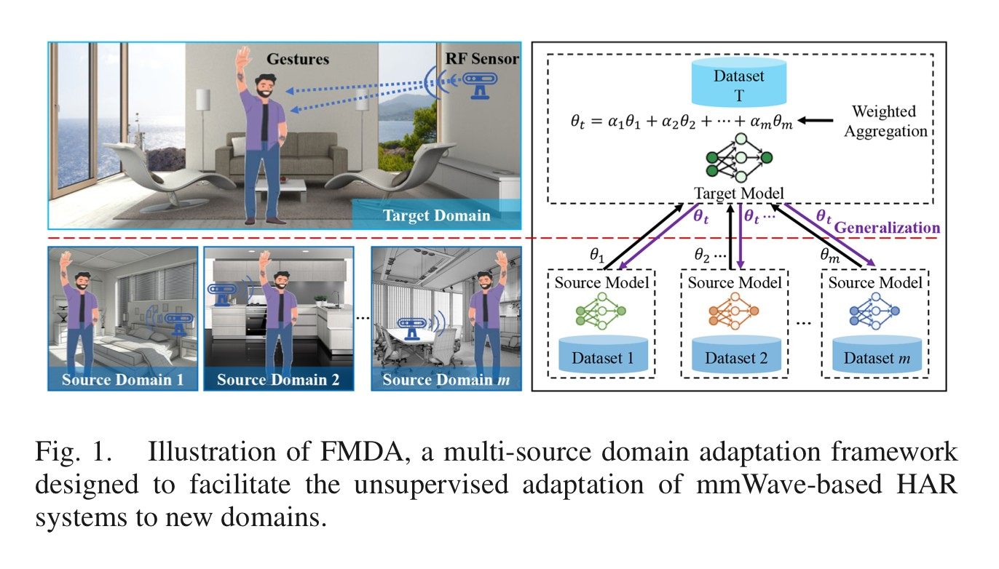
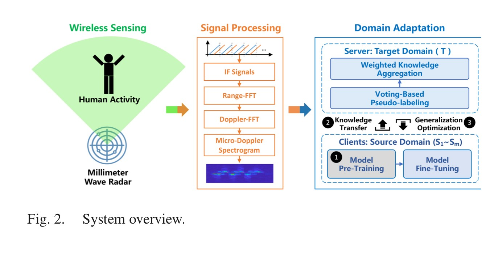
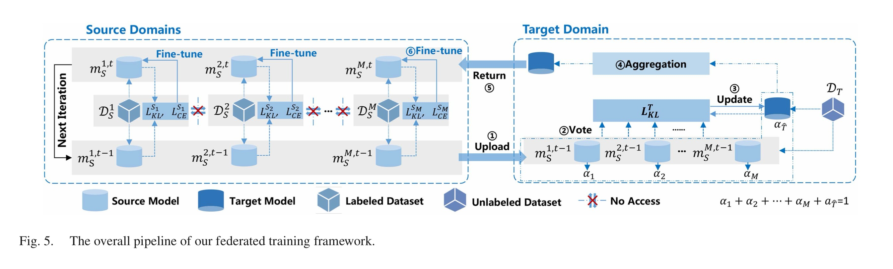
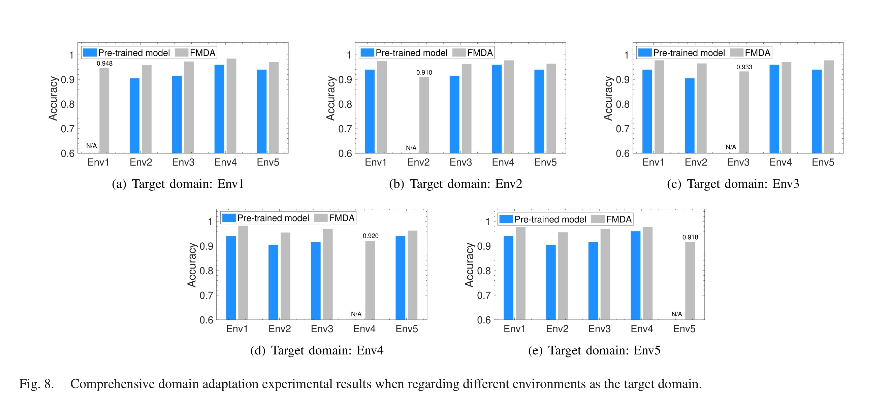
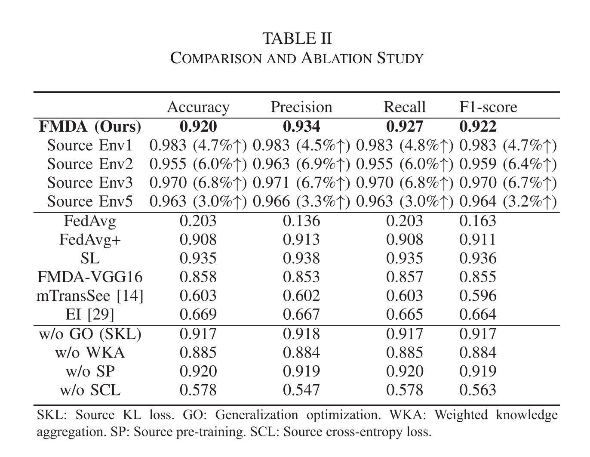
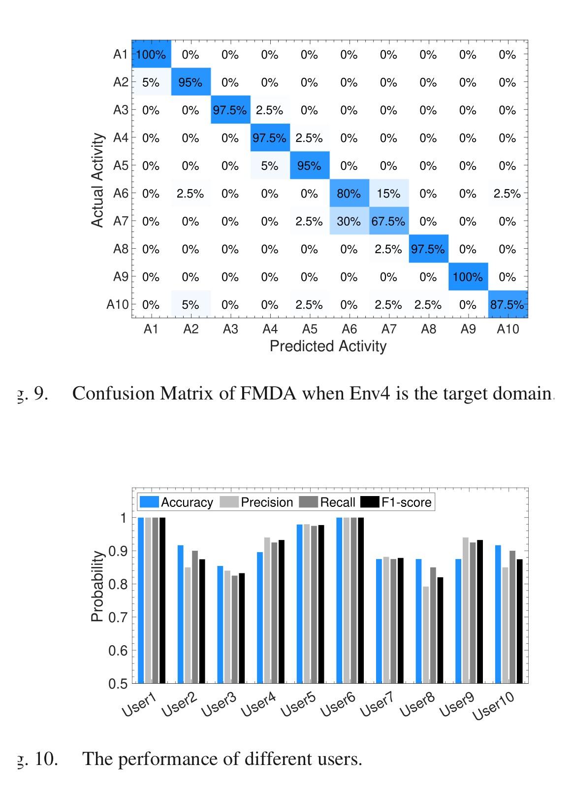

# Overview

mmWave human activity recognition works well in controlled settings, but it is fragile under **domain shift**: a model trained in one room, with one group of users or one radar placement, can degrade when moved to another environment. Standard domain adaptation assumes that source and target data can be centralized, which is often unrealistic for RF sensing because wireless signals may encode location, body, motion, trajectory, and other private behavioral information.

**FMDA** studies a more deployable setting. Several labeled source domains keep their raw mmWave data local, while an unlabeled target domain learns from their model parameters. The goal is to train a target HAR model without target labels and without moving source samples to a central server.

<figure class="markdown-figure">
  
  <figcaption>Figure 1 from the paper. FMDA aggregates knowledge from multiple private source models and adapts an unlabeled target-domain model without requiring source-domain data access.</figcaption>
</figure>

## Main Contributions

- Formulates mmWave HAR transfer as a **federated multi-source domain adaptation** problem.
- Uses **voting-based pseudo-labeling** to extract target-domain supervision from multiple source models.
- Estimates each source model's contribution and performs **weighted knowledge aggregation**, reducing the risk of negative transfer from weakly related domains.
- Introduces **generalization-gap optimization** so source and target models become flatter and more domain-agnostic during federated training.
- Implements the system on a COTS `AWR1443BOOST` mmWave radar and evaluates it across five real indoor environments.

## System And Data

The sensing pipeline uses FMCW mmWave radar. Raw RF reflections are converted through IF signal processing, Range-FFT, Doppler-FFT, and micro-Doppler spectrogram generation. The micro-Doppler representation is then fed to the domain adaptation DNN.

<figure class="markdown-figure">
  
  <figcaption>Figure 2 from the paper. The system turns mmWave radar signals into micro-Doppler spectrograms and then performs federated domain adaptation.</figcaption>
</figure>

The prototype uses an `AWR1443BOOST` radar operating at `77-81 GHz` with a `DCA1000EVM` collector. The experiments cover five indoor domains: hall, laboratory, corridor, break room, and corner. The dataset includes **10 volunteers**, **10 predefined HCI gestures**, and **20 repetitions per activity per volunteer**, for **10,000 samples** balanced across environments.

The source and target models share a simple structure: a `ResNet50` feature extractor with batch normalization plus a fully connected activity classifier. Training uses SGD with learning rate `0.001`, batch size `16`, and a voting confidence threshold that starts at `0.75` and rises to `0.98`.

## Method Details

FMDA's training loop has three moving parts.

First, each source model predicts labels for the unlabeled target samples. The system admits pseudo-labels only when the source predictions are confident enough, so low-confidence consensus does not dominate target training.

Second, FMDA does not simply average source parameters. It estimates a **quality score** for each source by measuring how much that source contributes to admitted target knowledge. Sources that better support the target domain receive larger aggregation weights.

Third, after target aggregation, the updated target feature extractor is sent back to source domains. Each source then fine-tunes with a **push-and-pull** objective: KL divergence guides it toward the aggregated target representation, while cross-entropy keeps it from forgetting its own labeled data distribution. This is the mechanism behind the paper's claim that source participants also benefit from joining the federated process.

<figure class="markdown-figure">
  
  <figcaption>Figure 5 from the paper. Source domains upload parameters, the target domain votes and aggregates, and the updated target feature extractor is returned to sources for generalization optimization.</figcaption>
</figure>

## Results

Across five target-environment choices, FMDA consistently improves over pre-trained source models and reaches about `91.0-94.8%` accuracy depending on the target domain. The authors use Env4 as the default target in later experiments because it is narrow and multipath-heavy, making it a representative challenging case.

<figure class="markdown-figure">
  
  <figcaption>Figure 8 from the paper. FMDA is evaluated by rotating each environment as the target domain and using the remaining environments as sources.</figcaption>
</figure>

In the default Env4 target setting, FMDA reaches **92.0% accuracy**, **93.4% precision**, **92.7% recall**, and **92.2% F1-score**. This is close to supervised learning on target labels (**93.5% accuracy**) while avoiding target annotations. It also strongly outperforms simple federated averaging, which reaches only **20.3% accuracy** in this setting.

| Method / Variant | Accuracy | Precision | Recall | F1-score |
| --- | ---: | ---: | ---: | ---: |
| FMDA | 0.920 | 0.934 | 0.927 | 0.922 |
| FedAvg | 0.203 | 0.136 | 0.203 | 0.163 |
| FedAvg+ | 0.908 | 0.913 | 0.908 | 0.911 |
| Supervised learning | 0.935 | 0.938 | 0.935 | 0.936 |
| FMDA-VGG16 | 0.858 | 0.853 | 0.857 | 0.855 |
| mTransSee | 0.603 | 0.602 | 0.603 | 0.596 |
| EI | 0.669 | 0.667 | 0.665 | 0.664 |

<figure class="markdown-figure">
  
  <figcaption>Table II from the paper. FMDA nearly matches supervised target-domain training and improves participating source models by 3.0% to 6.8% accuracy.</figcaption>
</figure>

The ablation study shows why the full design matters. Removing generalization optimization slightly lowers target performance and reduces source-side gains. Removing weighted knowledge aggregation causes a larger drop, matching the intuition that different source domains should not be treated equally. Removing source pre-training mainly slows training, while removing source cross-entropy supervision severely hurts performance.

## Practical Observations

FMDA performs well, but the paper is careful about the remaining challenges. Similar left/right gestures are still hard to distinguish from micro-Doppler alone; the confusion matrix shows that sliding the arm left is often mistaken for sliding the arm right. User habits also matter: per-user accuracy ranges from **85.4%** to **100%** in the main evaluation.

<figure class="markdown-figure">
  
  <figcaption>Figures 9 and 10 from the paper. Most errors come from visually similar gesture dynamics, and user-specific movement habits affect adaptation performance.</figcaption>
</figure>

The micro-benchmark experiments add two useful deployment lessons. Increasing the number of source domains has only a modest effect when all source domains are already informative: two sources reach **91.0%**, while four sources reach **92.0%**. Under new user-radar distances, FMDA stays near **80%** performance, and under changed orientations it stays near **75%**, still substantially better than retraining source-only models across domains.

## Takeaways

- The key problem is not only mmWave HAR accuracy, but **privacy-compatible cross-domain adaptation**.
- Pseudo-label voting gives the unlabeled target domain a training signal, but contribution-aware weighting is needed to avoid negative transfer.
- Returning the updated target model to sources makes collaboration mutually useful, not just target-centric.
- The remaining bottlenecks are domain geometry, user-specific motion habits, and ambiguous gestures that look similar in micro-Doppler space.

## Resources

- [Official paper / DOI](https://doi.org/10.1109/TMC.2025.3549705)
- [Framework crop](./assets/paper-framework.jpg)
- [Training pipeline crop](./assets/paper-pipeline.jpg)
- [Comparison and ablation table](./assets/paper-results.jpg)

## Citation

```bibtex
@article{zhao2025federated,
  title = {Federated Multi-Source Domain Adaptation for mmWave-Based Human Activity Recognition},
  author = {Zhao, Cui and Fang, Guotong and Ding, Han and Liu, Xinhui and Wang, Fei and Wang, Ge and Zhao, Kun and Wang, Zhi and Xi, Wei},
  journal = {IEEE Transactions on Mobile Computing},
  volume = {24},
  number = {8},
  pages = {7283--7296},
  year = {2025},
  doi = {10.1109/TMC.2025.3549705}
}
```
