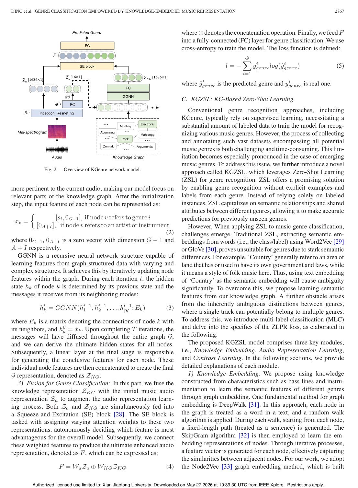
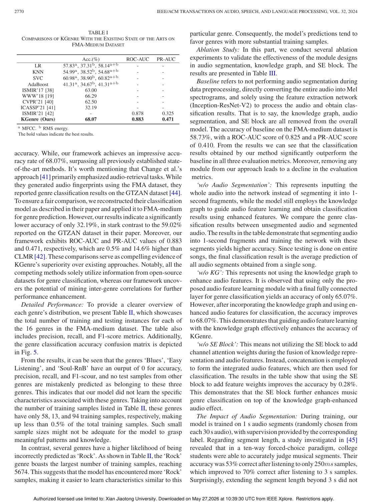
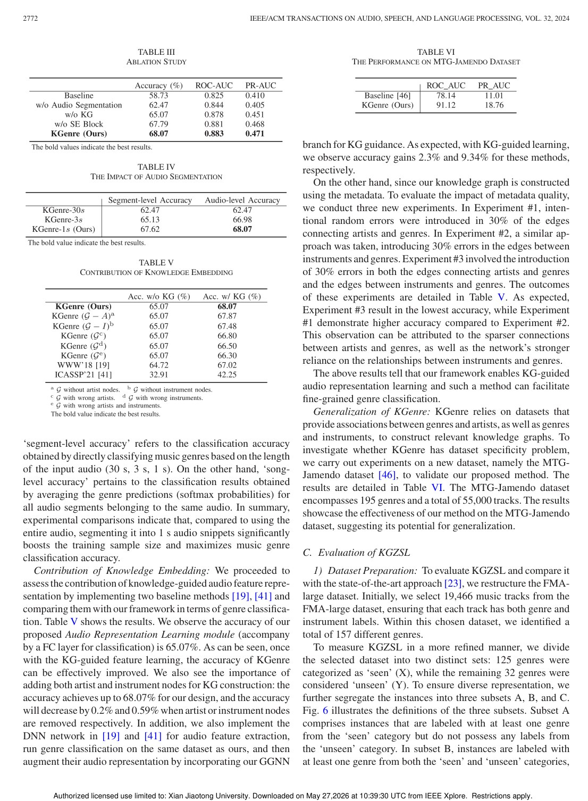

# Overview

Music genre classification is difficult because genre boundaries are fuzzy, audio-only features may miss semantic relationships, and new or rare genres can be underrepresented. This paper argues that music metadata can provide useful high-level structure. By constructing a knowledge graph over genres, artists, and instruments, the model can learn correlations that are not obvious from audio signals alone.

The work studies two related settings: fixed-set genre classification and open-set genre classification. In both cases, knowledge graph embeddings are used to enhance the representation learned from audio.

## Knowledge Graph Motivation

A song's genre is related not only to acoustic patterns, but also to artists, instruments, and genre relationships. Public datasets such as FMA and OpenMIC-2018 contain metadata that can be organized into a graph. This graph gives the model a way to reason about genre similarity and contextual relationships without requiring extra manual annotation.

## Main Contributions

- Constructs music knowledge graphs from public dataset metadata including genre, artist, and instrument relations.
- Proposes models for both fixed-set genre classification and open-set genre classification.
- Integrates high-level graph knowledge into audio representation learning.
- Shows that knowledge-embedded representations improve over audio-only state-of-the-art methods.
- Reports 68.07 percent average genre classification accuracy on FMA-medium and 42.4 percent open-set accuracy on FMA-large.

## Method Design

The framework first builds graph nodes and relations from dataset metadata. Graph neural representation learning is then used to capture genre correlations. These graph-derived embeddings are fused with audio features, so the classifier can use both signal-level evidence and knowledge-level relationships. For open-set classification, the graph helps transfer information to genres with limited or no direct training samples.

## Evaluation Highlights

The paper evaluates on FMA-medium and FMA-large and compares against strong music representation baselines. The reported gains suggest that genre classification benefits from structured knowledge, especially when audio cues alone are ambiguous or when genre labels have uneven data support.

## Takeaways

The work connects audio machine learning with knowledge graph reasoning. Its main value is showing that metadata already present in music datasets can be converted into useful semantic structure rather than being ignored during representation learning.

## Paper Screenshots: Method, Principle, And Results

The screenshots below are cropped from the paper PDF and are placed next to the reading notes so the page shows the actual method diagrams, principle illustrations, and result evidence rather than only prose.

<figure class="markdown-figure">
  
  <figcaption>KGenre architecture for fusing audio representations with knowledge graph embeddings. This is the central mechanism that injects genre, artist, and instrument relations.</figcaption>
</figure>

<figure class="markdown-figure">
  
  <figcaption>Fixed-set genre classification comparison on FMA-medium. The table provides the main evidence that knowledge-embedded audio features improve classification.</figcaption>
</figure>

<figure class="markdown-figure">
  
  <figcaption>Ablation studies for knowledge embedding and segmentation. These tables explain which pieces of the framework contribute to the reported gains.</figcaption>
</figure>

## Resources

- [Official paper / publisher page](https://doi.org/10.1109/taslp.2024.3402115)
- [Cover image](./assets/cover.svg)

## Citation

```bibtex
@inproceedings{genre-classification-empowered-by-knowledge-embedded-music-representation,
  title = {Genre Classification Empowered by Knowledge-Embedded Music Representation},
  author = {Han Ding and Linwei Zhai and Cui Zhao# and Fei Wang and Ge Wang and Wei Xi and Zhi Wang and Jizhong Zhao},
  booktitle = {IEEE/ACM Transactions on Audio, Speech, and Language Processing, 2024},
  year = {2024}
}
```
