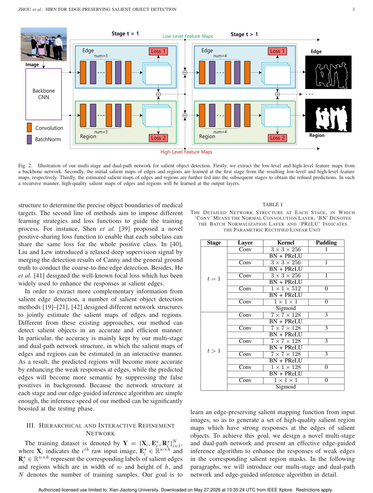
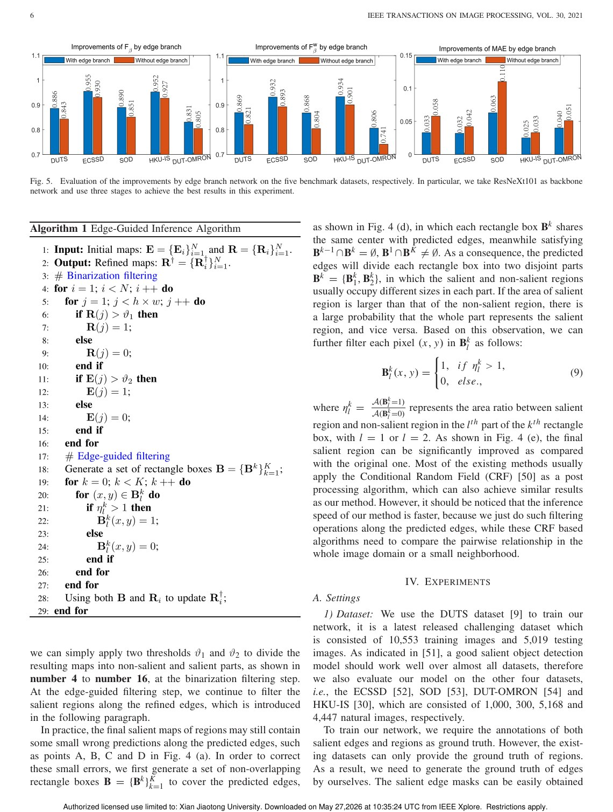
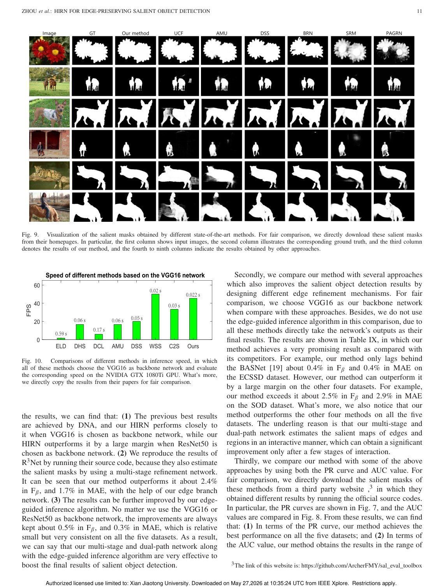

# Overview

Salient object detection identifies visually important regions in an image. Deep networks have improved this task substantially, but downsampling operations can blur object boundaries. This is a major issue because saliency maps are often used as preprocessing for segmentation, recognition, editing, and visual attention tasks where edge quality matters.

HIRN, the Hierarchical and Interactive Refinement Network, addresses this by jointly learning salient regions and salient edges. Region predictions help locate objects, while edge predictions preserve boundaries.

## Main Contributions

- Designs a multi-stage dual-path network for both salient regions and salient edges.
- Uses low-level and high-level features to refine edge and region predictions interactively.
- Introduces edge-guided inference to filter salient regions along predicted boundaries.
- Improves edge preservation in salient object detection.
- Demonstrates stronger performance than a range of state-of-the-art methods on benchmark datasets.

## Method Design

HIRN separates but connects two prediction paths. The region path focuses on object-level saliency, while the edge path focuses on boundary structure. Interaction between the two paths makes region maps more accurate near weak edges and makes edge maps more semantic by suppressing background false positives.

After network prediction, the edge-guided inference algorithm further refines region maps using the predicted edge structure. This extra step is designed to sharpen final saliency maps without relying only on pixel-level region scores.

## Evaluation Highlights

The paper evaluates HIRN on multiple salient object detection benchmarks and includes ablation studies for network components and the inference step. The reported results show that explicitly modeling edges improves both visual boundary quality and standard saliency metrics.

## Takeaways

HIRN's core lesson is that salient object detection should not treat edge preservation as an afterthought. By making edge prediction part of the learning and inference process, the method produces cleaner and more useful saliency maps.

## Paper Screenshots: Method, Principle, And Results

The screenshots below are cropped from the paper PDF and are placed next to the reading notes so the page shows the actual method diagrams, principle illustrations, and result evidence rather than only prose.

<figure class="markdown-figure">
  
  <figcaption>HIRN multi-stage dual-path network for edge and region prediction. The figure shows how low-level and high-level features interact.</figcaption>
</figure>

<figure class="markdown-figure">
  
  <figcaption>Edge-guided inference and edge-branch improvement analysis. This page explains how edges refine saliency regions after network prediction.</figcaption>
</figure>

<figure class="markdown-figure">
  
  <figcaption>Qualitative saliency-mask comparison. The examples show the practical effect of preserving object boundaries.</figcaption>
</figure>

## Resources

- [Official paper / publisher page](https://doi.org/10.1109/tip.2020.3027992)
- [Cover image](./assets/cover.svg)

## Citation

```bibtex
@inproceedings{hierarchical-and-interactive-refinement-network-for-edge-preserving-salient-object-detection,
  title = {Hierarchical and Interactive Refinement Network for Edge-Preserving Salient Object Detection},
  author = {Sanping Zhou and Jinjun Wang# and Le Wang and Jimuyang Zhang and Fei Wang and Dong Huang and Nanning Zheng},
  booktitle = {IEEE Transactions on Image Processing, 2021},
  year = {2021}
}
```
