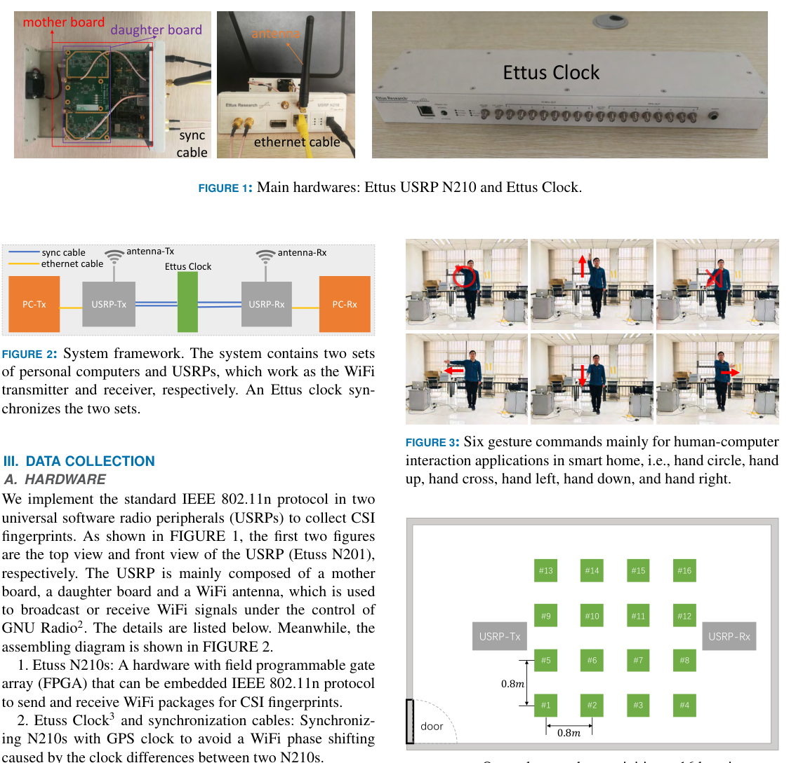
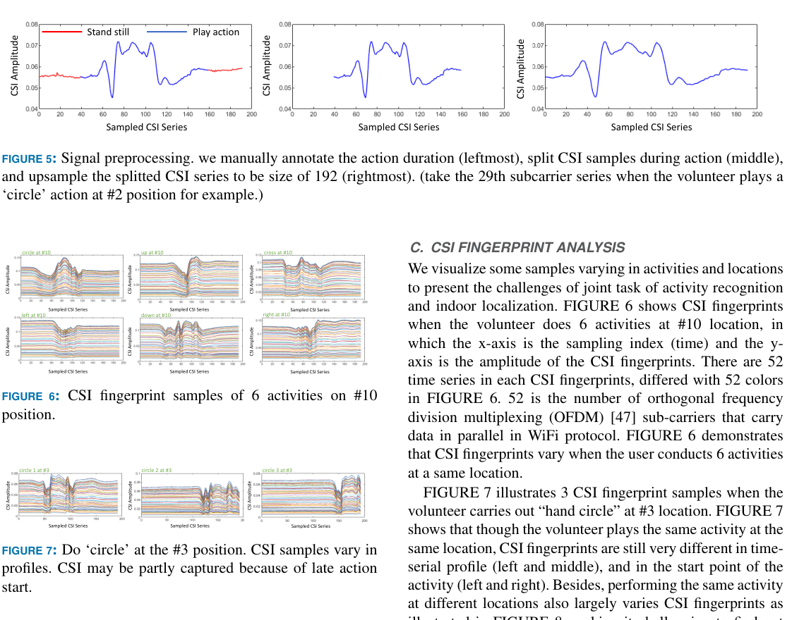
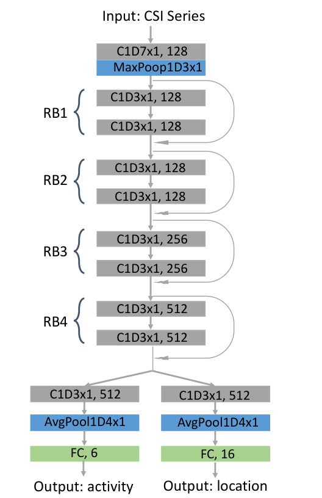
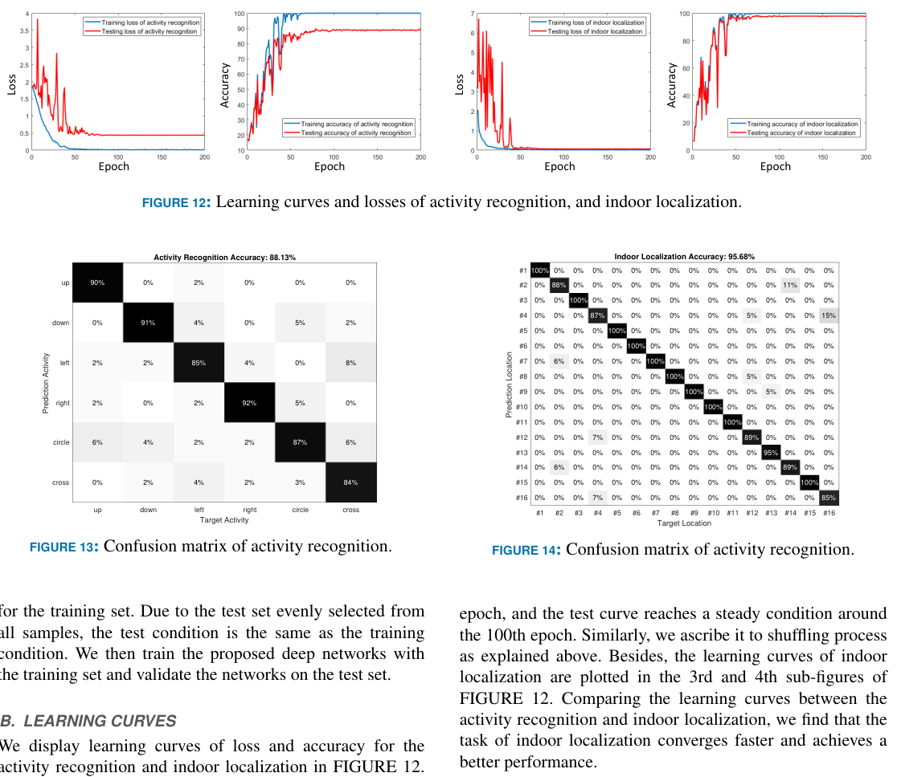
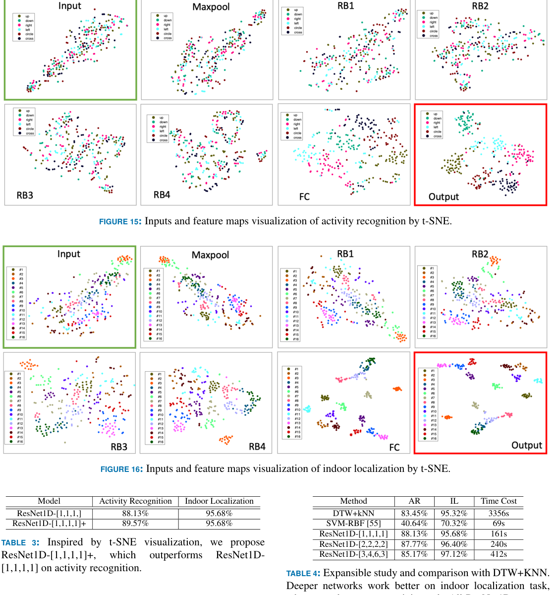

# Overview

Wi-Fi sensing research often separates two related tasks: recognizing what a person is doing and estimating where the person is. This paper studies them jointly. The core observation is that the same CSI fingerprint is shaped by both activity and location, so a sensing model can learn a shared representation and then branch into two predictions.

The application motivation is smart-home interaction. The same gesture can mean different things depending on where the user stands: a hand-down gesture near the television could lower TV volume, while the same gesture near an air conditioner could lower temperature. Joint recognition and localization makes this kind of context-aware command possible with Wi-Fi signals rather than cameras.

## Main Contributions

- Formulates a **joint Wi-Fi sensing task** that maps one CSI fingerprint to both an activity label and an indoor location label.
- Builds an IEEE 802.11n CSI collection system with two Ettus USRP N210 devices and an Ettus Clock for synchronization.
- Collects a dataset of six hand gestures at sixteen indoor locations, producing 1394 valid CSI fingerprints after filtering.
- Treats CSI fingerprints as temporal signals with 52 OFDM subcarrier channels and applies 1D convolution along the time axis.
- Designs a dual-branch **ResNet1D** model with shared temporal residual blocks and separate activity/localization heads.
- Reports 88.13% activity recognition accuracy and 95.68% indoor localization accuracy, outperforming DTW+kNN and SVM-RBF baselines.

## Joint Task

The paper denotes a Wi-Fi fingerprint as containing both activity and location information. The learning goal is not only `fingerprint -> activity` or `fingerprint -> location`, but `fingerprint -> (activity, location)`. This is more difficult because CSI patterns vary when the same activity is performed at different positions, and localization must still work while the user's motion changes the channel.

The authors frame two challenges clearly. First, the model needs activity features that remain stable across locations. Second, it needs location features that remain useful across different gestures. A shared network with task-specific branches is a natural compromise: early layers learn temporal CSI structure, while the two heads specialize for activity and location.

## Data Collection

The system uses two USRP-based Wi-Fi nodes, one transmitter and one receiver, synchronized by an Ettus Clock. The experiment defines six gesture commands for human-computer interaction: hand up, hand down, hand left, hand right, hand circle, and hand cross. A volunteer performs these gestures at sixteen locations arranged in a room grid with 0.8 m spacing.

The initial collection plan gives `16 locations x 6 activities x 15 repetitions = 1440` samples. After discarding invalid samples with very late action starts, the final dataset contains 1394 CSI fingerprints. The split uses 1116 samples for training and 278 for testing.

<figure class="markdown-figure">
  
  <figcaption>The data collection setup uses synchronized USRP transmitter/receiver hardware, six hand gestures, and a 16-location indoor grid.</figcaption>
</figure>

## CSI Fingerprints

Each CSI fingerprint is represented as a `52 x 192` matrix. The 52 dimension corresponds to OFDM data subcarriers, and the 192 dimension is the normalized temporal length. The paper uses CSI amplitude and leaves phase fusion outside the scope.

Before training, the action duration is manually annotated, the active CSI segment is cropped, and the segment is linearly interpolated to length 192. The examples in the paper show why the task is hard: different gestures at the same position produce different CSI traces, the same gesture at the same position may still vary in temporal profile, and the same gesture at different positions changes again because of the propagation geometry.

<figure class="markdown-figure">
  
  <figcaption>CSI fingerprints are cropped to the action duration and normalized to a fixed length; their profiles vary by both gesture and location.</figcaption>
</figure>

## ResNet1D Framework

The model treats CSI as a multichannel time series rather than as an image. A 1D convolution sweeps along the time axis while using the 52 subcarriers as channels. This lets the network learn temporal shape and amplitude patterns directly from the CSI fingerprint without hand-crafted statistics.

The proposed ResNet1D starts with a 1D convolution and max-pooling layer, followed by four residual-block stages. The lower layers are shared by both tasks. Near the end, the network splits into two branches: one predicts the six activity classes, and the other predicts the sixteen location classes. The training loss is the sum of the activity cross-entropy and localization cross-entropy, with the paper setting the balance weight to 1.

<figure class="markdown-figure">
  
  <figcaption>ResNet1D shares temporal CSI features, then branches into an activity head with 6 outputs and a localization head with 16 outputs.</figcaption>
</figure>

## Results

On the test set, the base ResNet1D-[1,1,1,1] obtains **88.13%** activity recognition accuracy and **95.68%** indoor localization accuracy. The learning curves show that localization converges faster and reaches a higher final accuracy than activity recognition.

For activity recognition, the per-class F1 scores are 0.94 for hand up, 0.90 for hand down, 0.84 for hand left, 0.92 for hand right, 0.82 for hand circle, and 0.86 for hand cross. For indoor localization, the weakest location F1 score is 0.81 at location #4, while several locations reach perfect or near-perfect scores. The average localization error is 0.0904 m; for misclassified localization samples only, the average error is 2.0943 m.

<figure class="markdown-figure">
  
  <figcaption>The dual-task model reaches 88.13% activity accuracy and 95.68% localization accuracy on the 278-sample test set.</figcaption>
</figure>

## Feature Analysis And Baselines

The paper uses t-SNE to visualize raw CSI inputs and intermediate feature maps. Raw inputs are highly mixed, but deeper layers produce progressively more separable clusters. Localization becomes separable earlier than activity recognition, which matches the higher localization accuracy. This visualization also motivates a small enhanced model, ResNet1D-[1,1,1,1]+, which improves activity recognition to 89.57% while keeping localization at 95.68%.

The baseline comparison is also useful. DTW+kNN reaches 83.45% activity recognition and 95.32% indoor localization but costs 3356 seconds. SVM-RBF is fast at 69 seconds but much less accurate, especially for activity recognition. ResNet1D-[1,1,1,1] improves activity recognition to 88.13%, keeps localization at 95.68%, and costs 161 seconds. Deeper ResNet1D variants improve localization up to 97.12% but reduce activity recognition, suggesting a tradeoff between model depth and the two tasks.

<figure class="markdown-figure">
  
  <figcaption>t-SNE shows features becoming more discriminative through the network; ResNet1D also outperforms DTW+kNN and SVM-RBF on the joint task.</figcaption>
</figure>

## Takeaways

This paper is an early reproducible baseline for joint Wi-Fi sensing. Its most important design choice is treating CSI as a temporal multichannel signal and letting a 1D CNN learn shared representations for two tasks. That makes the page relevant to later work on continuous Wi-Fi sensing, multitask representation learning, and context-aware human-computer interaction.

The dataset and code release are also part of its value: the paper does not only propose a model, but gives a concrete hardware setup, preprocessing pipeline, training protocol, and public benchmark for others to build on.

## Resources

- [arXiv paper](https://arxiv.org/abs/1904.04964)
- [Code and dataset](https://github.com/geekfeiw/apl)
- [Cover image](./assets/cover.svg)

## Citation

```bibtex
@article{wang2019jointwifi,
  title = {Joint Activity Recognition and Indoor Localization with WiFi Fingerprints},
  author = {Wang, Fei and Feng, Jianwei and Zhao, Yinliang and Zhang, Xiaobin and Zhang, Shiyuan and Han, Jinsong},
  journal = {IEEE Access},
  volume = {7},
  pages = {80058--80068},
  year = {2019}
}
```
