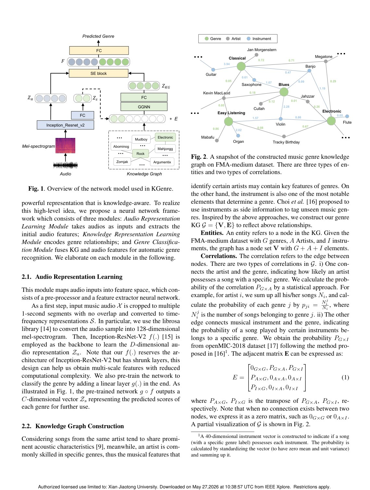
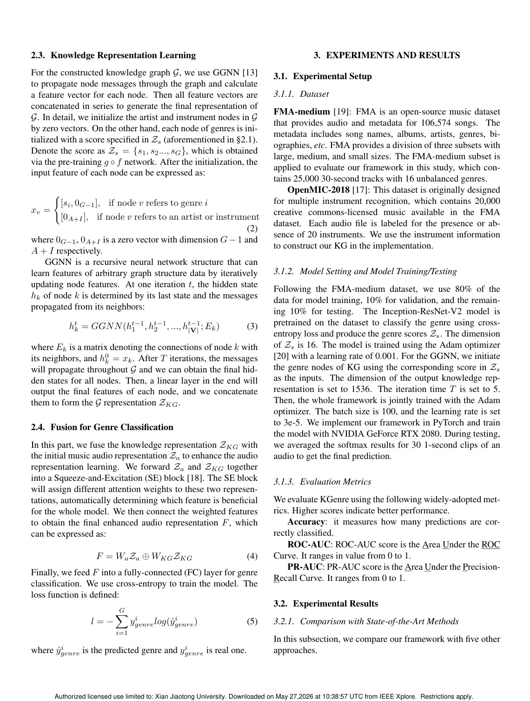
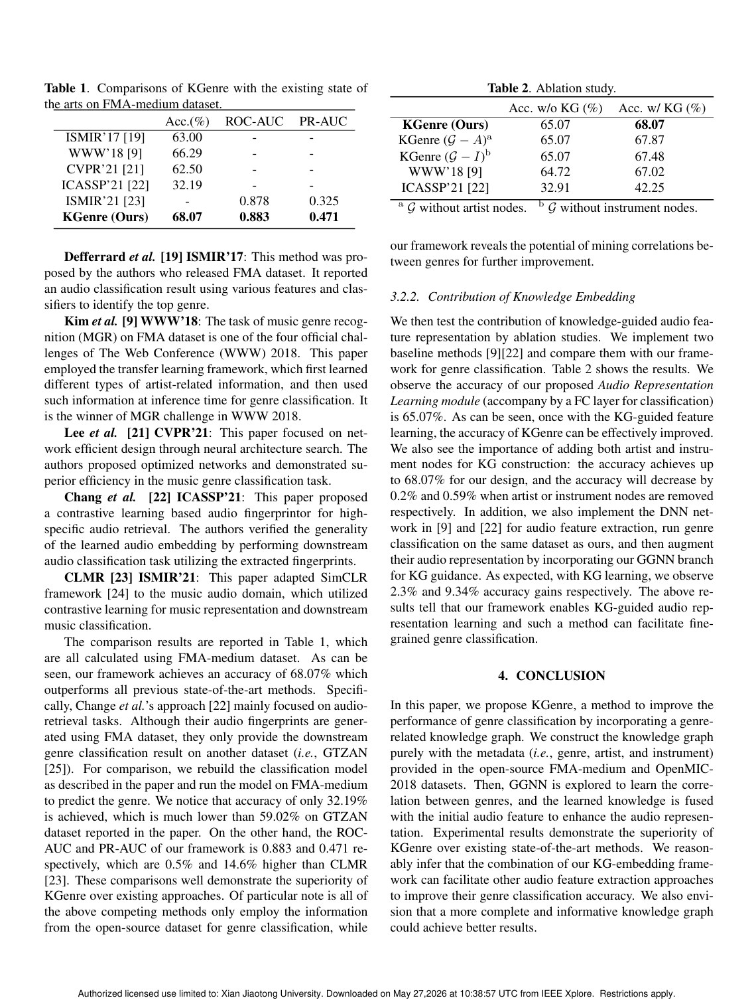

# Overview

KGenre studies a simple but important question: can genre classification improve if the model uses not only audio, but also the relationships among genres, artists, and instruments? Genre boundaries are often ambiguous, and audio-only classifiers may miss semantic structure that is already present in dataset metadata.

The method constructs a knowledge graph from FMA-medium and OpenMIC-2018 metadata without requiring additional labeling effort. It then learns genre correlations from the graph and embeds this knowledge into the audio representation.

## Main Contributions

- Builds a genre-related knowledge graph from public music dataset metadata.
- Uses graph representation learning to model correlations among genres.
- Fuses knowledge graph embeddings with audio features for genre classification.
- Shows that embedded knowledge improves audio representation quality.
- Presents one of the early attempts to combine high-level graph knowledge with audio-based genre recognition.

## Method Design

The graph contains metadata-derived relations involving genres, artists, and instruments. A graph neural network learns embeddings that encode genre correlation. These embeddings are combined with audio features extracted from music samples, giving the classifier access to both acoustic patterns and semantic relationships.

This design is especially useful when genres are related or overlapping. Instead of treating labels as independent classes, KGenre gives the model a structured view of how genres connect.

## Evaluation Highlights

Experiments on FMA-medium and OpenMIC-2018 show that knowledge-embedded features improve classification over audio-only baselines. The paper also suggests that the same graph-embedding idea can complement other audio feature extractors, because the knowledge graph is separate from the low-level audio encoder.

## Takeaways

KGenre is a compact but useful contribution: it shows that music genre recognition can benefit from metadata as structured knowledge, not just as side information for dataset bookkeeping.

## Paper Screenshots: Method, Principle, And Results

The screenshots below are cropped from the paper PDF and are placed next to the reading notes so the page shows the actual method diagrams, principle illustrations, and result evidence rather than only prose.

<figure class="markdown-figure">
  
  <figcaption>KGenre overview with knowledge graph, GGNN propagation, and audio feature fusion. This is the core principle behind graph-augmented music representation.</figcaption>
</figure>

<figure class="markdown-figure">
  
  <figcaption>Knowledge representation learning details. The page shows how metadata relations are converted into graph embeddings before fusion.</figcaption>
</figure>

<figure class="markdown-figure">
  
  <figcaption>FMA-medium comparison table. The result page shows the classification gains over prior music genre recognition methods.</figcaption>
</figure>

## Resources

- [Official paper / publisher page](http://dx.doi.org/10.1109/icassp49357.2023.10097131)
- [Cover image](./assets/cover.svg)

## Citation

```bibtex
@inproceedings{knowledge-graph-augmented-music-representation-for-genre-classification,
  title = {Knowledge-graph augmented music representation for genre classification},
  author = {H Ding and W Song and C Zhao and F Wang and G Wang and W Xi and J Zhao},
  booktitle = {ICASSP 2023-2023 IEEE International Conference on Acoustics, Speech and ..., 2023},
  year = {2023}
}
```
