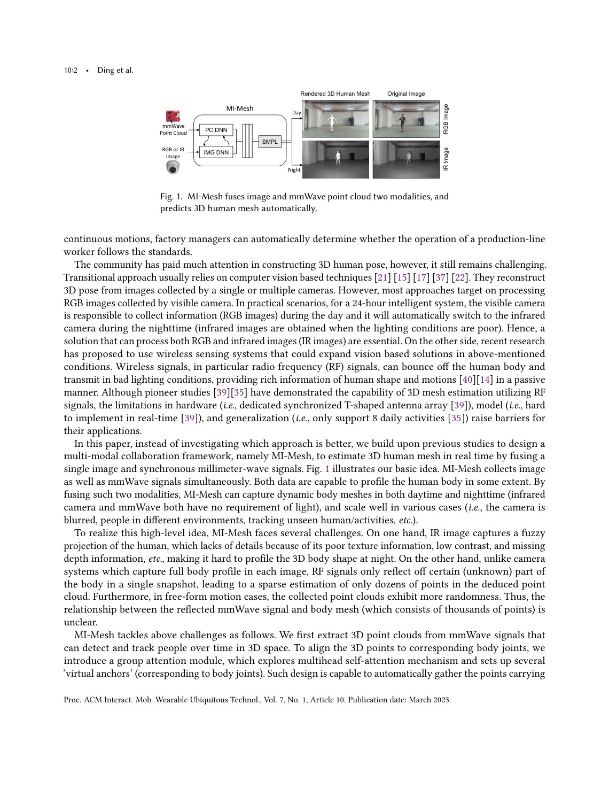
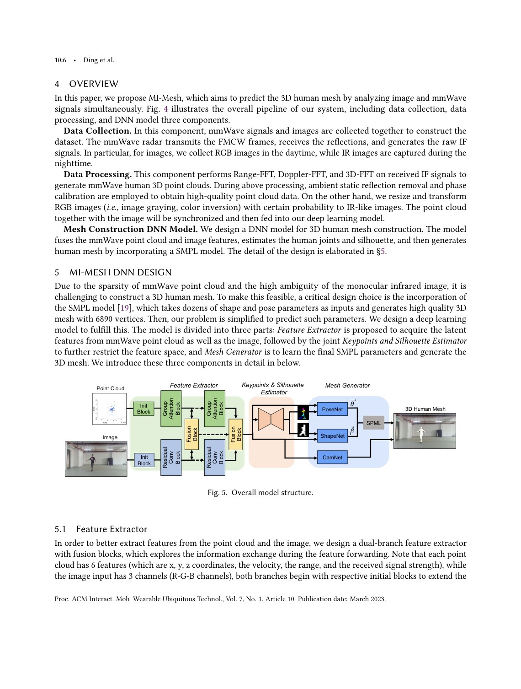
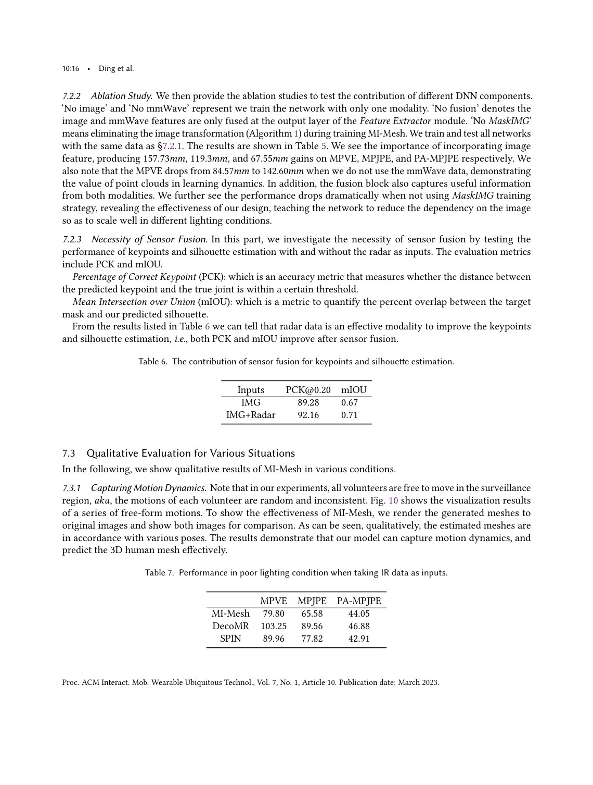

# Overview

3D human mesh reconstruction is useful for AR, healthcare, identity management, and human-computer interaction. Image-based methods provide rich appearance and spatial cues, but can suffer from occlusion, lighting, privacy concerns, and weak depth robustness. mmWave radar provides complementary geometric information and can work under challenging visual conditions, but its point clouds are sparse and noisy.

MI-Mesh fuses these two modalities. Instead of asking whether images or mmWave are better, the paper designs a multimodal framework that correlates mmWave point clouds with human joints, refines features with visual supervision, and regresses SMPL pose and shape parameters.

## Main Contributions

- Proposes a 3D human mesh reconstruction framework that fuses images and mmWave radar.
- Automatically correlates mmWave point clouds with human joints.
- Uses 2D joints and silhouettes to refine fused multimodal features.
- Regresses SMPL pose and shape parameters to generate full 3D human meshes.
- Implements and evaluates the system with commercial mmWave radar and camera devices.

## System Design

The network first extracts modality-specific features from the camera image and mmWave point cloud. It then learns correlations between radar points and human body joints, allowing sparse RF measurements to contribute to body-structure estimation. Visual predictions such as 2D joints and silhouettes are used as auxiliary refinements before the final SMPL regression stage.

The use of SMPL is important because it constrains the output to plausible human body geometry. The model predicts pose and shape parameters rather than an unconstrained mesh.

## Evaluation Highlights

The paper evaluates MI-Mesh across dynamic motions and different conditions. The conclusion is that fusing image and mmWave improves robustness compared with relying on either modality alone. The prototype demonstrates that commodity devices can support multimodal mesh construction in indoor settings.

## Takeaways

MI-Mesh fits the lab's broader theme of multimodal sensing: wireless signals are not only alternatives to cameras, but can provide complementary physical evidence when fused with visual modalities.

## Paper Screenshots: Method, Principle, And Results

The screenshots below are cropped from the paper PDF and are placed next to the reading notes so the page shows the actual method diagrams, principle illustrations, and result evidence rather than only prose.

<figure class="markdown-figure">
  
  <figcaption>MI-Mesh multimodal 3D human mesh reconstruction overview. The screenshot shows RGB/IR image input, mmWave point cloud input, DNN fusion, and SMPL mesh output.</figcaption>
</figure>

<figure class="markdown-figure">
  
  <figcaption>Full data collection, processing, and DNN pipeline. This page is useful for understanding how raw signals become synchronized multimodal training samples.</figcaption>
</figure>

<figure class="markdown-figure">
  
  <figcaption>Ablation and multimodal contribution analysis. The result page shows why both image and mmWave branches are needed under different visual conditions.</figcaption>
</figure>

## Resources

- [Official paper / publisher page](https://dl.acm.org/doi/10.1145/3580861)
- [Cover image](./assets/cover.svg)

## Citation

```bibtex
@inproceedings{mi-mesh-3d-human-mesh-construction-by-fusing-image-and-millimeter-wave,
  title = {MI-Mesh: 3D Human Mesh Construction by Fusing Image and Millimeter Wave},
  author = {Han Ding and Zhenbin Chen and Cui Zhao# and Fei Wang and Ge Wang and Wei Xi and Jizhong Zhao},
  booktitle = {ACM IMWUT/UBICOMP 2023},
  year = {2023}
}
```
