# Overview

MI-Mesh studies 3D human mesh reconstruction in a practical multimodal sensing setting: a single RGB/IR camera is paired with a commodity millimeter-wave radar. Image-based mesh recovery provides rich visual structure, but it can degrade under poor lighting, blur, privacy-sensitive conditions, and weak depth cues. mmWave sensing provides complementary physical evidence because RF reflections can profile human motion when visual observations are weak, but radar point clouds are sparse and noisy.

The paper's central idea is to **fuse image and mmWave signals rather than choose between them**. MI-Mesh correlates sparse mmWave point clouds with human body joints, exchanges information between image and radar branches, estimates keypoints and silhouettes as intermediate cues, and finally regresses SMPL pose and shape parameters to generate a full 3D human mesh.

> Core idea: use vision for dense appearance structure and mmWave for robust physical motion cues, then fuse both into an SMPL-based 3D mesh pipeline.

<figure class="markdown-figure">
  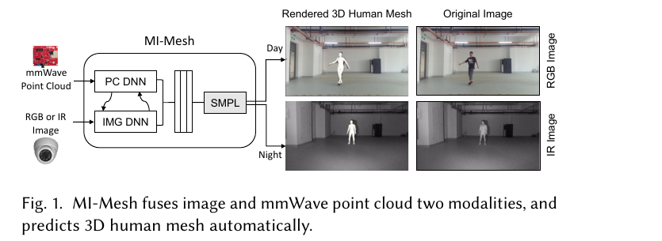
  <figcaption>Figure 1 from the paper. MI-Mesh fuses image and mmWave point cloud modalities to predict 3D human mesh in both RGB and IR settings.</figcaption>
</figure>

## Main Contributions

- Presents a vision-RF fusion system for 3D human mesh construction using commercial mmWave radar and RGB/IR camera devices.
- Designs a multimodal DNN that aligns sparse mmWave point clouds with body-joint structure and fuses them with image features.
- Introduces a **Group Attention Block** for dynamic point-cloud feature extraction under free-form human motion.
- Uses keypoint and silhouette estimation as intermediate supervision before SMPL pose and shape regression.
- Proposes **MaskIMG**, an image-degradation training strategy that reduces over-reliance on camera features and improves robustness.
- Evaluates the prototype across dynamic motions, multiple environments, RGB/IR inputs, weak lighting, blur, and unseen users.

## System and Model Design

MI-Mesh follows three stages: synchronized data collection, mmWave point-cloud preprocessing, and neural mesh construction. The prototype uses a TI AWR1443BOOST mmWave radar with DCA1000EVM streaming and an RGB/IR camera. Radar IF signals are processed with Range-FFT, Doppler-FFT, and 3D-FFT to generate 3D point clouds, which are synchronized with 30 fps image streams.

<figure class="markdown-figure">
  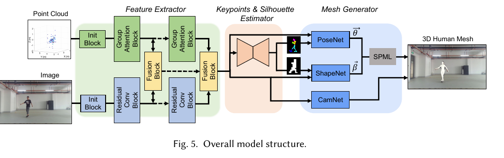
  <figcaption>Figure 5. Overall model structure: image and mmWave branches exchange information through fusion blocks, then keypoint, silhouette, camera, pose, and shape networks feed the SMPL mesh generator.</figcaption>
</figure>

The **Group Attention Block** treats attention heads as dynamic body-part anchors. Instead of assigning radar points to fixed spatial anchors, the model learns which point-cloud evidence is relevant for each body component. This matters because MI-Mesh targets free-form motion, where body parts may move far from fixed anchor positions.

<figure class="markdown-figure">
  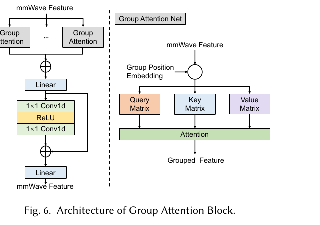
  <figcaption>Figure 6. Group Attention Block architecture for extracting dynamic mmWave point-cloud features.</figcaption>
</figure>

The **Fusion Block** exchanges information between modalities during feature extraction. mmWave point clouds help recover motion and joint cues when visual signals are fuzzy, while images help compensate for the sparsity and ambiguity of radar point clouds.

<figure class="markdown-figure">
  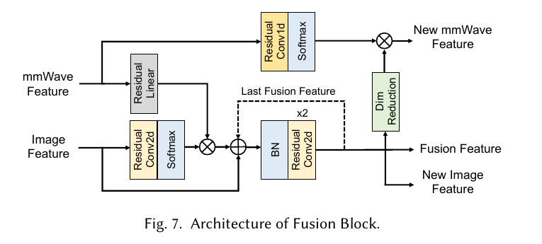
  <figcaption>Figure 7. Fusion Block architecture for bidirectional image-mmWave feature interaction.</figcaption>
</figure>

## Data and Implementation

The dataset contains **63,610 usable frames** collected over more than 30 days from **25 participants** in seven scenarios: laboratory, furnished laboratory, corridor, corner, rehearsal room, living room, and office. The reported split contains **43,336 training frames** and **20,274 testing frames**, including nighttime IR frames. MI-Mesh uses ProHMR-generated 3D mesh supervision, OpenPose keypoints, and projected silhouettes.

MaskIMG randomly applies grayscale conversion, Gaussian blur, color jitter, and color inversion during training. This pushes the network to use mmWave evidence when image quality is degraded instead of relying only on dense visual texture.

## Quantitative Results

The paper evaluates MPVE, MPJPE, and PA-MPJPE in millimeters. Lower is better. The following figures and tables are cropped directly from the PDF.

<figure class="markdown-figure">
  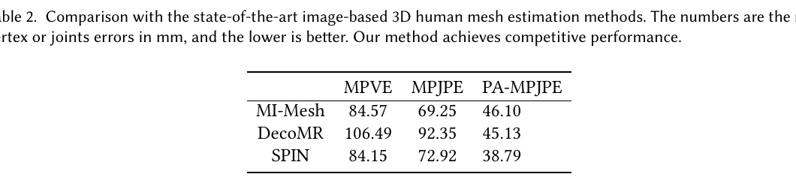
  <figcaption>Table 2. MI-Mesh achieves competitive 3D mesh reconstruction accuracy compared with image-based mesh estimation methods while using multimodal sensing.</figcaption>
</figure>

The RGB/IR comparison supports the paper's 24-hour sensing motivation: MI-Mesh can work with daytime RGB images and nighttime IR images when paired with radar.

<figure class="markdown-figure">
  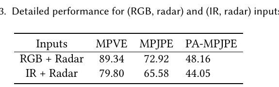
  <figcaption>Table 3. Detailed performance when using RGB plus radar and IR plus radar inputs.</figcaption>
</figure>

The fixed-activity comparison places MI-Mesh next to radar-only mmMesh and image-based baselines. The ablation table shows that image, mmWave, fusion, and MaskIMG each contribute to final performance.

<figure class="markdown-figure">
  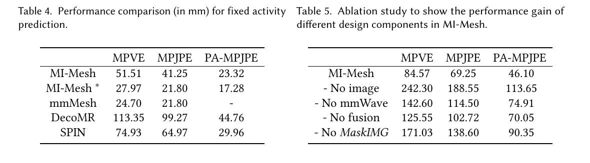
  <figcaption>Tables 4 and 5. Fixed-activity comparison and component ablation. Removing either image, mmWave, fusion, or MaskIMG substantially degrades performance.</figcaption>
</figure>

## Sensor Fusion and Robustness

For intermediate keypoint and silhouette estimation, adding radar improves PCK@0.20 and mIOU, showing that mmWave contributes useful body-structure evidence before the final SMPL regression stage.

<figure class="markdown-figure">
  
  <figcaption>Table 6. Sensor fusion improves keypoint and silhouette estimation when radar is added to image input.</figcaption>
</figure>

MI-Mesh is also evaluated under poor lighting and poor image quality. These settings are central to the motivation for using wireless sensing together with vision.

<figure class="markdown-figure">
  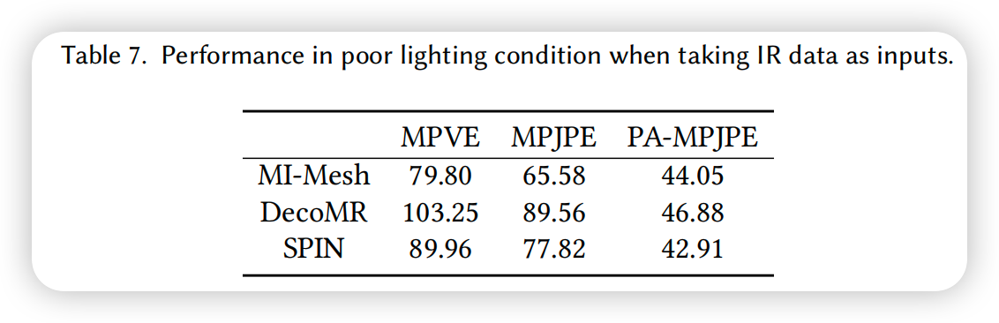
  <figcaption>Table 7. Performance under poor lighting conditions with IR data as input.</figcaption>
</figure>

<figure class="markdown-figure">
  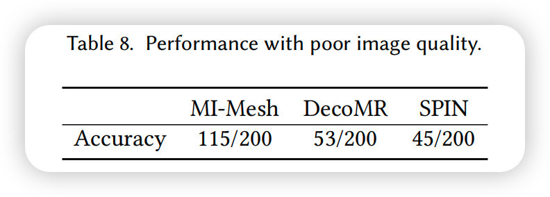
  <figcaption>Table 8. Under poor image quality, MI-Mesh produces more manually judged correct predictions than DecoMR and SPIN.</figcaption>
</figure>

Across different environments, MI-Mesh is tested in both seen and unseen rooms. The qualitative examples and metric plots show how environment changes affect mesh accuracy, especially when multipath and unseen layouts introduce new radar propagation patterns.

<figure class="markdown-figure">
  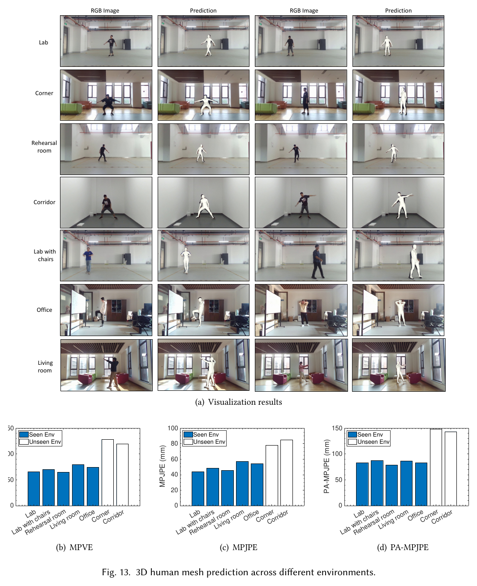
  <figcaption>Figure 13. 3D human mesh prediction across different environments, including seen and unseen environments.</figcaption>
</figure>

The paper further studies strong light and blurred camera-lens conditions. The examples show why mmWave helps: when visual evidence is corrupted, radar point clouds provide additional motion and body-structure cues.

<figure class="markdown-figure">
  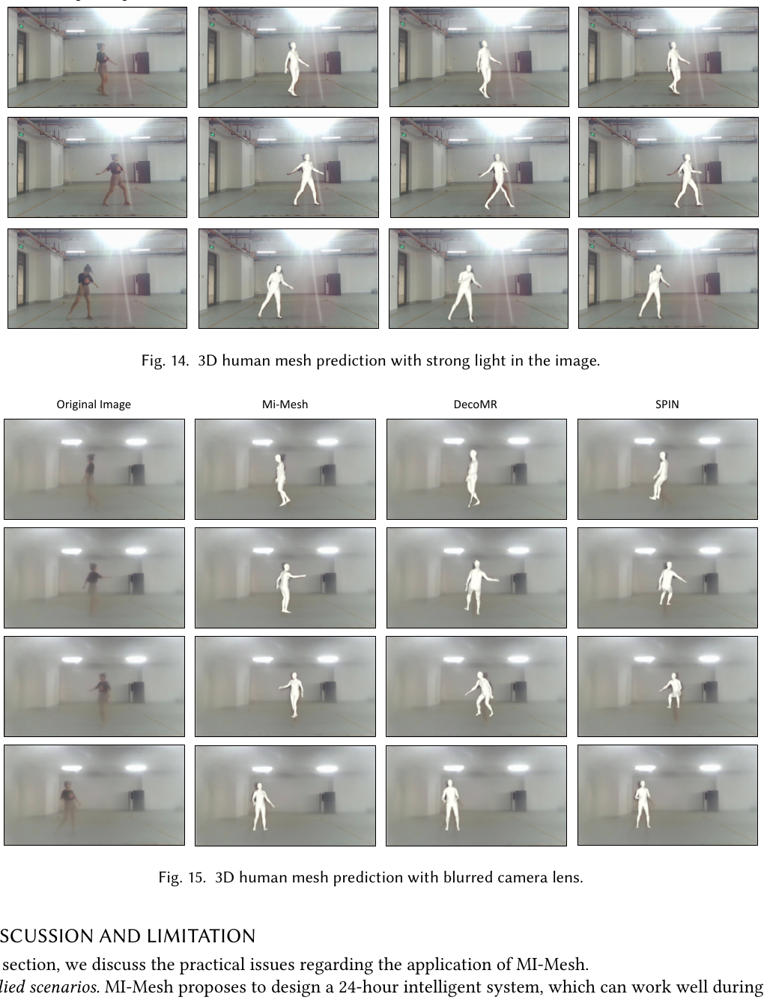
  <figcaption>Figures 14 and 15. Qualitative mesh predictions under strong light and blurred camera-lens conditions.</figcaption>
</figure>

## Runtime

MI-Mesh reports a total processing time of **155 ms** per generated mesh on an Intel i7-11700K and NVIDIA RTX 3060 desktop, including data collection, data processing, and DNN prediction.

<figure class="markdown-figure">
  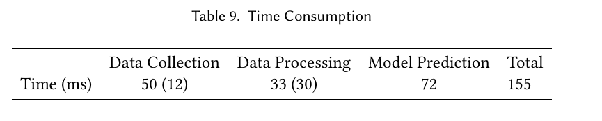
  <figcaption>Table 9. Time consumption of the MI-Mesh pipeline.</figcaption>
</figure>

## Takeaways

- MI-Mesh is a representative example of **vision plus wireless sensing** for embodied 3D perception.
- mmWave point clouds are not used as a camera replacement; they provide complementary geometric and motion evidence.
- Group attention, cross-modal fusion, and MaskIMG are the key mechanisms that make the system robust to free motion and degraded visual conditions.
- The work connects wireless sensing with full-body 3D reconstruction and practical human-centered applications.

## Resources

- [Official paper / publisher page](https://dl.acm.org/doi/10.1145/3580861)
- [Figure 1: system overview](./assets/figure-1-overview.png)
- [Figure 5: model structure](./assets/figure-5-model-structure.png)
- [Figure 6: group attention block](./assets/figure-6-group-attention.png)
- [Figure 7: fusion block](./assets/figure-7-fusion-block.png)
- [Table 2: main comparison](./assets/table-2-main-comparison.png)
- [Table 3: RGB/IR results](./assets/table-3-rgb-ir-results.png)
- [Tables 4 and 5: fixed activity and ablation](./assets/table-4-5-fixed-activity-ablation.png)
- [Table 6: sensor fusion](./assets/table-6-sensor-fusion.png)
- [Table 7: poor lighting](./assets/table-7-poor-lighting.png)
- [Table 8: poor image quality](./assets/table-8-poor-image-quality.png)
- [Figure 13: environments](./assets/figure-13-across-environments.png)
- [Figures 14 and 15: poor image quality](./assets/figure-14-15-poor-image-quality.png)
- [Table 9: runtime](./assets/table-9-runtime.png)

## Citation

```bibtex
@article{ding2023mimesh,
  title = {MI-Mesh: 3D Human Mesh Construction by Fusing Image and Millimeter Wave},
  author = {Ding, Han and Chen, Zhenbin and Zhao, Cui and Wang, Fei and Wang, Ge and Xi, Wei and Zhao, Jizhong},
  journal = {Proceedings of the ACM on Interactive, Mobile, Wearable and Ubiquitous Technologies},
  volume = {7},
  number = {1},
  articleno = {10},
  pages = {1--24},
  year = {2023},
  publisher = {ACM},
  doi = {10.1145/3580861}
}
```
