# Overview

**RadioSEP** addresses a practical limitation in speech enhancement and separation: most existing systems require task-specific models and explicit prior knowledge of the speaker count. In real-world smart-home or voice-assistant scenarios, the number of speakers is often unknown and dynamic, and the audio may include overlapping voices and background noise.

RadioSEP uses a commercial mmWave radar together with noisy audio to build a unified multimodal pipeline. The radar detects and localizes active speakers, extracts speaker-specific physical features from vocal-fold and vocal-tract movements, and provides speaker count information to a single deep neural network that generates the corresponding clean speech streams.

<figure class="markdown-figure">
  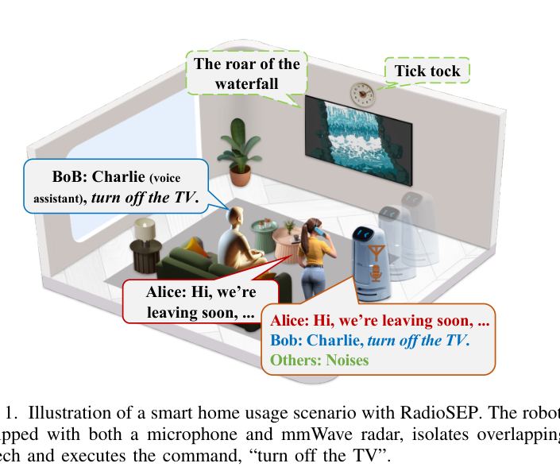
  <figcaption>Figure 1 from the paper. RadioSEP combines microphone audio and mmWave sensing to isolate overlapping speech in a smart-home scenario.</figcaption>
</figure>

## Main Contributions

- Presents **RadioSEP**, an end-to-end mmWave-audio multimodal framework for both speech enhancement and multi-speaker separation.
- Removes the need for **speaker count prior** by using mmWave radar to detect, localize, and profile speakers before speech generation.
- Extracts speaker-specific physical features from mmWave phase and magnitude variations caused by vocal-fold and vocal-tract motion.
- Designs a unified DNN with dual-branch feature extraction, cross-attention based mmWave-audio fusion, and speaker-aware separation.
- Introduces a revised **CGAN-based cross-modality data generation** method to synthesize mmWave-audio pairs for pre-training and improve generalization.

## System Overview

RadioSEP has three core components: speaker perception, cross-modality data generation, and the unified RadioSEP DNN framework. During inference, speaker perception estimates the number of active speakers and produces mmWave-based identity features. During training, CGAN-generated mmWave data augments public speech data, and the DNN is first pre-trained then fine-tuned on real multimodal data.

<figure class="markdown-figure">
  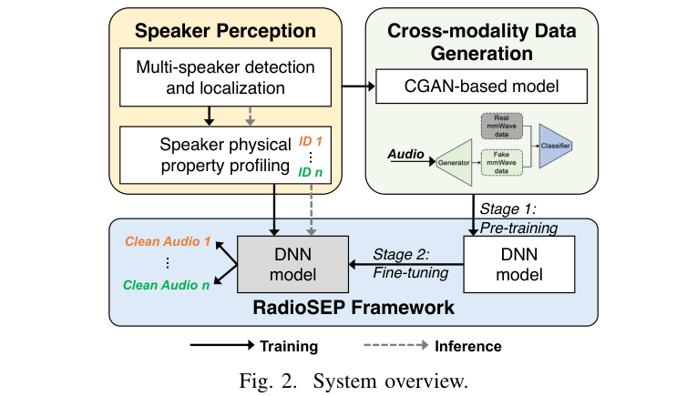
  <figcaption>Figure 2 from the paper. RadioSEP combines speaker perception, CGAN-based data generation, and a unified DNN model.</figcaption>
</figure>

## Speaker Perception with mmWave Radar

RadioSEP uses range-angle heatmaps, MVDR, CFAR, DBSCAN clustering, and Hungarian tracking to detect and localize speakers. This lets the system estimate the active speaker count and filter out silent moving users that may otherwise be detected by radar.

<figure class="markdown-figure">
  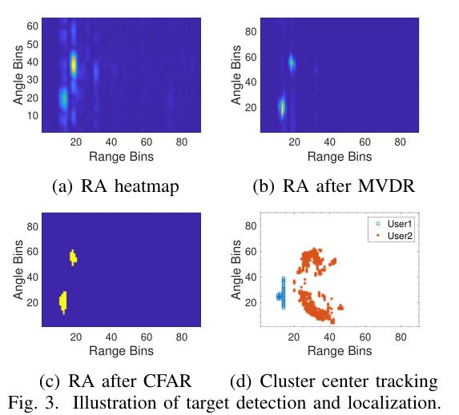
  <figcaption>Figure 3 from the paper. Target detection and localization with range-angle heatmaps, MVDR, CFAR, and cluster tracking.</figcaption>
</figure>

The paper further connects mmWave sensing to the source-filter model of speech production. Vocal folds generate source vibrations, while the vocal tract shapes the signal. RadioSEP monitors phase and magnitude changes at the target range-angle bins to capture speaker-specific articulatory features.

<figure class="markdown-figure">
  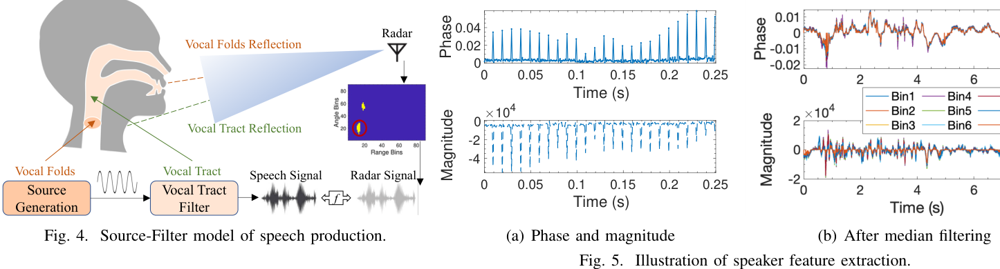
  <figcaption>Figures 4 and 5 from the paper. RadioSEP uses mmWave phase/magnitude variations to capture vocal-fold and vocal-tract related features.</figcaption>
</figure>

A feasibility study on 20 users shows that extracted mmWave features support speaker classification with **75.28% average accuracy**, confirming that the radar features encode speaker-specific physical characteristics rather than only sentence content.

<figure class="markdown-figure">
  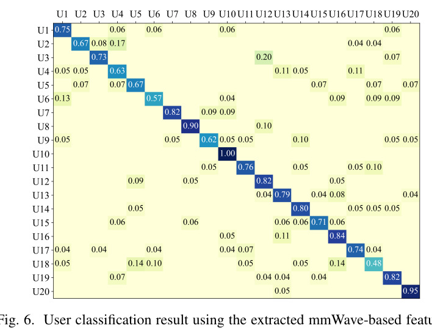
  <figcaption>Figure 6 from the paper. User classification results using extracted mmWave-based features.</figcaption>
</figure>

## RadioSEP Network

The unified network has a dual-branch feature extractor, a fusion block, and a separation block. The audio branch processes noisy speech, while the radar branch processes per-speaker mmWave features. The fusion block uses cross-attention to align and combine audio and radar information, then the separation block generates the required number of clean speech streams according to the radar-estimated speaker count.

<figure class="markdown-figure">
  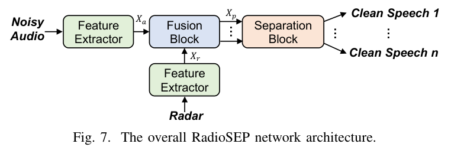
  <figcaption>Figure 7 from the paper. Overall RadioSEP architecture for unified speech enhancement and separation.</figcaption>
</figure>

<figure class="markdown-figure">
  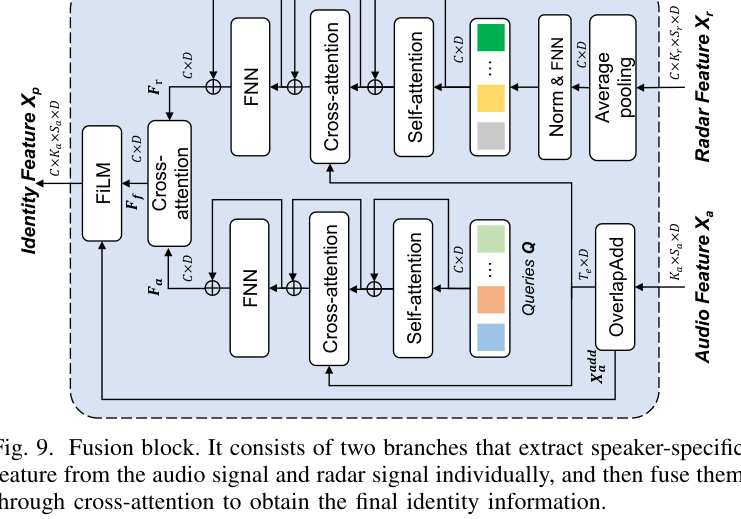
  <figcaption>Figure 9 from the paper. Cross-attention based fusion block for extracting and fusing speaker-specific audio/radar identity features.</figcaption>
</figure>

## Cross-Modality Data Generation

Because public multimodal mmWave-audio datasets are scarce, RadioSEP uses a revised CGAN to generate mmWave signals from public speech data. The discriminator is modified into a classifier that predicts speaker identities, encouraging generated mmWave data to preserve user-specific physical features. The generated data is used for pre-training, then the model is fine-tuned on real collected multimodal data.

<figure class="markdown-figure">
  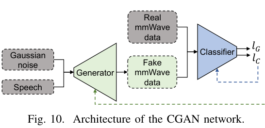
  <figcaption>Figure 10 from the paper. CGAN architecture for generating mmWave data from speech.</figcaption>
</figure>

<figure class="markdown-figure">
  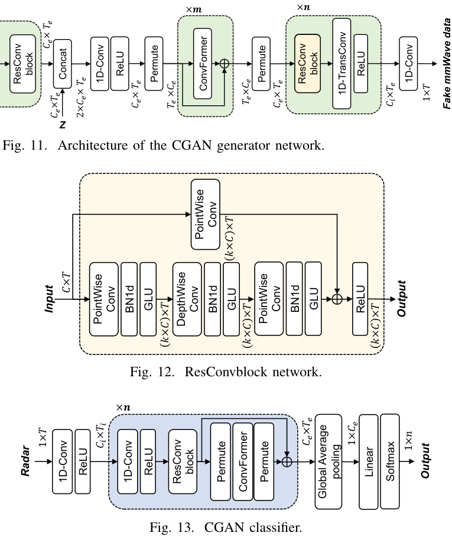
  <figcaption>Figures 11-13 from the paper. Generator, ResConv block, and classifier architectures used in cross-modality data generation.</figcaption>
</figure>

## Dataset and Implementation

The prototype uses a TI **IWR6843ISK** mmWave radar with **DCA1000EVM** and a Soaiy WS10A microphone. The radar uses **3 Tx and 4 Rx antennas**, **4 GHz bandwidth**, and a **1200 Hz** sampling rate. The dataset includes **20 volunteers** reading 100 randomly selected TIMIT sentences, with **1,960 words** in total. The paper also evaluates two lab environments to test robustness under environmental changes.

<figure class="markdown-figure">
  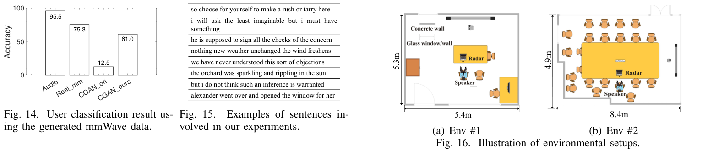
  <figcaption>Figures 14-16 from the paper. Generated mmWave data evaluation, sentence examples, and environmental layouts.</figcaption>
</figure>

## Overall Performance

RadioSEP consistently outperforms audio-only and prior multimodal baselines across enhancement, 2-speaker separation, and 3-speaker separation. In the main comparison, RadioSEP achieves **13.94 dB SiSNR** for enhancement, **19.13 dB SiSNR** for 2-mix separation, and **14.62 dB SiSNR** for 3-mix separation.

<figure class="markdown-figure">
  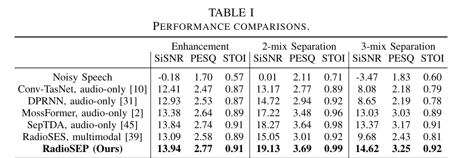
  <figcaption>Table I from the paper. RadioSEP outperforms audio-only and multimodal baselines on enhancement, 2-mix separation, and 3-mix separation.</figcaption>
</figure>

## Generalization and Robustness

RadioSEP maintains strong performance on unseen users and unseen environments. In unseen-user tests, RadioSEP reaches **13.70 dB SiSNR** for enhancement and **16.37 dB SiSNR** for 2-mix separation, while RadioSEP* reaches **18.31 dB SiSNR** on the unseen-user/environment setting reported in the table.

<figure class="markdown-figure">
  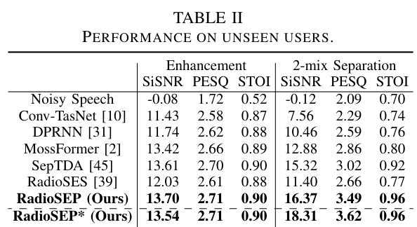
  <figcaption>Table II from the paper. RadioSEP generalizes to unseen users and the RadioSEP* setting.</figcaption>
</figure>

The system is also evaluated under different speaker angles, distances, and environments. The results show only mild degradation across 0-30 degrees, 0.5-1.5 m, and a second environment.

<figure class="markdown-figure">
  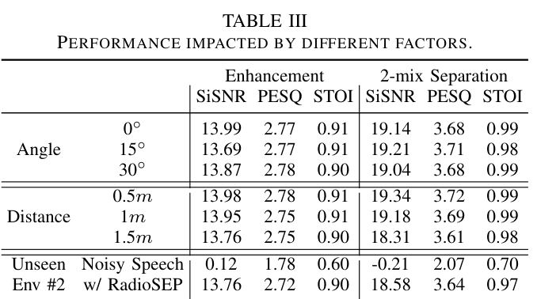
  <figcaption>Table III from the paper. Robustness under different angles, distances, and unseen environment factors.</figcaption>
</figure>

## More Speakers and Ablation

RadioSEP scales beyond the 2- and 3-speaker cases. On 4-mix and 5-mix separation, it still outperforms RadioSES, achieving **12.87 dB SiSNR** for 4-mix and **11.56 dB SiSNR** for 5-mix separation.

<figure class="markdown-figure">
  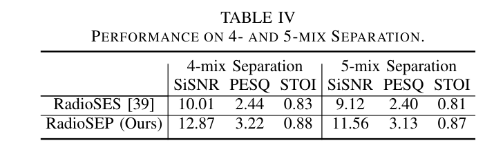
  <figcaption>Table IV from the paper. RadioSEP remains effective on 4- and 5-mix separation.</figcaption>
</figure>

The ablation study shows that CGAN-generated/noisy radar replacement improves unseen-speaker generalization, cross-attention style fusion is important, and the model remains reasonably robust even when radar input partially fails.

<figure class="markdown-figure">
  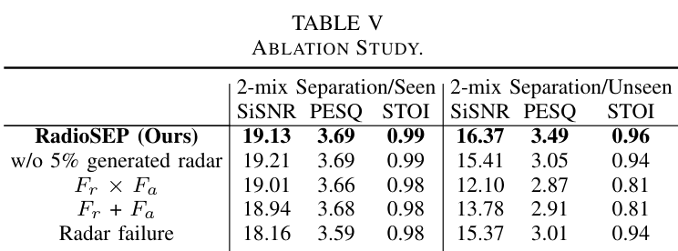
  <figcaption>Table V from the paper. Ablation study on generated radar augmentation, fusion strategy, and radar failure.</figcaption>
</figure>

## Resources

- [Project Website](https://radiosep.github.io)
- [System overview figure](./assets/figure-2-system-overview.png)
- [Overall performance table](./assets/table-1-overall-performance.png)
- [Ablation table](./assets/table-5-ablation-study.png)

## Citation

```bibtex
@inproceedings{han2026radiosep,
  title = {mmWave-Aided Unified Speech Enhancement and Separation without Speaker Count Prior},
  author = {Han, Dachao and Huang, Teng and Ding, Han and Zhao, Cui and Wang, Fei and Wang, Ge and Xi, Wei},
  booktitle = {IEEE INFOCOM},
  year = {2026}
}
```
