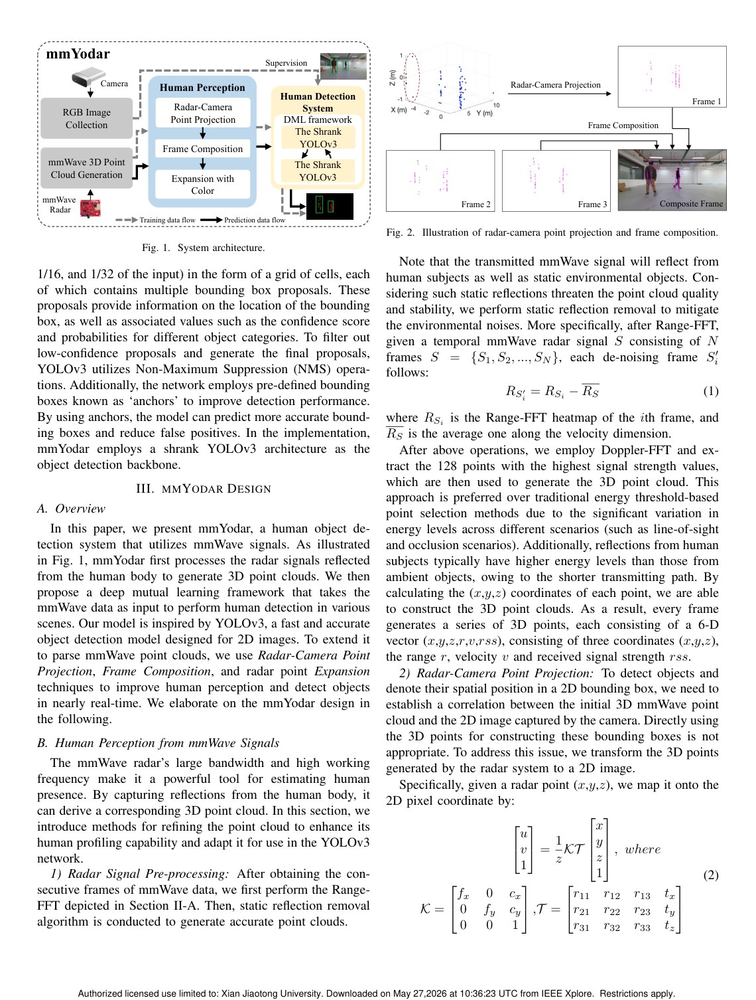
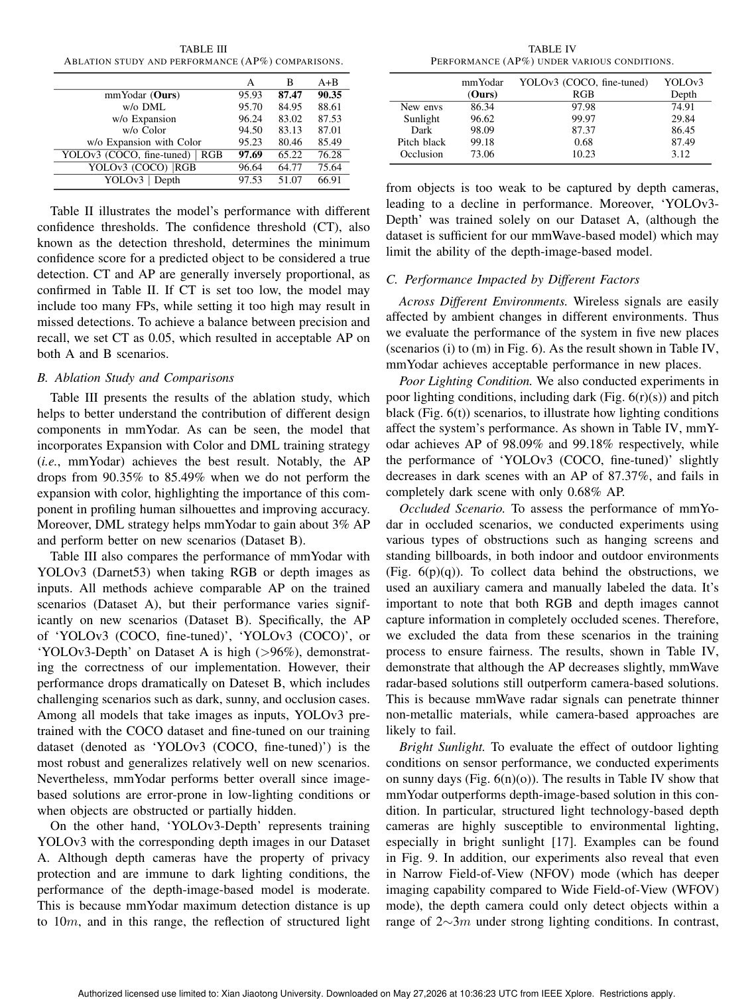
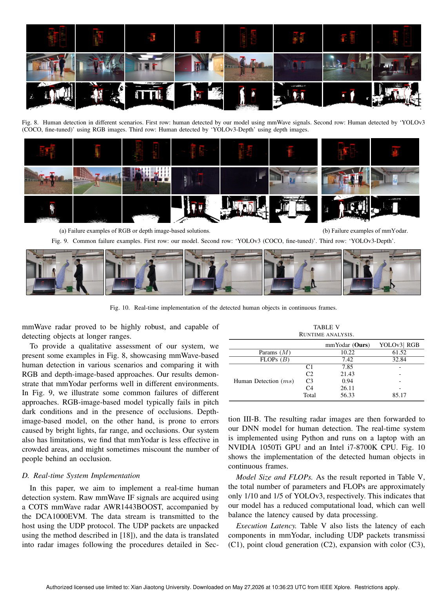

# Overview

mmYodar explores human object detection with mmWave radar. The motivation is clear: vision detectors can be accurate, but they depend on lighting, line of sight, and visual privacy. mmWave signals provide a different sensing channel that works in low light and can penetrate some nonmetallic obstacles, but their point clouds are sparse and difficult to interpret directly.

The system transforms mmWave point clouds into radar images, expands points based on radar angle resolution, and uses a deep mutual learning framework to train a lightweight detector.

## Main Contributions

- Presents a mmWave-based human object detection system using commercial radar signals.
- Converts 3D point clouds into 2D radar images suitable for image-style detection.
- Expands human-related points with color according to angle resolution to improve representation.
- Uses deep mutual learning to improve lightweight detection.
- Releases code and dataset through the project repository noted in the paper.

## Method Design

The raw radar output is first processed into a 3D point cloud. Because that representation is sparse, mmYodar projects it into a 2D image-like format. Point expansion helps compensate for the limited angular resolution of the radar, making the human profile more visible to the detector. The final detection model is designed to be lightweight enough for near-real-time use.

## Evaluation Highlights

The paper reports an average precision of 90.35 percent across indoor and outdoor scenarios, including different lighting and occlusion conditions. It also discusses real-time implementation, showing that mmWave-based detection can be practical rather than only a proof of concept.

## Relationship to mmYodar+

This page describes the SECON 2023 version. The later mmYodar+ page extends the same line of work with stronger human profiling, biometric filtering, and improved average precision. Keeping both pages is useful because this work establishes the original radar-image detection pipeline.

## Takeaways

mmYodar is a bridge between RF sensing and object detection. It shows that with the right representation, mmWave radar can be integrated into detection pipelines that are usually dominated by cameras.

## Paper Screenshots: Method, Principle, And Results

The screenshots below are cropped from the paper PDF and are placed next to the reading notes so the page shows the actual method diagrams, principle illustrations, and result evidence rather than only prose.

<figure class="markdown-figure">
  
  <figcaption>mmYodar radar-camera supervision and deep mutual learning framework. The figure shows how mmWave point clouds are transformed into a human-detection representation.</figcaption>
</figure>

<figure class="markdown-figure">
  
  <figcaption>Ablation study and AP comparison. The table isolates the effects of expansion, color, and deep mutual learning.</figcaption>
</figure>

<figure class="markdown-figure">
  
  <figcaption>Qualitative detection examples across scenarios. These screenshots show where radar-based detection remains useful when RGB detection is unreliable.</figcaption>
</figure>

## Resources

- [Official paper / publisher page](https://doi.org/10.1109/secon58729.2023.10287427)
- [Cover image](./assets/cover.svg)

## Citation

```bibtex
@inproceedings{mmyodar-lightweight-and-robust-object-detection-using-mmwave-signals,
  title = {mmYodar: Lightweight and Robust Object Detection using mmWave Signals},
  author = {C Yuance and H Ding and D Han and T Zhang and G Wang and C Zhao and F Wang and W Xi and ...},
  booktitle = {20th Annual IEEE International Conference on Sensing, Communication, and ..., 2023},
  year = {2023}
}
```
