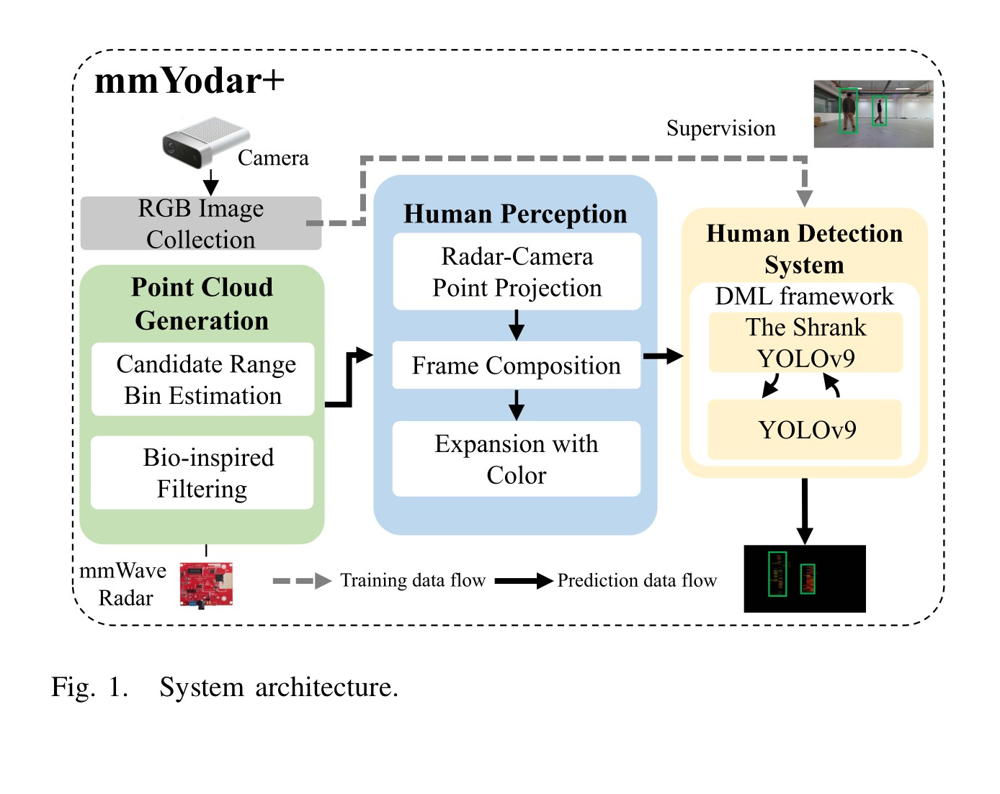
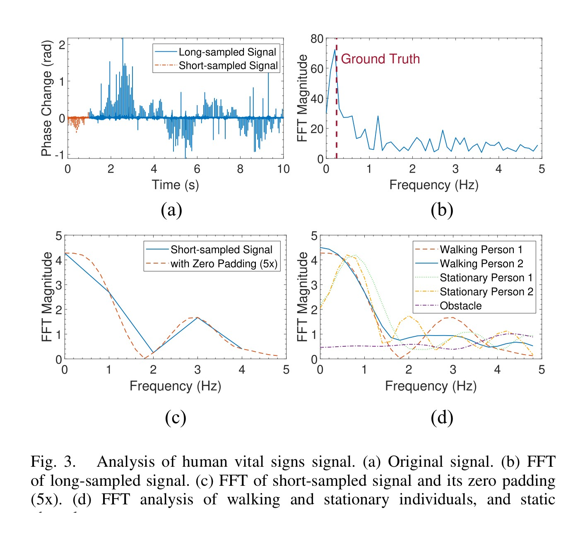
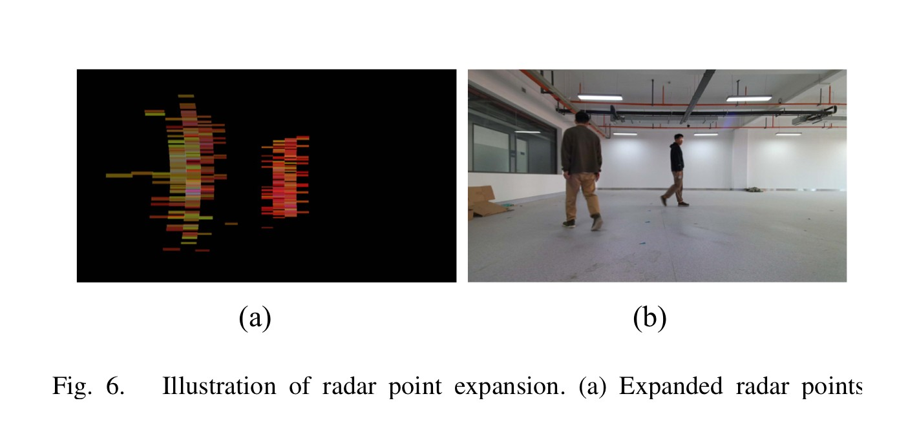
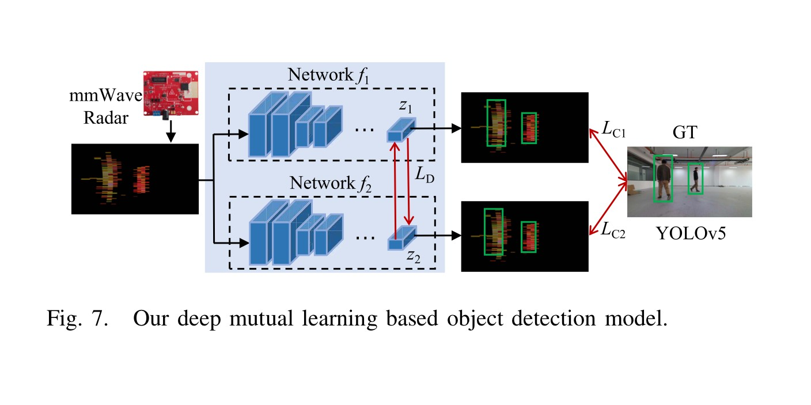
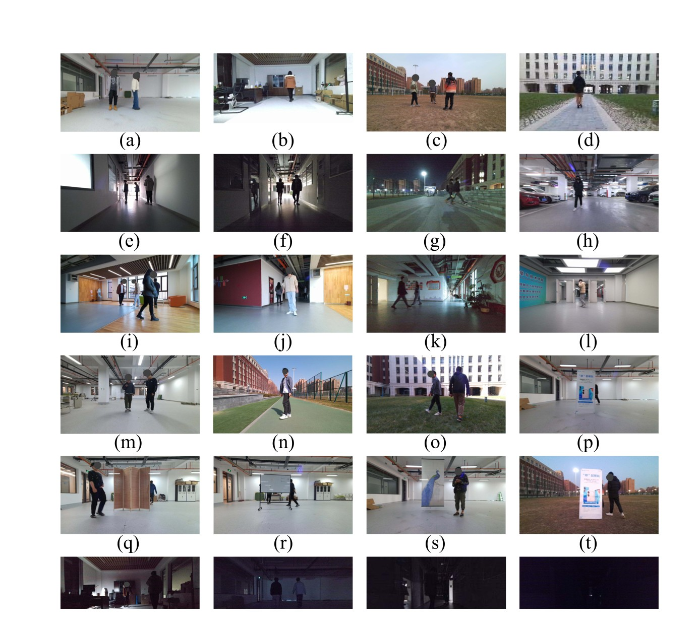
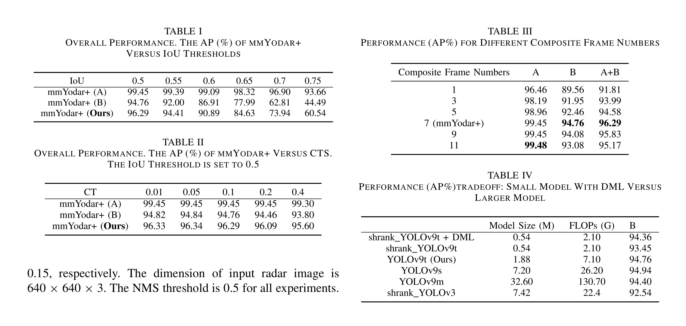
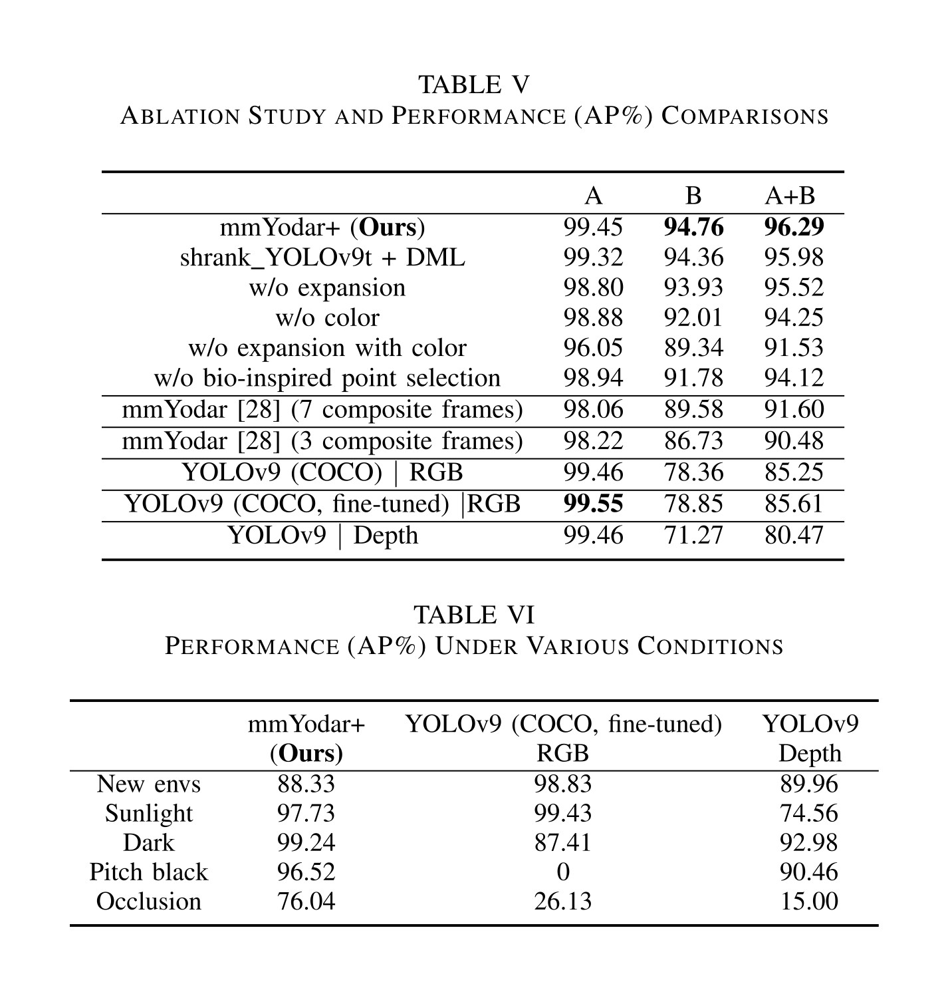
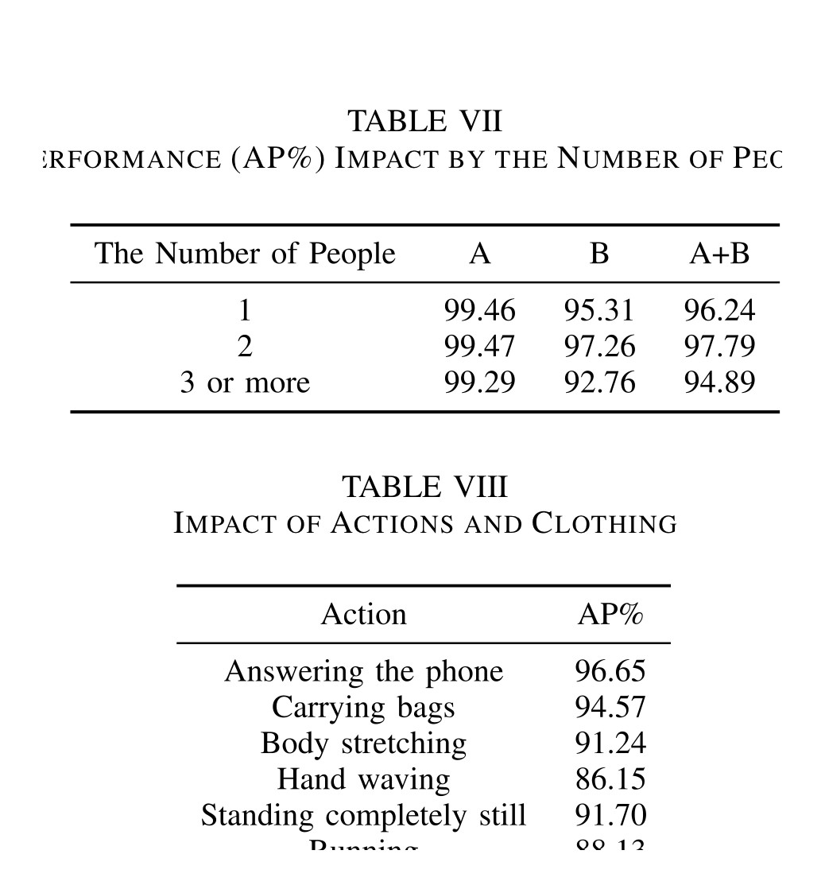

# Overview

mmYodar+ studies robust human detection with commodity millimeter-wave radar. Unlike camera-based detectors, mmWave sensing works in darkness, protects visual privacy, and remains usable under partial occlusion. The technical difficulty is that mmWave point clouds are sparse and noisy, so a detector trained directly on the raw points has limited visual structure to exploit.

The paper addresses this by building a signal-to-image pipeline for radar. It first extracts 3D point clouds from raw mmWave signals, selects points that are likely to come from humans with biometric evidence, expands those points according to the radar angle resolution, and encodes range, velocity, and overlap information as a 2D radar image. A YOLOv9-family detector is then trained with deep mutual learning (DML), keeping the deployed model lightweight while preserving detection accuracy.

<figure class="markdown-figure">
  
  <figcaption>Overall mmYodar+ architecture. The system converts mmWave returns into human-oriented radar images, then performs lightweight human detection.</figcaption>
</figure>

## Why It Matters

Human detection is a basic capability for elder care, home monitoring, smart buildings, indoor security, and context-aware IoT services. Vision models are strong when lighting and viewpoints are favorable, but they can fail in pitch-black environments, under occlusion, or when cameras are unacceptable for privacy reasons. mmYodar+ shows that a carefully designed mmWave representation can support reliable detection without relying on RGB images.

The key idea is not simply to apply an image detector to radar data. The paper reshapes the sensing modality first: human-related radar points are selected, densified, and color-coded so the downstream network sees a structured 2D representation rather than an extremely sparse point set.

## Method

The sensing front end uses Range-FFT and MVDR beamforming to build radar point clouds. Candidate range bins are selected with CA-CFAR, and the system scans azimuth angles from -45 to 45 degrees. To reduce clutter, mmYodar+ adds a bio-inspired point selection step: a point is treated as human-related when its short-time spectrum contains a strong peak in the 0-2 Hz range, consistent with breathing and heartbeat dynamics.

After point selection, the paper projects the 3D radar point cloud into a 2D radar image. Because each raw point occupies too little area for an image detector, mmYodar+ expands points based on radar angular resolution. It also uses color channels to preserve physical information: range, velocity, and overlap ratio are normalized into RGB-like channels. This gives the detector more separable visual patterns while keeping the signal semantics tied to radar measurements.

<figure class="markdown-figure">
  
  <figcaption>Bio-inspired point selection. Human-related radar points are filtered by checking vital-sign frequency evidence before building the detection image.</figcaption>
</figure>

<figure class="markdown-figure">
  
  <figcaption>Radar point expansion. Sparse point clouds are expanded into a denser image representation that is easier for object detectors to learn from.</figcaption>
</figure>

## Lightweight Detection With DML

The detection model is trained with a deep mutual learning framework. A compressed YOLOv9-style student and a stronger peer network learn from supervised detection losses and from one another through a mutual MSE-based distillation loss. The compact network is retained for deployment.

This training design matters because mmWave human detection needs both robustness and deployability. The paper reports that the DML-trained compressed detector keeps high AP while sharply reducing parameters and FLOPs compared with larger YOLOv9 variants.

<figure class="markdown-figure">
  
  <figcaption>Deep mutual learning for the lightweight detector. The deployed model benefits from peer learning during training without carrying the larger model at inference time.</figcaption>
</figure>

## Dataset And Implementation

The prototype uses a Texas Instruments AWR1443BOOST mmWave radar with DCA1000EVM capture hardware and an Azure Kinect for synchronized RGB/depth reference. Radar frames are collected at 20 fps, with 240 chirps per frame; the RGB/depth stream runs at 30 fps. The paper reports a maximum modality delay of about 0.05 seconds.

The dataset contains 13,848 sample frames from 27 volunteers, including indoor and outdoor settings, lighting changes, different people counts, clothing variations, actions, and occlusion. Dataset A is split into training, validation, and testing with 9,172, 1,150, and 1,151 samples, respectively. Dataset B is held out for broader scenario testing with 2,375 samples.

<figure class="markdown-figure">
  
  <figcaption>Evaluation scenarios. The dataset covers regular indoor/outdoor environments and challenging cases such as darkness, occlusion, and varied human actions.</figcaption>
</figure>

## Evaluation Highlights

At IoU 0.5, mmYodar+ reaches 99.45 AP on Dataset A, 94.76 AP on Dataset B, and 96.29 AP over the combined test set. The best default configuration uses seven composite frames and confidence threshold 0.1, balancing performance across familiar and held-out scenarios.

| Setting | Dataset A AP | Dataset B AP | A+B AP |
|---|---:|---:|---:|
| mmYodar+ | 99.45 | 94.76 | 96.29 |
| Shrank YOLOv9t + DML | 99.32 | 94.36 | 95.98 |
| Without point expansion | 98.80 | 93.93 | 95.52 |
| Without color encoding | 98.88 | 92.01 | 94.25 |
| Without bio-inspired point selection | 98.94 | 91.78 | 94.12 |
| Earlier mmYodar baseline, 7 composite frames | 98.06 | 89.58 | 91.60 |

<figure class="markdown-figure">
  
  <figcaption>Main quantitative results. mmYodar+ combines high AP with a compact detector and clear gains over earlier radar-image baselines.</figcaption>
</figure>

## Robustness

The strongest evidence for the system is the robustness analysis. The mmWave-based detector keeps working in conditions where RGB/depth sensing becomes unreliable, especially pitch-black and occluded scenes. On Dataset B, mmYodar+ reports 96.52 AP in pitch-black conditions, while RGB detection drops to 0 AP. Under occlusion, mmYodar+ reaches 76.04 AP, compared with 26.13 AP for RGB and 15.00 AP for depth.

| Scenario | mmYodar+ AP | RGB AP | Depth AP |
|---|---:|---:|---:|
| New environments | 88.33 | 98.83 | 89.96 |
| Sunlight | 97.73 | 99.43 | 74.56 |
| Dark | 99.24 | 87.41 | 92.98 |
| Pitch black | 96.52 | 0.00 | 90.46 |
| Occlusion | 76.04 | 26.13 | 15.00 |

<figure class="markdown-figure">
  
  <figcaption>Ablation and robustness results. The radar representation helps preserve detection performance under lighting failure and occlusion.</figcaption>
</figure>

The paper also analyzes people count, actions, and clothing. Detection remains strong with one or two people and becomes harder when three or more people are close together, because their radar point clouds overlap in azimuth. Actions such as hand waving, stillness, and running are more challenging than walking, but the method remains usable across common behaviors.

<figure class="markdown-figure">
  
  <figcaption>People-count and behavior studies. The main limitation appears when several people are spatially close and their radar reflections overlap.</figcaption>
</figure>

## Takeaways

mmYodar+ is useful as a reference design for privacy-preserving human detection with RF sensing. Its main lesson is that representation engineering and model compression should be considered together: the radar image construction makes sparse mmWave signals learnable, while DML keeps the final detector lightweight enough for practical deployment.

The paper is most convincing for sparse human activity scenarios such as homes, offices, elder care, and indoor monitoring. The authors note that crowded or tightly grouped people remain difficult, suggesting that future work may need fusion-based or stronger multi-target reasoning methods for dense scenes.

## Resources

- [Official paper / publisher page](https://doi.org/10.1109/JIOT.2025.3577559)
- [Method crop](./assets/paper-method.jpg)
- [Bio-inspired point selection crop](./assets/paper-biometric-filter.jpg)
- [Main results crop](./assets/paper-results.jpg)
- [Robustness crop](./assets/paper-robustness.jpg)

## Citation

```bibtex
@article{chang2025mmyodarplus,
  title = {mmYodar+: Robust Human Detection Using mmWave Signals},
  author = {Chang, Yuance and Ding, Han and Cao, Feng and Zhao, Cui and Wang, Fei and Wang, Ge and Wang, Zhi and Xi, Wei},
  journal = {IEEE Internet of Things Journal},
  volume = {12},
  number = {16},
  pages = {33702--33713},
  year = {2025},
  doi = {10.1109/JIOT.2025.3577559}
}
```
