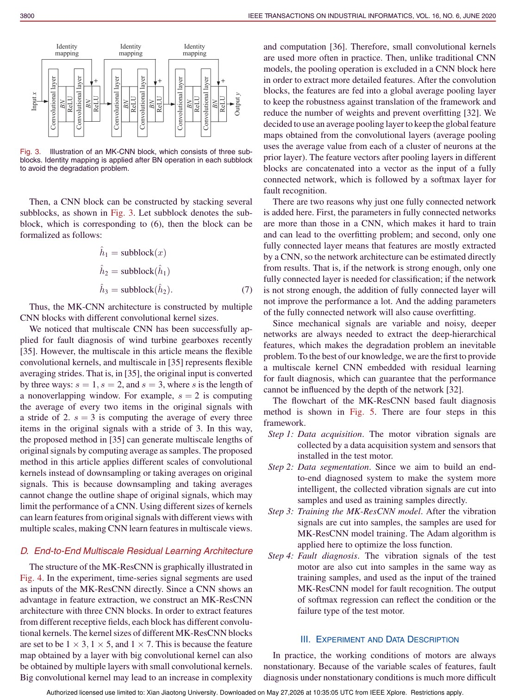
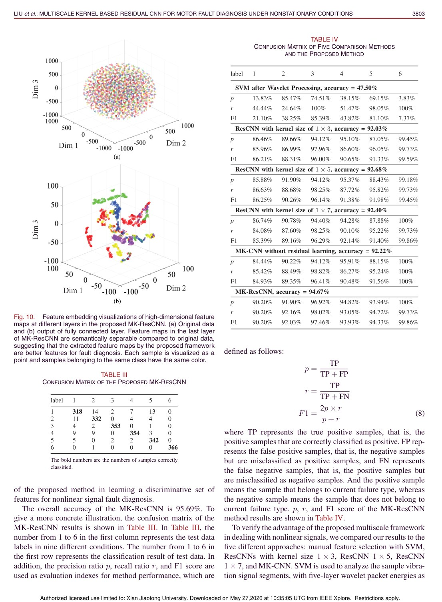
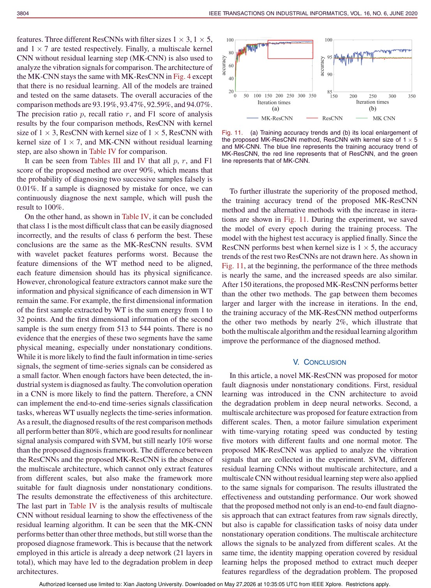

# Overview

Motor vibration signals under nonstationary operating conditions are complex: the same fault can appear with different temporal patterns as speed and load change. Standard feature engineering may miss these variations, while deeper CNNs can suffer from degradation when simply stacked.

This paper proposes a multiscale-kernel residual CNN for motor fault diagnosis. The method uses convolution kernels of different scales to capture diverse signal patterns and residual learning to make deeper feature extraction trainable.

## Main Contributions

- Applies multiscale convolution kernels to capture fault patterns at different temporal scales.
- Embeds residual learning into the CNN to avoid degradation in deeper networks.
- Builds an end-to-end architecture for raw vibration signal classification.
- Evaluates normal motors and five fault categories under nonstationary conditions.
- Shows stronger performance than comparison methods including feature-engineering baselines.

## Method Design

The multiscale kernel module reflects the fact that fault signatures do not have one fixed temporal scale. Different kernel sizes observe different local patterns, improving robustness when operating conditions vary. Residual connections allow the model to become deeper without losing optimization stability, enabling hierarchical representation learning from raw signals.

## Evaluation Highlights

The paper compares MK-ResCNN with traditional machine-learning methods and other deep models. The discussion notes that wavelet-transform features can lose chronological meaning when feature dimensions are aligned across segments, while CNN-style temporal convolution can preserve pattern information more naturally. MK-ResCNN achieves the best or among-best results in the reported comparisons.

## Takeaways

This work is a clear example of adapting CNN design to physical signal characteristics. Multiscale kernels address nonstationarity, while residual learning addresses depth and optimization.

## Paper Screenshots: Method, Principle, And Results

The screenshots below are cropped from the paper PDF and are placed next to the reading notes so the page shows the actual method diagrams, principle illustrations, and result evidence rather than only prose.

<figure class="markdown-figure">
  
  <figcaption>Multiscale kernel CNN block and residual learning principle. The diagram shows how different temporal scales are captured in one residual block.</figcaption>
</figure>

<figure class="markdown-figure">
  
  <figcaption>Feature embedding visualization across network layers. This screenshot helps explain how the learned representation becomes more separable.</figcaption>
</figure>

<figure class="markdown-figure">
  
  <figcaption>Ablation and comparison results for MK-ResCNN. The result page shows the role of multiscale kernels and residual learning.</figcaption>
</figure>

## Resources

- [Official paper / publisher page](https://doi.org/10.1109/tii.2019.2941868)
- [Cover image](./assets/cover.svg)

## Citation

```bibtex
@inproceedings{multiscale-kernel-based-residual-convolutional-neural-network-for-motor-fault-diagnosis-under-nonstationary-conditions,
  title = {Multiscale Kernel Based Residual Convolutional Neural Network for Motor Fault Diagnosis Under Nonstationary Conditions},
  author = {Ruonan Liu and Fei Wang and Boyuan Yang# and S. Joe Qin},
  booktitle = {IEEE Transactions on Industrial Informatics, 2020},
  year = {2020}
}
```
