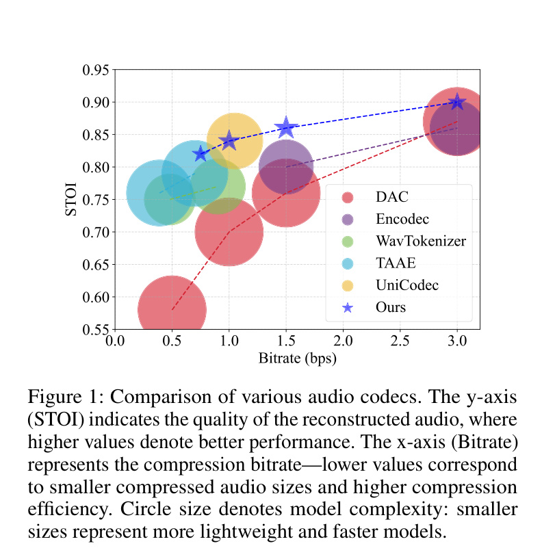
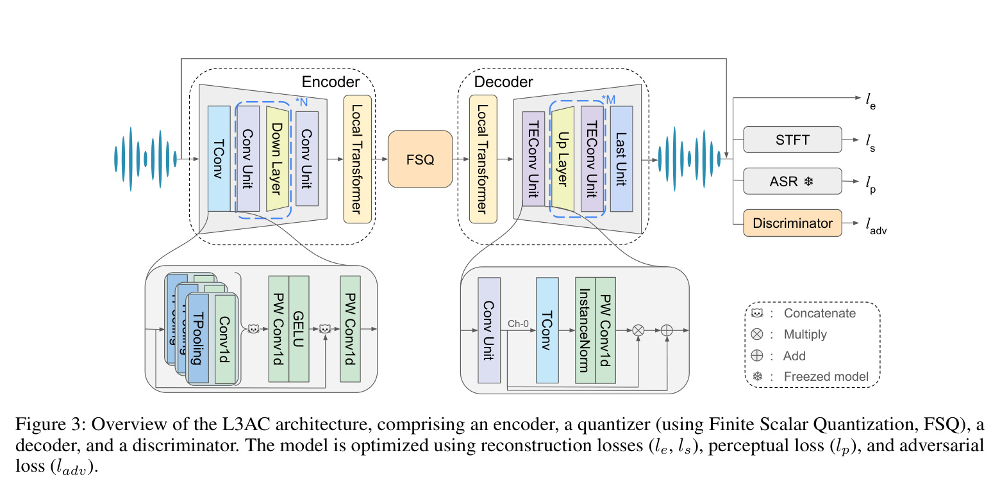
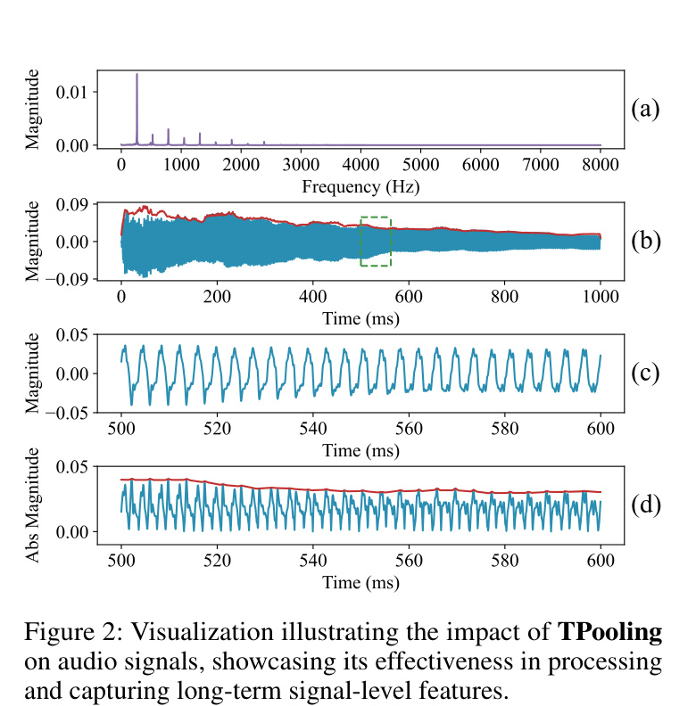
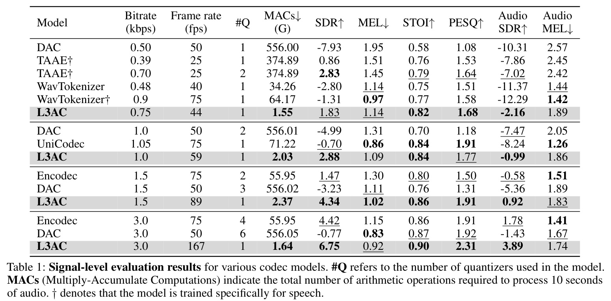
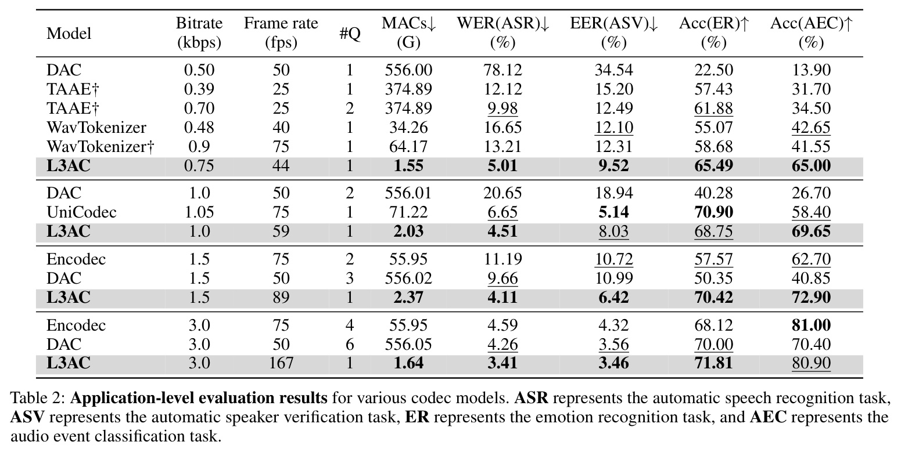
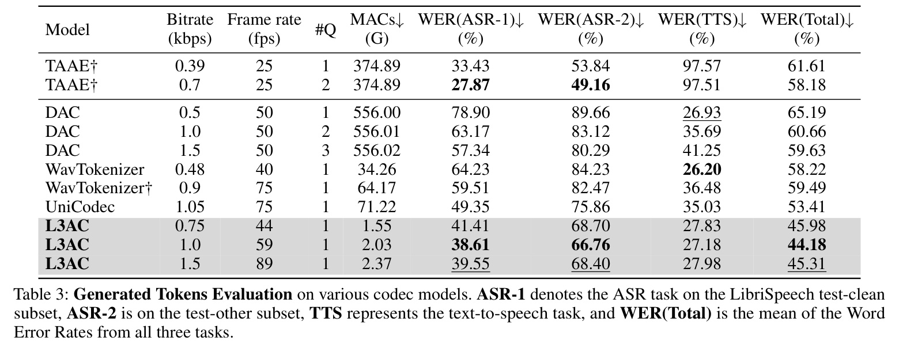
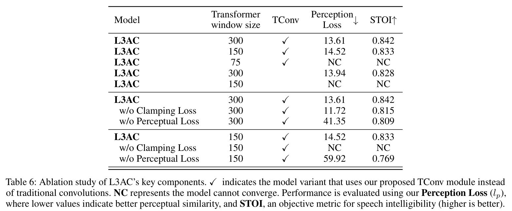

# Overview

Neural audio codecs are becoming infrastructure for both compression and generative audio modeling. They turn waveform audio into compact discrete tokens, which can then be reconstructed or modeled by downstream audio language models. The problem is that many high-quality codecs use large networks and multiple residual quantizers, creating heavy computation and hierarchical token streams that are awkward for downstream models.

This paper introduces **L3AC**, a lightweight neural audio codec built around a deliberately simple question: how far can one quantizer go if the architecture is designed carefully around audio structure? L3AC uses a single finite scalar quantizer, a compact encoder-decoder, local Transformer blocks, and the proposed TConv/TPooling design to model both short-term waveform details and longer acoustic variation.

<figure class="markdown-figure">
  
  <figcaption>Codec quality and efficiency. L3AC appears as the star-marked curve, aiming for high STOI at lower model complexity and practical bitrate settings.</figcaption>
</figure>

## Main Contributions

- Proposes a **single-quantizer** audio codec that avoids the hierarchical token streams produced by multi-quantizer systems.
- Designs a lightweight codec architecture combining convolutional processing, local Transformer modules, and finite scalar quantization.
- Introduces **TConv** and **TPooling** to capture multi-scale temporal variation in audio signals.
- Uses reconstruction, spectrogram, perceptual, and adversarial losses to preserve waveform quality while keeping the model compact.
- Shows that L3AC can match or outperform stronger neural codec baselines while reducing computation by an order of magnitude in several settings.

## Method

L3AC follows the standard neural codec structure: an encoder maps waveform audio into latent representations, a quantizer discretizes those features, and a decoder reconstructs the waveform. The paper's main simplification is that this pipeline uses only one quantizer. Instead of depending on many residual quantizers to refine reconstruction quality, L3AC puts more of the modeling burden into efficient temporal feature extraction.

The quantizer is based on finite scalar quantization (FSQ). This helps support a large codebook without the collapse problems that can affect traditional vector quantizers. The single token stream is also easier to consume in downstream generation settings because there is no need to combine or predict multiple quantizer levels.

<figure class="markdown-figure">
  
  <figcaption>L3AC architecture. The codec combines an encoder, FSQ quantizer, decoder, and discriminator, optimized with waveform, spectrogram, perceptual, and adversarial losses.</figcaption>
</figure>

## TConv And TPooling

Audio has structure at several temporal scales. Very short waveform oscillations matter, but so do longer amplitude and acoustic trends. The paper argues that shallow convolutional layers can miss these longer signal-level patterns, while simply increasing model size defeats the goal of a lightweight codec.

To address this, L3AC introduces **TPooling**, a two-stage pooling operation that smooths short-term oscillations while preserving longer temporal envelopes. TConv then uses multiple TPooling branches and convolutional processing to extract temporal features at different resolutions. This gives the encoder and decoder a larger effective receptive field without turning the codec into a heavy global-attention model.

<figure class="markdown-figure">
  
  <figcaption>TPooling motivation. The module is designed to expose longer signal-level trends that are hidden by rapid waveform oscillations.</figcaption>
</figure>

## Results

The signal-level evaluation compares L3AC against DAC, EnCodec, WavTokenizer, TAAE, and UniCodec across several bitrates. L3AC keeps a single quantizer while reporting much lower MACs than heavier baselines. For example, at around 1.0 kbps, L3AC uses about **2.03G MACs** compared with **556.01G** for DAC and **71.22G** for UniCodec, while staying competitive on SDR, STOI, PESQ, and spectral metrics.

<figure class="markdown-figure">
  
  <figcaption>Signal-level results. L3AC keeps one quantizer and low MACs while remaining competitive or strongest across several objective reconstruction metrics.</figcaption>
</figure>

The application-level evaluation tests whether reconstructed audio remains useful for downstream tasks such as automatic speech recognition, speaker verification, audio captioning, and audio classification. This is important because an audio codec used as a tokenizer should preserve task-relevant information, not only waveform similarity.

<figure class="markdown-figure">
  
  <figcaption>Application-level results. The codec is evaluated through downstream ASR, ASV, AAC, and ACls metrics, showing that compact tokenization can preserve task utility.</figcaption>
</figure>

## Token Quality

The paper also evaluates generated tokens directly. This is where the one-quantizer design becomes especially practical: a single token stream is easier for language-model-style audio systems to predict. The reported token evaluation covers ASR, ASV, AAC, and classification tasks over several datasets, comparing L3AC with both multi-quantizer and single-quantizer baselines.

<figure class="markdown-figure">
  
  <figcaption>Generated-token evaluation. L3AC is evaluated not only as a reconstruction codec, but also as a tokenizer for downstream audio modeling.</figcaption>
</figure>

## Ablations

The ablation study supports the main design choices. Larger local Transformer windows improve convergence and quality, while removing TConv or key losses weakens performance. The table also shows that some reduced variants fail to converge, which suggests that the lightweight design still needs the right temporal modeling and training losses to remain stable.

<figure class="markdown-figure">
  
  <figcaption>Ablation results. TConv, window size, clamping loss, and perceptual loss all affect stability and reconstruction quality.</figcaption>
</figure>

## Takeaways

The main lesson is that codec simplicity can be recovered through architecture, not only through quantizer stacking. L3AC keeps the token interface simple, reduces compute, and remains useful for reconstruction and downstream token modeling. That makes it relevant for deployable audio compression, audio-language-model tokenizers, and lightweight generative audio pipelines.

## Resources

- [arXiv paper](https://arxiv.org/abs/2504.04949)
- [Code](https://github.com/zhai-lw/L3AC)
- [Architecture crop](./assets/paper-architecture.jpg)
- [Signal-level results crop](./assets/paper-signal-results.jpg)
- [Ablation crop](./assets/paper-ablation.jpg)

## Citation

```bibtex
@article{zhai2025one,
  title = {One Quantizer is Enough: Toward a Lightweight Audio Codec},
  author = {Zhai, Linwei and Ding, Han and Zhao, Cui and Wang, Fei and Wang, Ge and Wang, Zhi and Xi, Wei},
  journal = {arXiv preprint arXiv:2504.04949},
  year = {2025}
}
```
