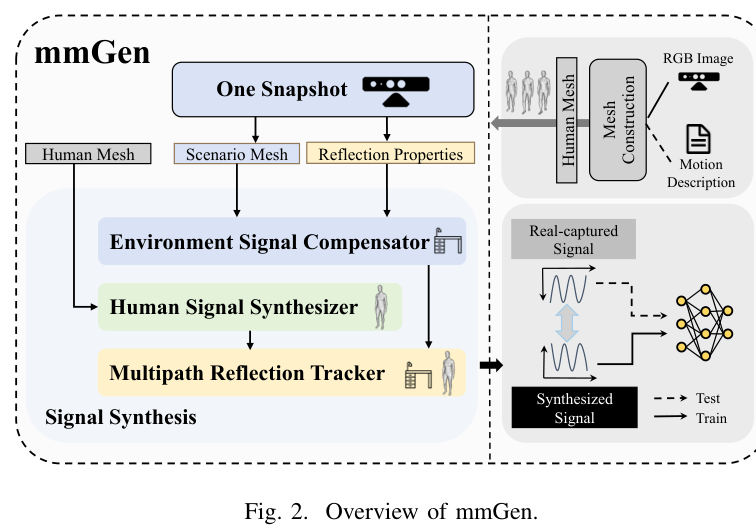
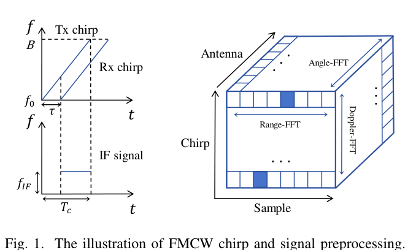
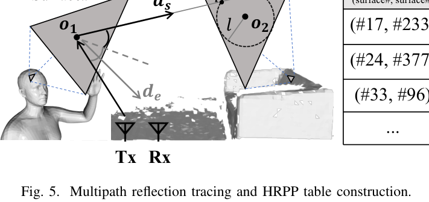
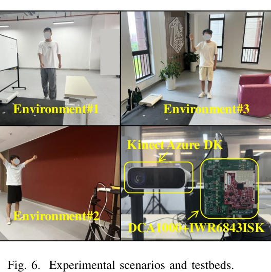
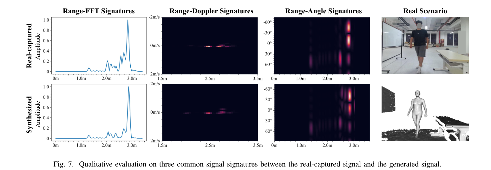
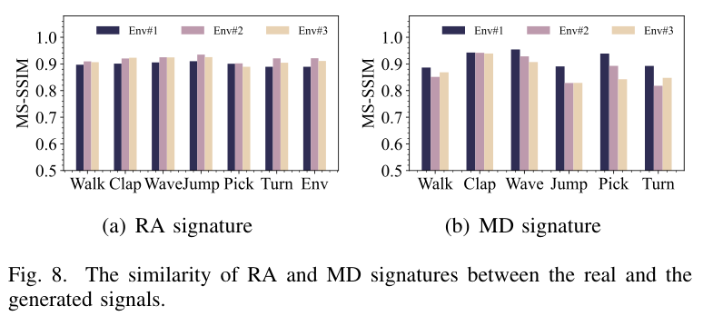
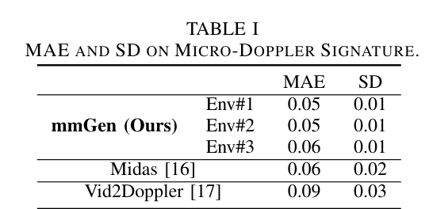
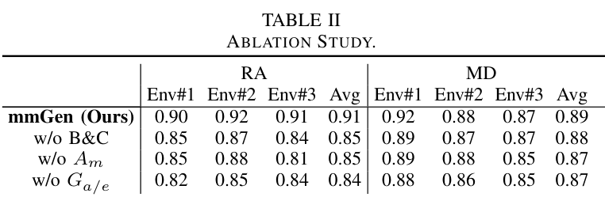
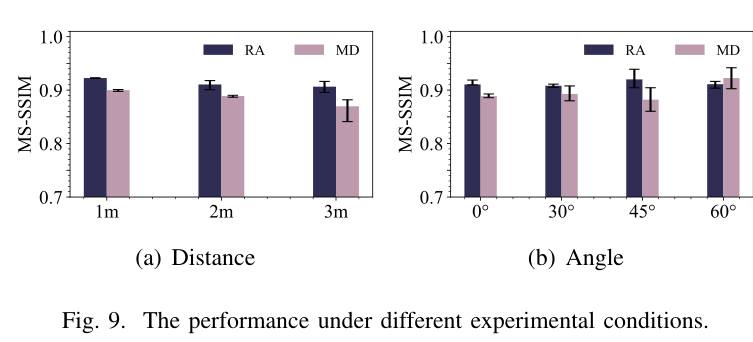
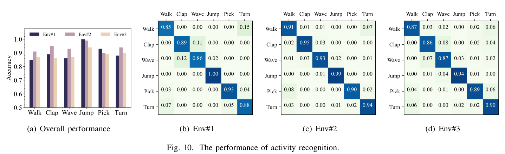

# Overview

Collecting large and diverse mmWave sensing datasets is expensive, time-consuming, and usually tied to one downstream task or annotation format. **One Snapshot is All You Need** introduces **mmGen**, a generalized framework that generates realistic FMCW mmWave signals from a **single snapshot of the environment** plus constructed 3D meshes.

Instead of generating only task-specific signatures such as micro-Doppler maps or point clouds, mmGen models the original signal formation process. It synthesizes **human-reflected**, **environment-reflected**, and **multipath-reflected** mmWave signals, so the generated data can support broader mmWave sensing tasks such as activity recognition, pose estimation, localization, and tracking.

<figure class="markdown-figure">
  
  <figcaption>Figure 2 from the paper. mmGen uses one snapshot, human/environment mesh construction, reflection modeling, and signal synthesis to produce realistic mmWave signals.</figcaption>
</figure>

## Main Contributions

- Proposes **mmGen**, a generalized full-scene mmWave signal generation framework that does not rely on deep-learning-based signal generators.
- Models **human reflections** and **environment reflections** in a unified physical signal synthesis pipeline.
- Incorporates practical factors including **material properties**, **antenna gains**, and **multipath propagations** to improve realism.
- Supports human mesh construction from either **video data** or **textual motion descriptions**, making the generated data more flexible for downstream sensing tasks.
- Builds a prototype with commercial mmWave devices and Kinect sensors, showing strong similarity between synthesized and real-captured signals across three environments.

## FMCW Signal Background

mmGen targets FMCW mmWave radar signals. The transmitted chirp and received chirp are mixed into an intermediate-frequency signal, then processed through range, Doppler, and angle FFTs to obtain common sensing signatures. By synthesizing signals before these task-specific preprocessing steps, mmGen keeps the generated data useful for multiple downstream tasks.

<figure class="markdown-figure">
  
  <figcaption>Figure 1 from the paper. FMCW chirp structure and signal preprocessing into range, Doppler, and angle signatures.</figcaption>
</figure>

## mmGen Design

The system decomposes signal generation into three parts. First, the **human-reflected signal synthesizer** represents the body as a SMPL-style 3D mesh and computes reflection points from triangular surfaces. Second, the **environment signal compensator** constructs a 3D environment mesh from one depth-camera snapshot, accounting for furniture layout, material properties, and antenna gain. Third, the **multipath reflection tracker** uses high reflection probability planes (HRPP) to efficiently approximate dominant two-bounce multipath reflections in dynamic indoor scenes.

<figure class="markdown-figure">
  
  <figcaption>Figure 5 from the paper. mmGen tracks likely multipath paths through HRPP records instead of exhaustive ray tracing.</figcaption>
</figure>

## Prototype and Dataset

The prototype uses a TI **IWR6843ISK** mmWave radar with **DCA1000**, together with a **Kinect Azure DK** for RGB/depth capture. The evaluation covers three environments: an indoor furniture scene, a corridor scene, and a scene with sofa/window/plant reflectors. Six volunteers perform six motions: walking, clapping, waving left hand, jumping jacks, picking up a stone, and turning around.

The paper defines three datasets: **D1** for real-captured mmWave signals, **D2** for synthesized signals generated from RGB-derived human meshes and Kinect environment meshes, and **D3** for synthesized signals generated from text-described motions through a diffusion-based motion model.

<figure class="markdown-figure">
  
  <figcaption>Figure 6 from the paper. Experimental environments and prototype testbed with mmWave radar and Kinect.</figcaption>
</figure>

## Signal Generation Quality

Qualitatively, mmGen reproduces range-FFT, range-angle, and range-Doppler signatures that align closely with real captures. In particular, the range-angle signature captures not only human reflections, but also environmental reflectors such as boards and tables.

<figure class="markdown-figure">
  
  <figcaption>Figure 7 from the paper. Qualitative comparison between real-captured and synthesized signatures.</figcaption>
</figure>

Quantitatively, the average MS-SSIM similarity between real and synthesized signatures reaches **0.91** for range-angle signatures and **0.89** for micro-Doppler signatures across three environments.

<figure class="markdown-figure">
  
  <figcaption>Figure 8 from the paper. Similarity of range-angle and micro-Doppler signatures between real and generated signals.</figcaption>
</figure>

Compared with prior video-to-radar generation methods, mmGen achieves competitive or better micro-Doppler reconstruction quality while remaining a physical, scenario-adaptable signal generator.

<figure class="markdown-figure">
  
  <figcaption>Table I from the paper. mmGen reports lower MAE than Midas and Vid2Doppler on micro-Doppler signatures.</figcaption>
</figure>

## Ablation and Robustness

The ablation study shows that body/environment construction, material modeling, and antenna gain modeling all improve signal realism, especially for range-angle signatures in complex scenes. Micro-benchmarks further show that mmGen remains stable across different subject distances and body rotation angles.

<figure class="markdown-figure">
  
  <figcaption>Table II from the paper. Removing body/environment construction, material modeling, or antenna gain modeling reduces generated signal similarity.</figcaption>
</figure>

<figure class="markdown-figure">
  
  <figcaption>Figure 9 from the paper. Signal quality under different human-radar distances and body angles.</figcaption>
</figure>

## Downstream Case Study

As a downstream case study, the paper trains an activity recognition model using generated signals and evaluates it on real captures. The model achieves strong recognition accuracy across all three environments, with most confusion occurring between walking and turning around because some generated turning samples include short walking segments.

<figure class="markdown-figure">
  
  <figcaption>Figure 10 from the paper. Activity recognition performance using mmGen-generated data.</figcaption>
</figure>

## Resources

- [Code: friendlyCamel/mmGen](https://github.com/friendlyCamel/mmGen)
- [arXiv abstract](https://arxiv.org/abs/2503.21122)
- [arXiv PDF](https://arxiv.org/pdf/2503.21122)
- [Local overview figure](./assets/figure-2-mmgen-overview.png)
- [Local qualitative signatures](./assets/figure-7-qualitative-signatures.png)

## Citation

```bibtex
@inproceedings{huang2025mmgen,
  title = {One Snapshot is All You Need: A Generalized Method for mmWave Signal Generation},
  author = {Huang, Teng and Ding, Han and Sun, Wenxin and Zhao, Cui and Wang, Ge and Wang, Fei and Zhao, Kun and Wang, Zhi and Xi, Wei},
  booktitle = {IEEE INFOCOM},
  year = {2025}
}
```
