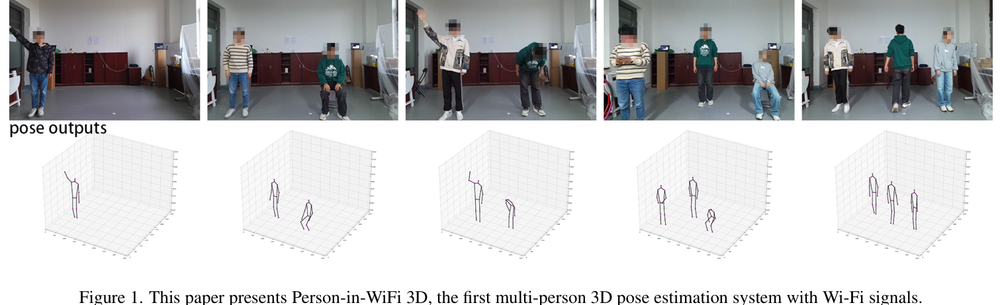
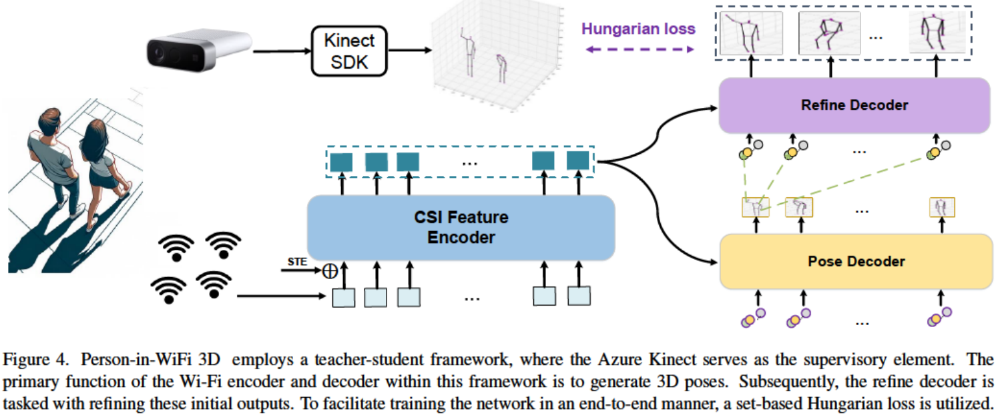
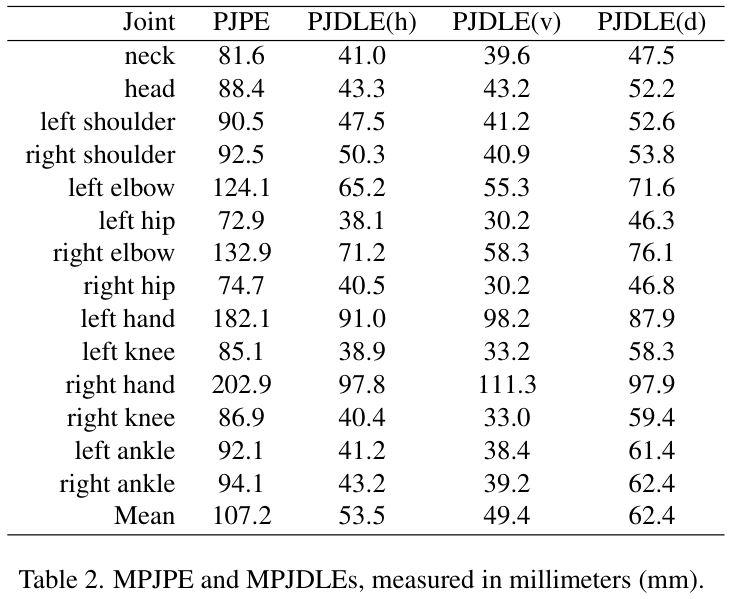
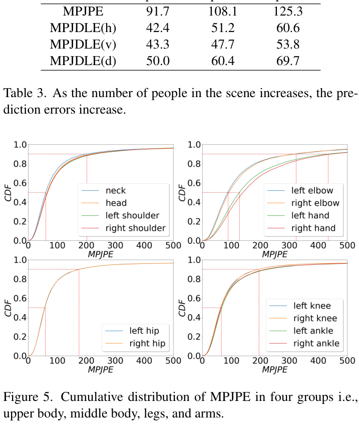
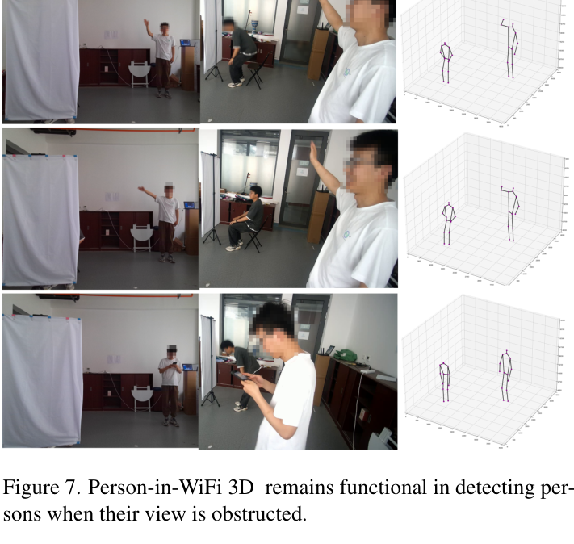

# Overview

**Person-in-WiFi 3D** pushes Wi-Fi human sensing from single-person or 2D pose estimation toward **multi-person 3D pose estimation**. The system uses one Wi-Fi transmitter and three Wi-Fi receivers to capture richer spatial reflections from multiple people, then predicts 3D body keypoints in an end-to-end set prediction framework.

Compared with camera-based pose estimation, Wi-Fi sensing preserves privacy and can remain usable under occlusion or poor lighting. Compared with earlier Wi-Fi pose systems, this work avoids large 3D heatmaps and part affinity fields by using a Transformer-based model that directly maps CSI sequences to a set of 3D poses.

> The paper reports the first Wi-Fi system for multi-person 3D pose estimation and releases a dataset with more than 97K Wi-Fi samples.

<figure class="markdown-figure">
  
  <figcaption>Figure 1 from the paper. Person-in-WiFi 3D estimates multi-person 3D poses from Wi-Fi signals and visualizes the corresponding pose outputs.</figcaption>
</figure>

## Main Contributions

- Introduces **Person-in-WiFi 3D**, a Wi-Fi-based system for multi-person 3D pose estimation.
- Proposes the **Wi-Fi Pose Transformer**, which converts CSI signals into multi-person 3D poses in an end-to-end manner.
- Uses a **set-based Hungarian loss** so each person's ground-truth pose is assigned to a unique prediction.
- Builds and releases a self-collected dataset with **more than 97,000 Wi-Fi samples** from 7 volunteers, 8 daily actions, and 3 indoor locations.

## Technical Details

The data collection setup uses four ThinkPad X201 laptops with Intel 5300 network cards: one transmitter and three receivers. The transmitter broadcasts Wi-Fi at `5.64 GHz` with 30 subcarriers, while the receivers capture CSI at 300 packets per second. An Azure Kinect records RGB-D videos at 15 FPS and provides supervisory 3D pose annotations through the Kinect Body Tracking SDK.

The model contains three main components:

- **CSI Feature Encoder**: tokenizes amplitude and denoised phase features and learns spatial-temporal CSI representations.
- **Pose Decoder**: uses learnable queries to regress a set of candidate 3D body poses and confidence scores.
- **Refine Decoder**: further refines initial pose predictions, inspired by PETR-style refinement.

<figure class="markdown-figure">
  
  <figcaption>Figure 4 from the paper. Person-in-WiFi 3D uses a teacher-student framework with Kinect supervision, a CSI feature encoder, a pose decoder, a refine decoder, and set-based Hungarian loss.</figcaption>
</figure>

## Results

The dataset contains 456 RGB-D clips, 270,000 total video frames, and more than 97,000 cleaned Wi-Fi samples. It covers 1-4 people, 8 actions, and 3 indoor locations with different multipath conditions. After cleaning Kinect tracking failures, the final split includes 89,946 training samples and 7,824 testing samples.

Person-in-WiFi 3D reports **91.7 mm**, **108.1 mm**, and **125.3 mm** MPJPE in 1-person, 2-person, and 3-person scenes, respectively. The overall mean MPJPE is **107.2 mm**. The paper also reports that the system can run at **54 FPS**, while avoiding the storage and post-processing burden of extending 2D heatmap-based Person-in-WiFi to 3D.

<figure class="markdown-figure">
  
  <figcaption>Table 2 from the paper. Main per-joint 3D pose estimation errors measured in millimeters.</figcaption>
</figure>

<figure class="markdown-figure">
  
  <figcaption>Table 3 and Figure 5 from the paper. Errors increase as the number of people increases, and the CDF plots show that arm joints are the most difficult to estimate accurately.</figcaption>
</figure>

## Occlusion and Limitations

The paper highlights that Wi-Fi can still detect people when the visual view is obstructed, which is important for privacy-sensitive and occluded indoor settings. It also reports two limitations: the upper-bound performance depends on Kinect annotation quality, and cross-environment generalization remains challenging because the system uses four distributed Wi-Fi transceivers whose spatial configuration changes across locations.

<figure class="markdown-figure">
  
  <figcaption>Figure 7 from the paper. Person-in-WiFi 3D remains functional when the camera view is obstructed.</figcaption>
</figure>

## Resources

- [TPAMI journal version](../person-in-wifi-3d-unified-model-for-3d-wifi-perception/index.html)
- [Project Page](https://aiotgroup.github.io/Person-in-WiFi-3D/)
- [CVF Open Access Paper](https://openaccess.thecvf.com/content/CVPR2024/html/Yan_Person-in-WiFi_3D_End-to-End_Multi-Person_3D_Pose_Estimation_with_Wi-Fi_CVPR_2024_paper.html)
- [Overview figure](./assets/figure-1-overview.png)
- [Architecture figure](./assets/figure-4-architecture.png)
- [Main results table](./assets/table-2-main-errors.png)

## Citation

```bibtex
@inproceedings{yan2024personinwifi3d,
  title = {Person-in-WiFi 3D: End-to-End Multi-Person 3D Pose Estimation with Wi-Fi},
  author = {Yan, Kangwei and Wang, Fei and Qian, Bo and Ding, Han and Han, Jinsong and Wei, Xing},
  booktitle = {Proceedings of the IEEE/CVF Conference on Computer Vision and Pattern Recognition (CVPR)},
  pages = {969--978},
  year = {2024}
}
```
