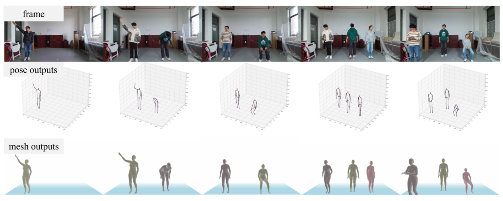
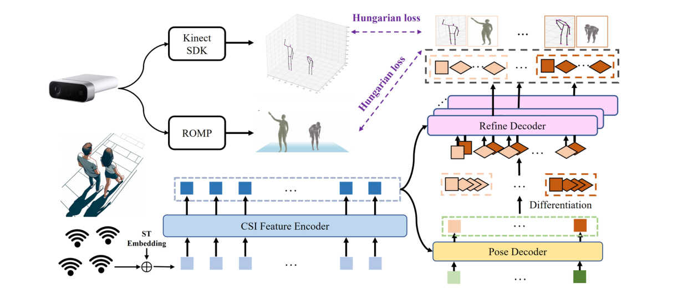
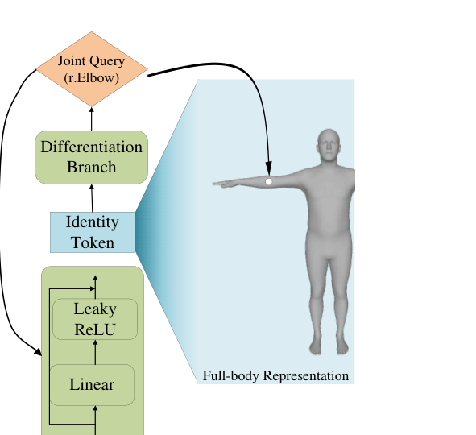
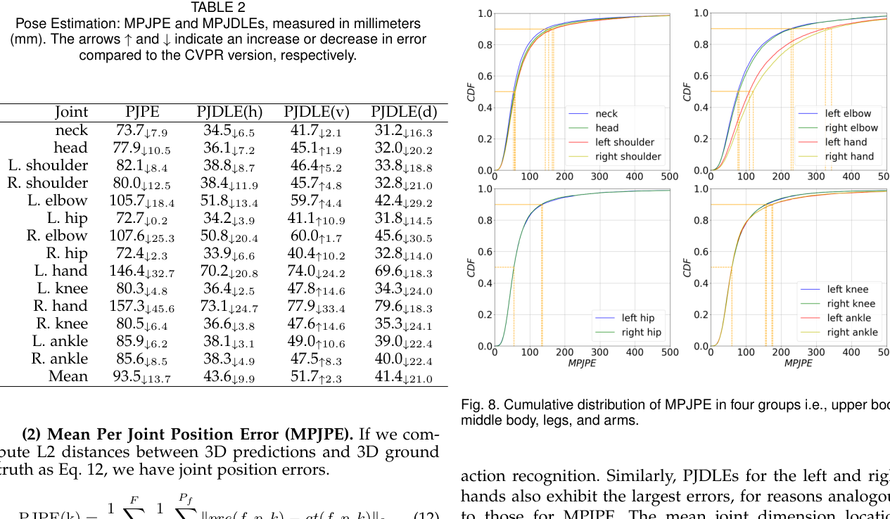
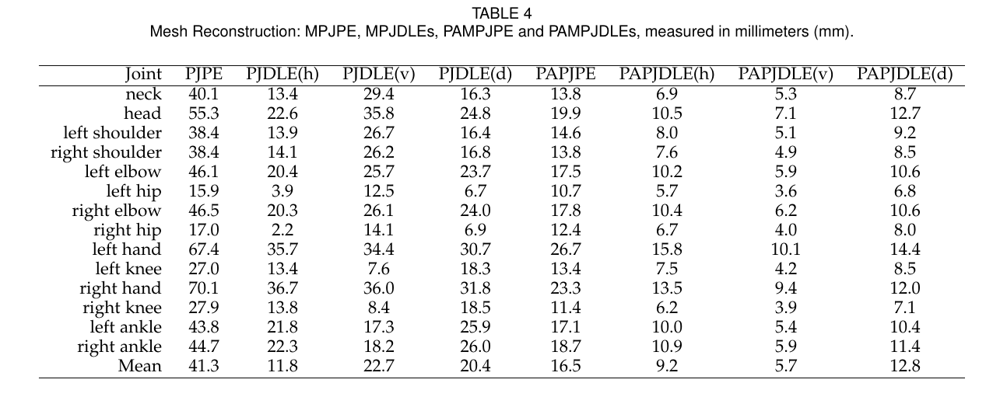
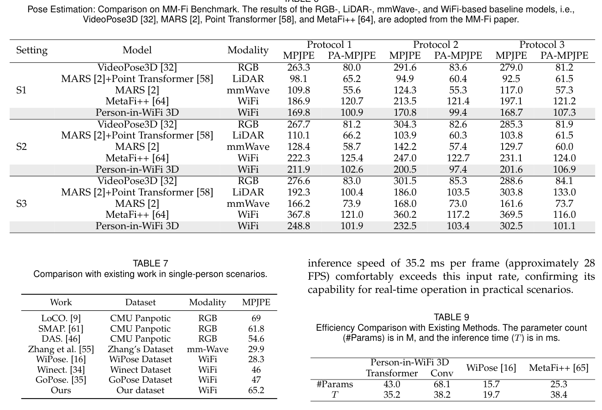
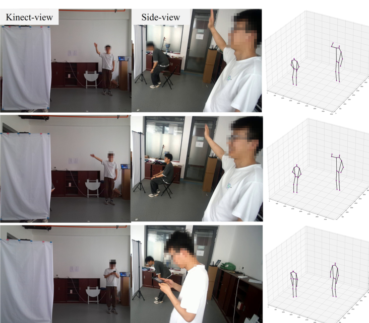
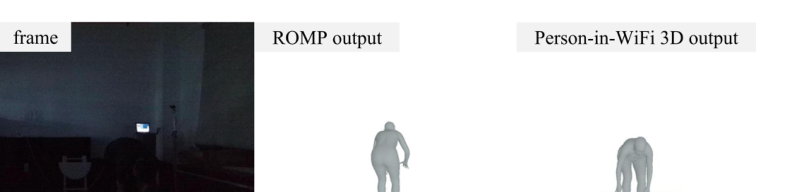

# Overview

**Person-in-WiFi 3D: Unified Model for 3D WiFi Perception** is the PAMI journal extension of the CVPR 2024 **Person-in-WiFi 3D** work. The paper studies whether commodity Wi-Fi signals can support richer 3D human perception in privacy-sensitive indoor spaces, moving beyond multi-person 3D pose estimation toward a unified model that also reconstructs multi-person 3D human meshes.

The core idea is to treat Wi-Fi human perception as an end-to-end set prediction problem. Instead of extending 2D heatmaps and part affinity fields into heavy 3D tensors, the system uses multiple Wi-Fi receivers, a Transformer-style CSI encoder, Hungarian matching, and hierarchical coarse-to-fine refinement to directly decode multiple people's 3D representations from CSI signals.

<figure class="markdown-figure">
  
  <figcaption>Qualitative examples from the PAMI paper: RGB reference frames, Wi-Fi 3D pose estimates, and Wi-Fi-driven mesh reconstruction outputs.</figcaption>
</figure>

## What Is New Beyond CVPR 2024

This page describes the **PAMI journal version**. The earlier conference version is available here: [Person-in-WiFi 3D: End-to-End Multi-Person 3D Pose Estimation with Wi-Fi](../person-in-wifi-3d-end-to-end-multi-person-3d-pose-estimation-with-wi-fi/index.html).

Compared with the CVPR 2024 version, the journal paper adds three major extensions:

- **Dataset extension:** Wiception3D now includes multi-person mesh reconstruction annotations in addition to 3D pose annotations.
- **Task extension:** the system supports both multi-person 3D pose estimation and multi-person 3D mesh reconstruction.
- **Model improvement:** the refine decoder adds a differentiation branch that generates instance-aware keypoint queries from identity tokens, improving fine-grained refinement.
- **Expanded experiments:** the journal version reports broader ablations, MM-Fi benchmark comparisons, occlusion and low-light cases, and cross-person / cross-environment analysis.

## Main Contributions

- Introduces a unified Wi-Fi framework for **multi-person 3D human perception**, covering both pose estimation and mesh reconstruction.
- Develops the **WiFi Human Perception Transformer**, which maps CSI signals to multi-person 3D representations in an end-to-end manner.
- Extends **Wiception3D** to more than 97,000 samples with annotations for both 3D pose estimation and 3D mesh reconstruction.
- Demonstrates strong results on Wiception3D and the public MM-Fi benchmark, while keeping commodity Wi-Fi as the sensing hardware.

## System Design

The sensing setup uses one Wi-Fi transmitter and three Wi-Fi receivers, with the receivers placed around the sensing area to capture human-body reflections from multiple directions. An Azure Kinect provides 3D keypoint supervision through the Kinect Body Tracking SDK, while ROMP supplies mesh supervision for training and evaluation.

At the model level, Person-in-WiFi 3D uses a teacher-student framework. CSI amplitude and denoised phase features are tokenized and passed through a Transformer-based CSI Feature Encoder. A pose decoder then uses learnable queries to produce instance-level human representations. The refine decoder improves these coarse predictions at the keypoint level, and the model is trained with set-based Hungarian matching so each predicted person is assigned to a unique ground-truth person.

<figure class="markdown-figure">
  
  <figcaption>System architecture. The PAMI version unifies Wi-Fi-based 3D pose estimation and mesh reconstruction under a teacher-student, set-prediction framework.</figcaption>
</figure>

## Refinement and Differentiation Branch

The journal version improves the refinement stage. A straightforward refine decoder with independently learned keypoint queries can struggle because those queries do not naturally encode which person they belong to. The PAMI version addresses this with a **differentiation branch**: identity tokens from the pose decoder are transformed into keypoint queries through stacked MLPs with residual connections.

This gives each keypoint query both instance-level identity information and joint-specific information. In the ablations, replacing randomly initialized learnable queries with the differentiation branch reduces pose MPJPE from **107.2 mm** to **93.5 mm** and mesh MPJPE from **50.7 mm** to **41.3 mm**.

<figure class="markdown-figure">
  
  <figcaption>The differentiation branch generates joint-specific queries from identity tokens, making the refinement process instance-aware.</figcaption>
</figure>

## Wiception3D Dataset

The data collection covers 7 volunteers, 8 daily actions, and 3 indoor locations: an office room, a classroom, and a corridor. The actions include static movements such as reaching out, raising hands, bending over, sitting down, lifting legs, and standing, as well as dynamic free-moving actions such as walking.

The dataset contains 456 CSI and RGB-D clips, each 40 seconds long, with 270,000 RGB-D frames before cleaning. After removing frames where Kinect or ROMP annotation failed, the final dataset includes **89,946 training samples** and **7,824 test samples** across one-, two-, and three-person cases.

| Split | 1-person | 2-person | 3-person | All |
| --- | ---: | ---: | ---: | ---: |
| Training | 28,121 | 36,242 | 25,583 | 89,946 |
| Test | 2,586 | 3,184 | 2,054 | 7,824 |

## Results on Wiception3D

For 3D multi-person pose estimation, the PAMI version reports a final **93.5 mm MPJPE**, improving over the CVPR version by 13.7 mm. The system achieves **65.2 mm**, **90.8 mm**, and **117.1 mm** MPJPE in one-, two-, and three-person scenarios, respectively. The paper also reports dimension-wise mean errors of **43.6 mm** horizontally, **51.7 mm** vertically, and **41.4 mm** in depth.

<figure class="markdown-figure">
  
  <figcaption>Pose estimation results. Arm joints are the hardest to localize, while upper-body, middle-body, and leg errors are more concentrated.</figcaption>
</figure>

For 3D mesh reconstruction, Person-in-WiFi 3D reaches **41.3 mm MPJPE** and **16.5 mm PAMPJPE** on Wiception3D. One-, two-, and three-person mesh reconstruction scenarios report **37.21 mm**, **42.11 mm**, and **45.51 mm** MPJPE, respectively.

<figure class="markdown-figure">
  
  <figcaption>Mesh reconstruction results. The largest errors are concentrated around hands and other terminal joints.</figcaption>
</figure>

## Benchmark and Ablations

On MM-Fi, Person-in-WiFi 3D consistently improves over the Wi-Fi baseline MetaFi++ across the reported protocols and splits. The paper also compares with RGB, LiDAR, and mmWave baselines to place Wi-Fi perception in a broader sensing context: Wi-Fi does not yet match the strongest LiDAR or mmWave systems on the same benchmark, but it offers lower deployment cost because commodity Wi-Fi infrastructure is already common indoors.

<figure class="markdown-figure">
  
  <figcaption>MM-Fi comparison and efficiency results. Person-in-WiFi 3D improves over the Wi-Fi baseline while remaining fast enough for the 15 FPS CSI input stream.</figcaption>
</figure>

The ablation studies show that several design choices matter:

- Using three receivers is much stronger than two-receiver or one-receiver variants.
- The Transformer CSI encoder reduces pose MPJPE from **118.3 mm** with a CNN backbone to **93.5 mm**.
- The refine decoder reduces pose MPJPE from **116.1 mm** to **93.5 mm**.
- Adding denoised phase information reduces pose MPJPE from **192.4 mm** with amplitude only to **93.5 mm**.
- The differentiation branch improves both pose and mesh reconstruction compared with learnable keypoint queries.

## Robustness and Limitations

Because Wi-Fi does not rely on visible light or direct visual capture, the system remains usable in some settings where camera-based perception is fragile. The paper demonstrates qualitative occlusion cases where a screen blocks the Kinect view and low-light cases where the camera image is poor, while Person-in-WiFi 3D still produces human perception outputs.

<figure class="markdown-figure">
  
  <figcaption>Occlusion examples. Wi-Fi perception remains functional when the front visual view is blocked.</figcaption>
</figure>

<figure class="markdown-figure">
  
  <figcaption>Low-light example. Person-in-WiFi 3D continues to produce a human perception output when camera-based visual evidence is degraded.</figcaption>
</figure>

The paper also identifies important limitations. Annotation quality depends on Kinect Body Tracking SDK and ROMP outputs, which degrade in crowded scenes. Cross-environment generalization is still challenging because the system uses four distributed Wi-Fi transceivers whose spatial configuration changes across locations. The authors also note that future multimodal integration may further improve reconstruction fidelity.

## Resources

- [Project page](https://aiotgroup.github.io/Person-in-WiFi-3D/)
- [CVPR 2024 version page](../person-in-wifi-3d-end-to-end-multi-person-3d-pose-estimation-with-wi-fi/index.html)
- [Teaser figure](./assets/paper-teaser.png)
- [Architecture figure](./assets/paper-architecture.png)
- [MM-Fi comparison figure](./assets/paper-mmfi-comparison.png)

## Citation

```bibtex
@article{qian2026personinwifi3d,
  title = {Person-in-WiFi 3D: Unified Model for 3D WiFi Perception},
  author = {Qian, Bo and Wei, Xing and Yan, Kangwei and Ding, Han and Han, Jinsong and Wang, Fei},
  journal = {IEEE Transactions on Pattern Analysis and Machine Intelligence},
  year = {2026}
}
```
