# Overview

**Person-in-WiFi 3D: Unified Model for 3D WiFi Perception** extends the CVPR 2024 conference paper from multi-person 3D pose estimation to a broader **3D WiFi human perception** framework. The TPAMI version jointly studies 3D pose estimation and 3D mesh reconstruction using commodity WiFi signals, aiming to support privacy-preserving, occlusion-resilient human perception for indoor scenarios such as smart homes, elderly care, and virtual reality.

The system uses one WiFi transmitter and three WiFi receivers to capture richer spatial reflections from multiple people. A Transformer-based architecture maps CSI signals to a set of human representations in an end-to-end manner, avoiding large 3D heatmaps, part affinity fields, and heavy post-processing.

<figure class="markdown-figure">
  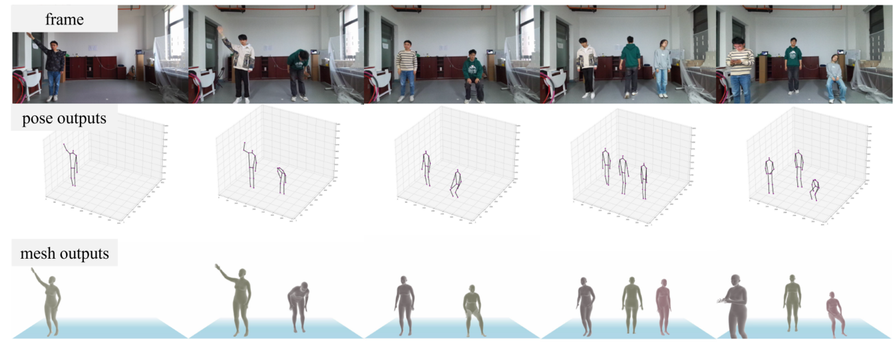
  <figcaption>Figure 1 from the TPAMI paper. Person-in-WiFi 3D estimates multi-person 3D poses and reconstructs human meshes from WiFi signals.</figcaption>
</figure>

## Journal Extension over CVPR 2024

This TPAMI version extends the CVPR 2024 conference paper in three major ways:

- **Dataset extension**: adds multi-person mesh reconstruction annotations to **Wiception3D**, enabling both 3D pose estimation and 3D mesh reconstruction.
- **Model architecture improvement**: introduces a differentiation branch in the refine decoder to generate keypoint queries with identity-aware information, enabling finer-grained refinement.
- **Additional experiments**: provides broader evaluation, including mesh reconstruction results, MM-Fi benchmark comparison, additional ablations, occlusion tests, low-light tests, and cross-domain analysis.

## Main Contributions

- Presents a unified WiFi-based multi-person 3D human perception system for both **pose estimation** and **mesh reconstruction**.
- Develops the **WiFi Human Perception Transformer**, which maps CSI samples into multi-person 3D representations through set prediction and Hungarian matching.
- Introduces **Wiception3D**, an open-access dataset with more than **97,000 WiFi samples** annotated for 3D pose estimation and mesh reconstruction.
- Demonstrates that WiFi-based 3D human perception can be storage-efficient, real-time, privacy-aware, and resilient to occlusion and poor lighting.

## System Design

The model follows a teacher-student training pipeline. Azure Kinect Body Tracking SDK provides 3D pose supervision, while ROMP provides mesh supervision. CSI samples are tokenized across transmitter, receiver, antenna, time, and subcarrier dimensions, then encoded by a Transformer-based CSI feature encoder. A pose decoder predicts initial human representations, and a refine decoder improves the predictions with identity-aware keypoint queries.

<figure class="markdown-figure">
  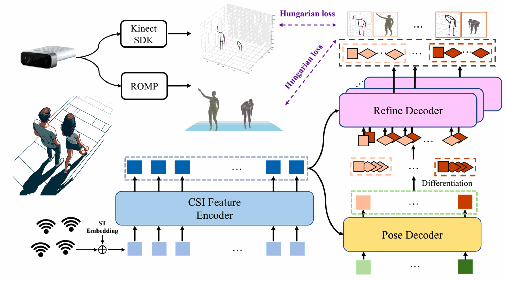
  <figcaption>Figure 4 from the TPAMI paper. The system uses Kinect SDK and ROMP as supervision, a CSI feature encoder, pose decoder, refine decoder, differentiation branch, and Hungarian loss for end-to-end training.</figcaption>
</figure>

The refine decoder is one of the key differences in the journal version. Instead of relying only on randomly initialized learnable keypoint queries, the differentiation branch transforms the identity token into keypoint queries. These queries preserve instance-level information and help the refine decoder perform targeted, fine-grained updates.

<figure class="markdown-figure">
  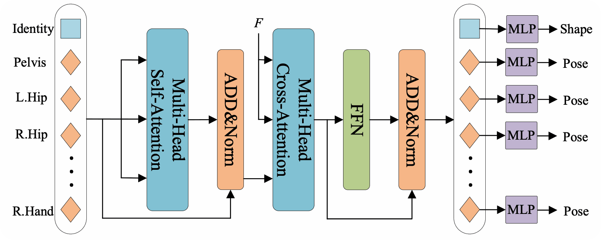
  <figcaption>Figure 5 from the TPAMI paper. The refine decoder combines an identity token and keypoint queries to refine the target person's representation.</figcaption>
</figure>

<figure class="markdown-figure">
  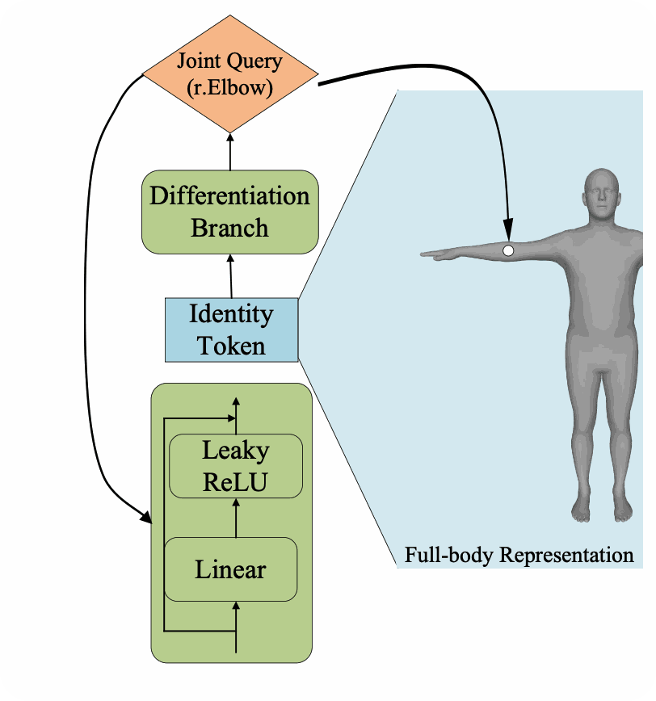
  <figcaption>Figure 6 from the TPAMI paper. The differentiation branch generates joint-specific queries from identity tokens for more precise refinement.</figcaption>
</figure>

## Wiception3D Dataset

Wiception3D was collected with four ThinkPad X201 laptops equipped with Intel 5300 network cards: one transmitter and three receivers. An Azure Kinect camera records synchronized RGB-D video. The dataset covers three indoor scenes: office room, corridor, and classroom. Seven volunteers perform eight daily actions across one-person, two-person, three-person, and four-person scenarios.

After cleaning failed Kinect SDK and ROMP annotations, the released dataset contains more than **97,000 samples**, including **89,946 training samples** and **7,824 test samples** for one-person to three-person settings.

<figure class="markdown-figure">
  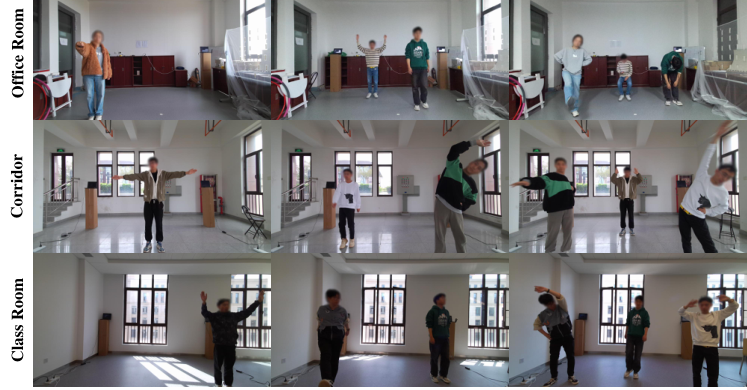
  <figcaption>Figure 7 from the TPAMI paper. Data collection spans office room, corridor, and classroom scenes.</figcaption>
</figure>

<figure class="markdown-figure">
  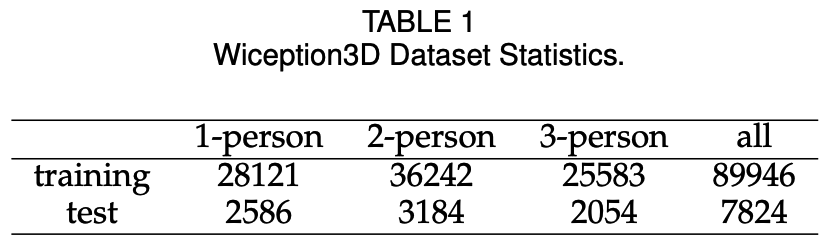
  <figcaption>Table 1 from the TPAMI paper. Wiception3D statistics after cleaning invalid annotations.</figcaption>
</figure>

## Pose Estimation Results

On Wiception3D, Person-in-WiFi 3D achieves a mean 3D keypoint localization error of **93.5 mm**. In one-person, two-person, and three-person scenarios, the MPJPE is **65.2 mm**, **90.8 mm**, and **117.1 mm**, respectively. The TPAMI version improves the CVPR version on most horizontal and depth errors, while making the system broader by supporting mesh reconstruction.

<figure class="markdown-figure">
  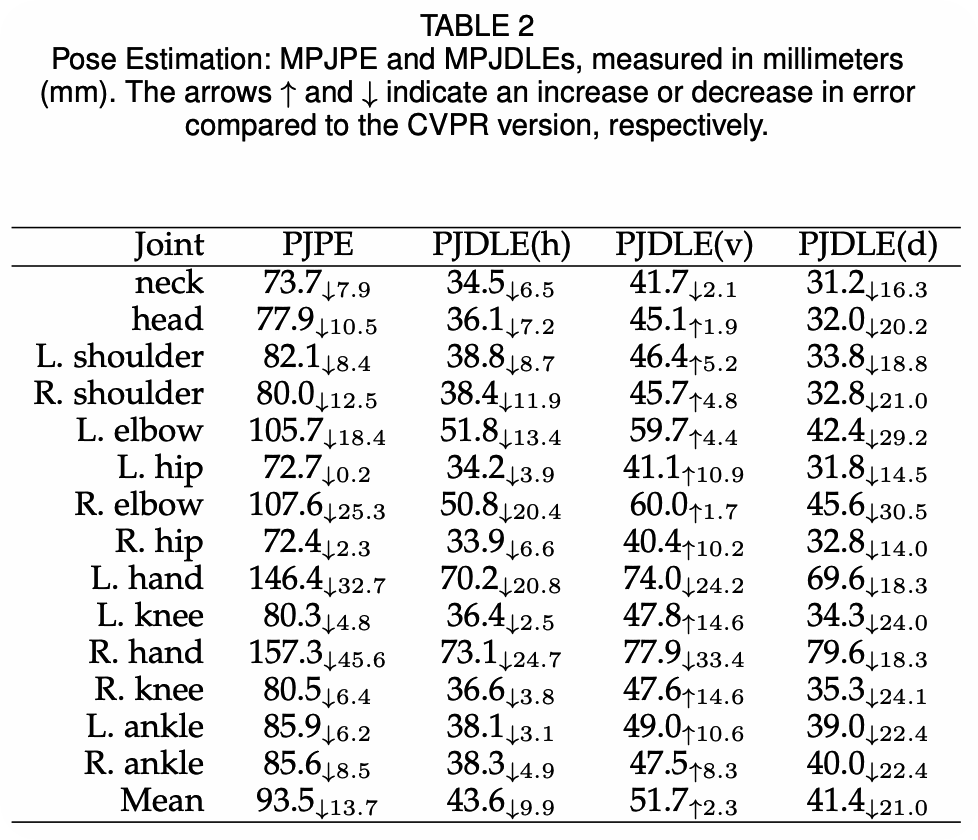
  <figcaption>Table 2 from the TPAMI paper. Pose estimation errors measured by per-joint 3D localization metrics.</figcaption>
</figure>

<figure class="markdown-figure">
  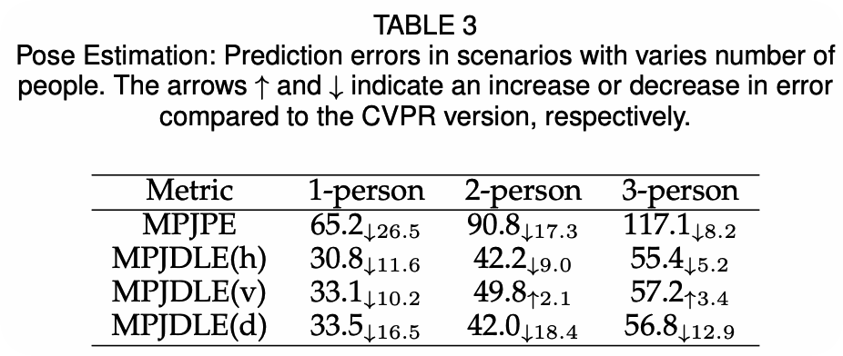
  <figcaption>Table 3 from the TPAMI paper. Prediction errors increase as the number of people increases, but the growth remains controlled.</figcaption>
</figure>

<figure class="markdown-figure">
  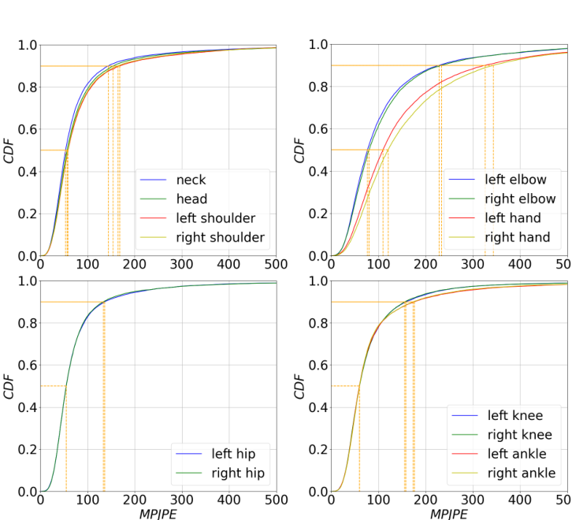
  <figcaption>Figure 8 from the TPAMI paper. Arm joints are harder to estimate than upper body, middle body, and leg joints.</figcaption>
</figure>

## Mesh Reconstruction Results

The journal version adds multi-person 3D mesh reconstruction. Person-in-WiFi 3D reaches **41.3 mm MPJPE** and **16.5 mm PA-MPJPE** in mesh reconstruction. Across one-person, two-person, and three-person scenarios, mesh MPJPE is **37.21 mm**, **42.11 mm**, and **45.51 mm**, respectively.

<figure class="markdown-figure">
  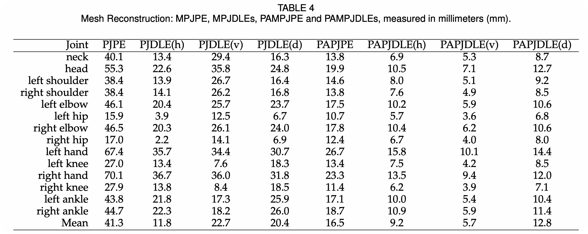
  <figcaption>Table 4 from the TPAMI paper. Mesh reconstruction errors across joints.</figcaption>
</figure>

<figure class="markdown-figure">
  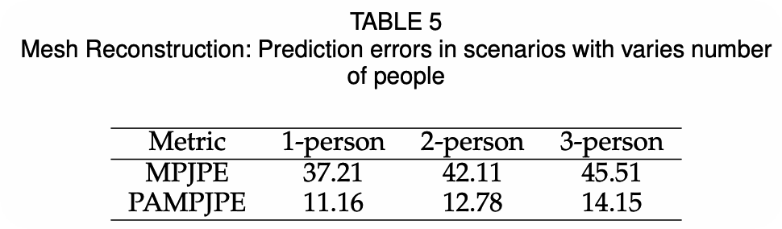
  <figcaption>Table 5 from the TPAMI paper. Mesh reconstruction errors under different numbers of people.</figcaption>
</figure>

## Benchmark and Ablation Studies

The paper also evaluates Person-in-WiFi 3D on the public **MM-Fi** benchmark. Compared with the WiFi-based baseline MetaFi++, Person-in-WiFi 3D consistently reduces MPJPE and PA-MPJPE across multiple settings and protocols, while retaining the practical deployment advantage of commodity WiFi hardware.

<figure class="markdown-figure">
  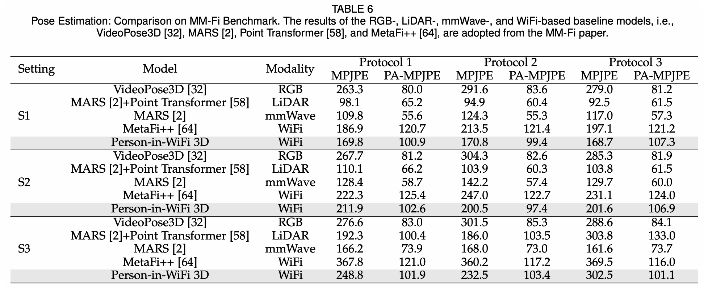
  <figcaption>Table 6 from the TPAMI paper. Person-in-WiFi 3D improves over the WiFi-based MetaFi++ baseline across the MM-Fi protocols.</figcaption>
</figure>

The ablation studies show that three receivers are important for spatial coverage, the Transformer CSI encoder outperforms the CNN variant, the refine decoder improves performance, phase denoising is critical, and the differentiation branch substantially improves both pose and mesh reconstruction.

<figure class="markdown-figure">
  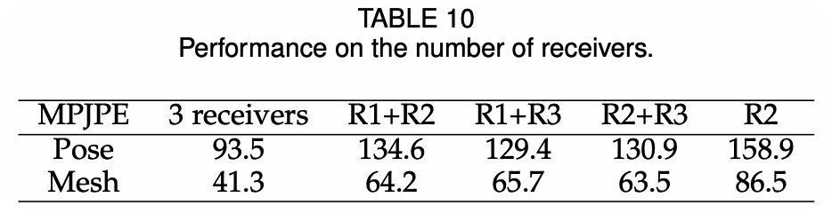
  <figcaption>Table 10 from the TPAMI paper. Ablation over the number of WiFi receivers.</figcaption>
</figure>

<figure class="markdown-figure">
  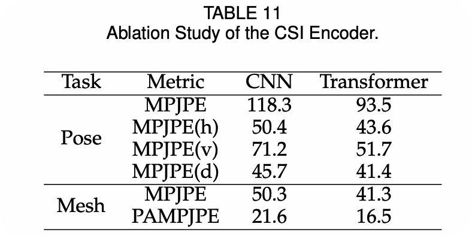
  <figcaption>Table 11 from the TPAMI paper. The Transformer CSI encoder outperforms the CNN variant.</figcaption>
</figure>

<figure class="markdown-figure">
  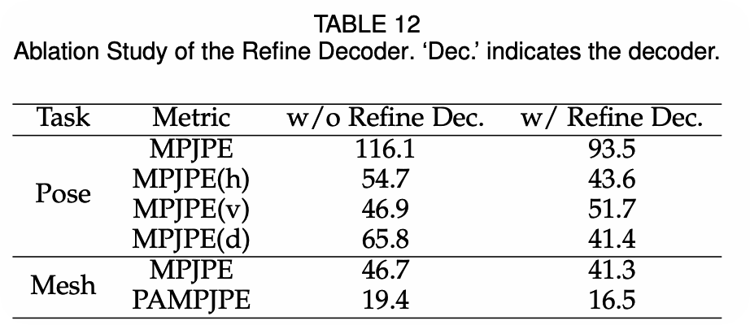
  <figcaption>Table 12 from the TPAMI paper. The refine decoder improves pose and mesh reconstruction.</figcaption>
</figure>

<figure class="markdown-figure">
  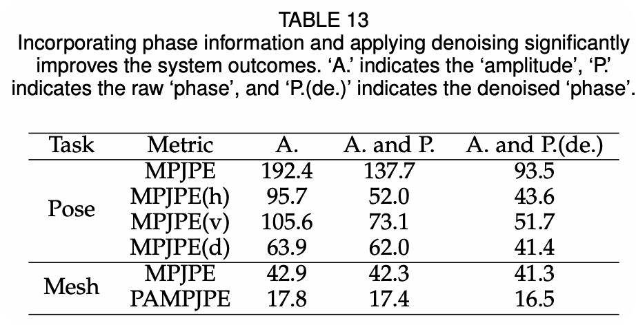
  <figcaption>Table 13 from the TPAMI paper. Phase information and denoising improve system outcomes.</figcaption>
</figure>

<figure class="markdown-figure">
  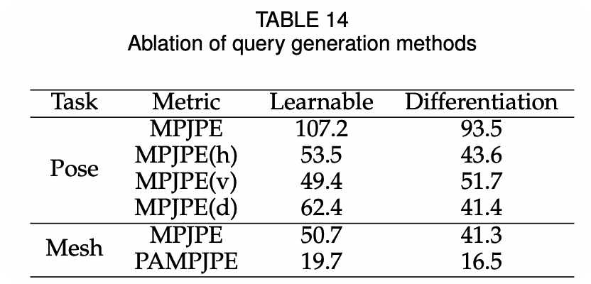
  <figcaption>Table 14 from the TPAMI paper. The differentiation branch improves query generation over learnable queries.</figcaption>
</figure>

## Occlusion, Low Light, and Limitations

WiFi sensing provides complementary strengths to camera-based perception. The paper shows that Person-in-WiFi 3D can still function when the visual view is obstructed, and it remains robust under inadequate lighting conditions. These properties are especially relevant for privacy-sensitive, occluded, or low-light indoor deployments.

<figure class="markdown-figure">
  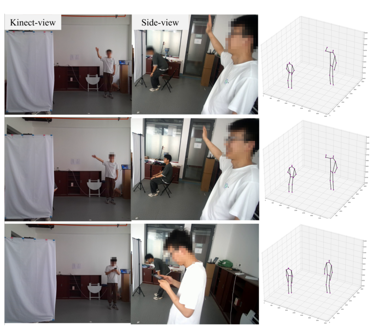
  <figcaption>Figure 12 from the TPAMI paper. Person-in-WiFi 3D remains functional when the front camera view is obstructed.</figcaption>
</figure>

<figure class="markdown-figure">
  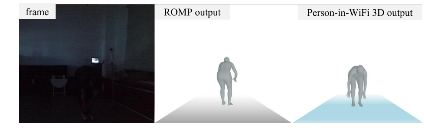
  <figcaption>Figure 13 from the TPAMI paper. Person-in-WiFi 3D continues to work under inadequate lighting conditions.</figcaption>
</figure>

The paper also reports remaining challenges: annotation quality depends on Kinect SDK and ROMP, distributed WiFi deployment is sensitive to device placement and antenna orientation, and single-modality WiFi perception still has limits compared with multimodal sensing.

## Resources

- [Project Page](https://aiotgroup.github.io/Person-in-WiFi-3D/)
- [CVPR 2024 conference version](../person-in-wifi-3d-end-to-end-multi-person-3d-pose-estimation-with-wi-fi/index.html)
- [Overview figure](./assets/figure-1-overview.png)
- [System architecture](./assets/figure-4-system-architecture.png)
- [Pose estimation results](./assets/table-2-pose-estimation-results.png)
- [Mesh reconstruction results](./assets/table-4-5-mesh-reconstruction-results.png)

## Citation

```bibtex
@article{qian2026personinwifi3d,
  title = {Person-in-WiFi 3D: Unified Model for 3D WiFi Perception},
  author = {Qian, Bo and Wei, Xing and Yan, Kangwei and Ding, Han and Han, Jinsong and Wang, Fei},
  journal = {IEEE Transactions on Pattern Analysis and Machine Intelligence},
  year = {2026}
}
```
