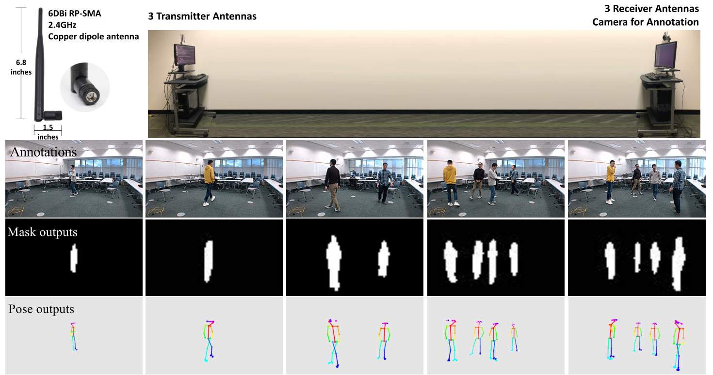
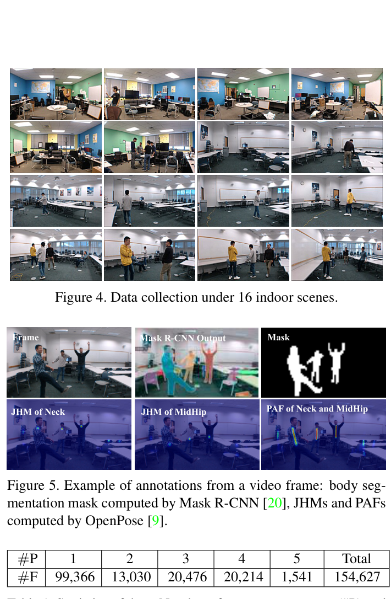
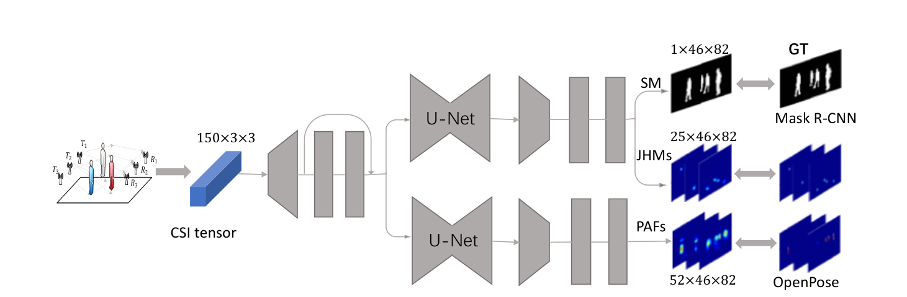
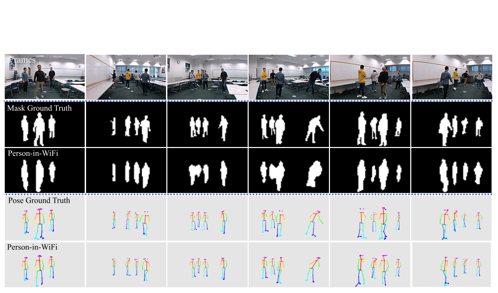
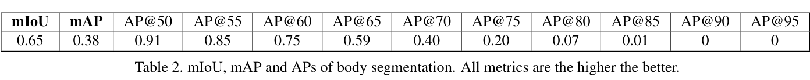
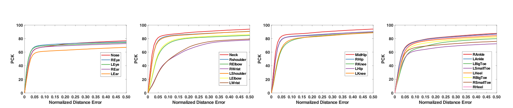
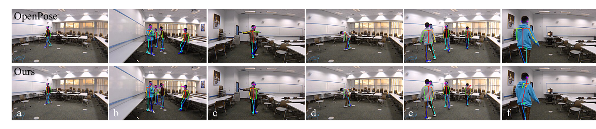
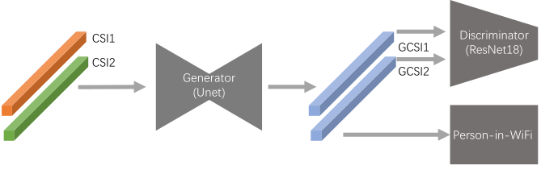

# Overview

**Person-in-WiFi** is an early fine-grained wireless perception system that asks a deliberately ambitious question: can ordinary WiFi signals support body-level perception tasks that are usually handled by cameras, radar, or LiDAR? The paper demonstrates that commodity IEEE 802.11n WiFi antennas and CSI measurements can be used to estimate **human body segmentation masks** and **2D body poses** in an end-to-end deep learning pipeline.

The system uses RGB videos only as supervision during data collection: Mask R-CNN provides body segmentation labels, and OpenPose provides joint heatmaps and part affinity fields. At inference time, the model takes WiFi CSI as input and outputs person masks and pose estimates, making it robust to illumination and more privacy-preserving than camera-only sensing.

<figure class="markdown-figure">
  
  <figcaption>Figure 1 from the paper. Person-in-WiFi uses WiFi antennas as sensors and learns to produce body segmentation and pose outputs from CSI signals.</figcaption>
</figure>

## Main Contributions

- Introduces one of the first systems showing **fine-grained person perception from off-the-shelf WiFi antennas** and standard IEEE 802.11n CSI.
- Formulates WiFi-based person perception as a supervised mapping from 1D wireless signal observations to 2D spatial body representations.
- Builds a multi-task deep network that jointly predicts **segmentation masks (SM)**, **joint heatmaps (JHMs)**, and **part affinity fields (PAFs)** from CSI tensors.
- Proposes **Matthew Weight** to address the sparsity of keypoint and limb annotations, improving pose estimation over naive L2 supervision.
- Collects synchronized WiFi and RGB data across **16 indoor scenes**, with up to **5 concurrent persons** and **154,627 video frames**.

## Sensing Setup and Data

The hardware setup uses one transmitter group and one receiver group, each with three antennas, similar to a household WiFi router layout. CSI is recorded over **30 OFDM subcarriers** centered at **2.4 GHz**, while synchronized RGB videos provide the annotation source. The final input around one video frame is represented as a CSI tensor aligned with temporal samples, antenna pairs, and subcarriers.

<figure class="markdown-figure">
  
  <figcaption>Figures 4 and 5 plus Table 1 from the paper. The dataset covers 16 indoor scenes and uses Mask R-CNN/OpenPose annotations from synchronized video frames.</figcaption>
</figure>

## Network Design

Person-in-WiFi maps CSI tensors to three complementary body representations. The network upsamples CSI features, uses residual convolution and U-Net style modules, and supervises the output against segmentation masks, joint heatmaps, and part affinity fields. This design lets the model learn spatial body structure from multiple transmitter-receiver antenna pairs and frequency samples.

<figure class="markdown-figure">
  
  <figcaption>Figure 6 from the paper. The network maps CSI into segmentation masks, joint heatmaps, and part affinity fields.</figcaption>
</figure>

## Results

On body segmentation, Person-in-WiFi reports **0.65 mIoU** and **0.38 mAP**, with **AP@50 = 0.91**. For pose estimation, the paper evaluates PCK over 25 joints and shows strong performance on larger body parts such as torso, arms, and legs, while small or occluded joints remain harder.

<figure class="markdown-figure">
  
  <figcaption>Figure 10 from the paper. Qualitative comparison between camera-derived annotations and Person-in-WiFi outputs.</figcaption>
</figure>

<figure class="markdown-figure">
  
  <figcaption>Table 2 from the paper. Person-in-WiFi achieves 0.65 mIoU and 0.91 AP@50 for body segmentation.</figcaption>
</figure>

<figure class="markdown-figure">
  
  <figcaption>Figure 11 from the paper. PCK curves for head, torso/arms, legs, and feet joints.</figcaption>
</figure>

## Discussion and Limitations

The paper is careful about the gap between WiFi sensing and camera-based perception. On a manually annotated subset, camera-based methods report **0.83 mIoU** for Mask R-CNN and **89.48 mPCK@0.20** for OpenPose, while Person-in-WiFi reports **0.66 mIoU** and **78.75 mPCK@0.20**. The main failure cases come from limited spatial resolution, rare poses, and incomplete annotations from a single camera view.

<figure class="markdown-figure">
  
  <figcaption>Figure 12 from the paper. Failure cases include small limbs, rare poses, and incomplete camera-view annotations.</figcaption>
</figure>

For deployment in unseen environments, the paper explores an adversarial training strategy to reduce scene-specific information in CSI. In preliminary experiments with 14 training scenes and 2 testing scenes, this improves segmentation mIoU from **0.12 to 0.24** and pose mPCK@0.20 from **19.34 to 31.06**, suggesting that cross-environment generalization is important future work.

<figure class="markdown-figure">
  
  <figcaption>Figure 13 from the paper. Adversarial training attempts to make CSI representations less environment-specific.</figcaption>
</figure>

## Resources

- [CVF Open Access PDF](https://openaccess.thecvf.com/content_ICCV_2019/papers/Wang_Person-in-WiFi_Fine-Grained_Person_Perception_Using_WiFi_ICCV_2019_paper.pdf)
- [Local overview figure](./assets/figure-1-person-in-wifi-overview.png)
- [Local network figure](./assets/figure-6-network.png)
- [Local qualitative results figure](./assets/figure-10-results.png)

## Citation

```bibtex
@inproceedings{wang2019personinwifi,
  title = {Person-in-WiFi: Fine-Grained Person Perception Using WiFi},
  author = {Wang, Fei and Zhou, Sanping and Panev, Stanislav and Han, Jinsong and Huang, Dong},
  booktitle = {Proceedings of the IEEE/CVF International Conference on Computer Vision (ICCV)},
  pages = {5452--5461},
  year = {2019}
}
```
