# Overview

Respiratory monitoring with wireless RF signals is promising for healthcare, smart cockpits, sleep monitoring, and daily-life wellbeing. The practical obstacle is domain shift: a model trained in one setting often breaks when the user moves, changes posture, lies at a different distance or orientation, meets dynamic interference, or enters a new environment.

**RF-Carer** targets this deployment gap with a zero-effort cross-domain system built on commercial IR-UWB devices. It trains once, then directly handles unseen users, movements, obstacles, and environments without extra data collection or domain-specific retraining. The central design choice is to push generalization into the signal-processing layer: heterogeneous UWB observations are transformed into a unified signal form before a lightweight contrastive bi-channel U-Net estimates respiration.

<figure class="markdown-figure">
  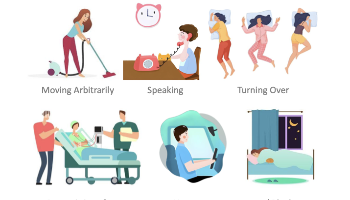
  <figcaption>RF-Carer is designed for real-world respiration monitoring under free movement, speech, turning over, dynamic interference, user-state changes, and obstacles such as blankets.</figcaption>
</figure>

## Why Cross-Domain Respiration Is Hard

Wireless respiration sensing needs to extract a subtle periodic chest-motion signal from RF reflections. In real deployments, that signal is mixed with factors that are irrelevant to respiration but change strongly across domains:

- **Range-space non-uniformity**: different range bins have different attenuation, phase offsets, and background reflections.
- **Spatial state agnosticism**: the system does not know the user's orientation, position, posture, or trajectory beforehand.
- **Time-varying interference**: free movement, speaking, turning over, and moving objects can disturb the raw signal at unpredictable times.

<figure class="markdown-figure">
  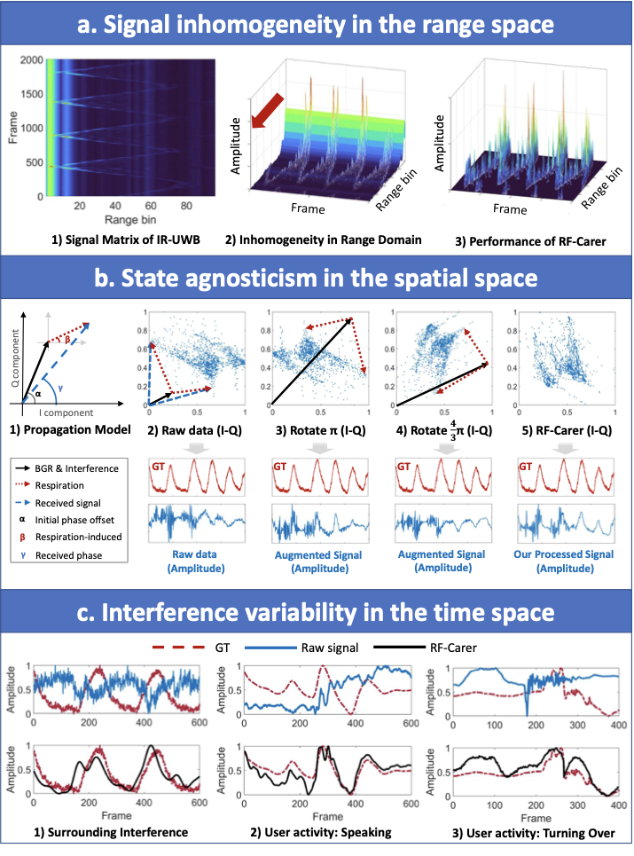
  <figcaption>The paper frames cross-domain respiration sensing as a signal unification problem across range, spatial, and temporal variation.</figcaption>
</figure>

## Main Contributions

- Proposes a **fully zero-effort cross-domain** respiration monitoring system that can be trained once and directly reused in unseen domains.
- Builds an **explainable propagation model** to transform heterogeneous RF signals from unknown domains into a unified representation in the signal processing layer.
- Introduces **feature-space alignment with noisy-dimension suppression** through contrastive learning, making the model more robust to irrelevant environmental and motion factors.
- Demonstrates adaptation across **12 domains and 57 practical cases**, including unconstrained body movement, unknown users, user-state changes, obstacles, and untrained environments.
- Releases code and a **56-hour dataset from 39 volunteers**.

## RF-Carer System

RF-Carer has two layers. The **signal processing layer** removes or compensates domain-dependent components before learning. It performs signal compensation, temporal-space and range-space background elimination, respiration identification and tracking, preliminary respiration extraction, and orientation/distance normalization. The **data training layer** then uses a two-way U-Net with contrastive learning to align respiration-related features and suppress noisy dimensions.

<figure class="markdown-figure">
  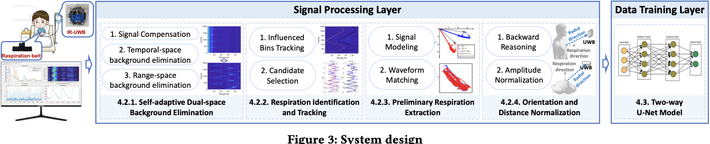
  <figcaption>RF-Carer combines a propagation-aware signal processing pipeline with a contrastive two-way U-Net model.</figcaption>
</figure>

### Method Highlights

- **Self-adaptive dual-space background elimination**: compensates range-dependent signal variation and removes temporal and range-space background components.
- **Consistent factor matching**: preliminarily extracts respiration signals without assuming a fixed respiration period or regular waveform shape.
- **Backward reasoning**: compensates posture and distance changes using signal geometry rather than prior domain labels.
- **Contrastive bi-channel U-Net**: further aligns useful features and suppresses noisy dimensions after signal normalization.

## Dataset And Evaluation

The authors implement RF-Carer on a Novelda X4M05 IR-UWB radar operating at 7.3 GHz with a 1.5 GHz bandwidth. Ground truth is collected by a respiration sensing belt synchronized with the UWB radar. The one-fits-all model is trained with cluttered-lab data from 12 volunteers and evaluated in new domains.

| Item | Setup |
| --- | --- |
| Participants | 39 volunteers |
| Dataset scale | 56 hours |
| Training domain | Cluttered lab |
| Training volunteers | 12 |
| Time window | 30 s |
| Test coverage | 12 domains, 57 cases |
| Metrics | Cosine similarity (CS), respiration rate absolute error (RRAE) |

<figure class="markdown-figure">
  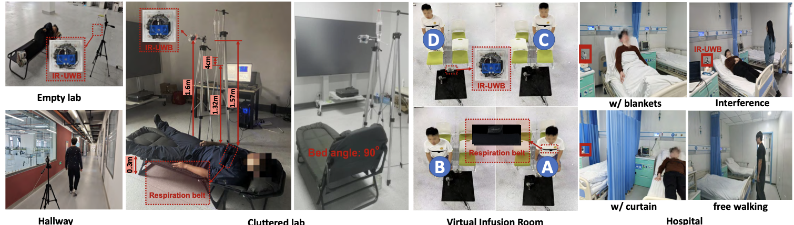
  <figcaption>The evaluation spans lab, virtual infusion-room, and hospital settings, plus obstacles, interference, and free walking.</figcaption>
</figure>

## Comparison With Related Work

Compared with recent respiration-monitoring systems using Wi-Fi, acoustic, RFID, mmWave, PPG, GPS, and UWB signals, RF-Carer is positioned as the first RF-based respiration system in the table that supports movement tolerance, non-in-situ movement, and explicit cross-domain evaluation together.

<figure class="markdown-figure">
  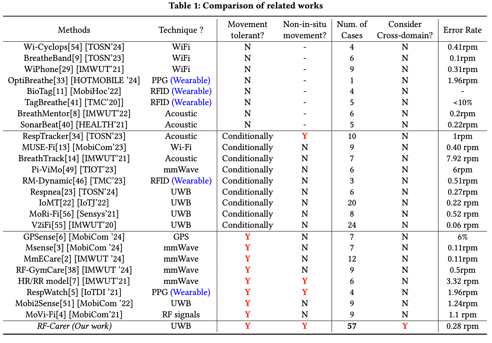
  <figcaption>RF-Carer uses UWB, covers 57 cases, supports non-in-situ movement, and reports 0.28 rpm error under cross-domain evaluation.</figcaption>
</figure>

## Core Results

The main quantitative table reports RRAE across user states, free movements, and environments. RF-Carer obtains the best or second-best result in **43 of 57** cases and reaches the lowest average RRAE, **0.28 rpm**, across all domains.

<div class="markdown-table-wrap">
  <table class="markdown-table">
    <thead>
      <tr>
        <th>Method</th>
        <th>Average RRAE</th>
        <th>Top-2 Cases</th>
        <th>Interpretation</th>
      </tr>
    </thead>
    <tbody>
      <tr>
        <td>AUG</td>
        <td>1.76 rpm</td>
        <td>0</td>
        <td>Virtual sample augmentation alone is not enough for unseen domains.</td>
      </tr>
      <tr>
        <td>RF-Carer*</td>
        <td>0.72 rpm</td>
        <td>16</td>
        <td>Signal processing alone already improves cross-domain robustness.</td>
      </tr>
      <tr>
        <td>MoRe-Fi</td>
        <td>0.97 rpm</td>
        <td>1</td>
        <td>Learning-based isolation is less stable under broad domain shift.</td>
      </tr>
      <tr>
        <td>RF-Carer* + VED</td>
        <td>0.56 rpm</td>
        <td>16</td>
        <td>Processed signals help even when paired with an existing VED model.</td>
      </tr>
      <tr>
        <td>AUG + RF-Carer model</td>
        <td>0.65 rpm</td>
        <td>12</td>
        <td>The proposed model helps, but raw augmented input remains limiting.</td>
      </tr>
      <tr>
        <td><strong>RF-Carer</strong></td>
        <td><strong>0.28 rpm</strong></td>
        <td><strong>43</strong></td>
        <td><strong>Signal processing plus contrastive learning gives the strongest overall result.</strong></td>
      </tr>
    </tbody>
  </table>
</div>

<figure class="markdown-figure">
  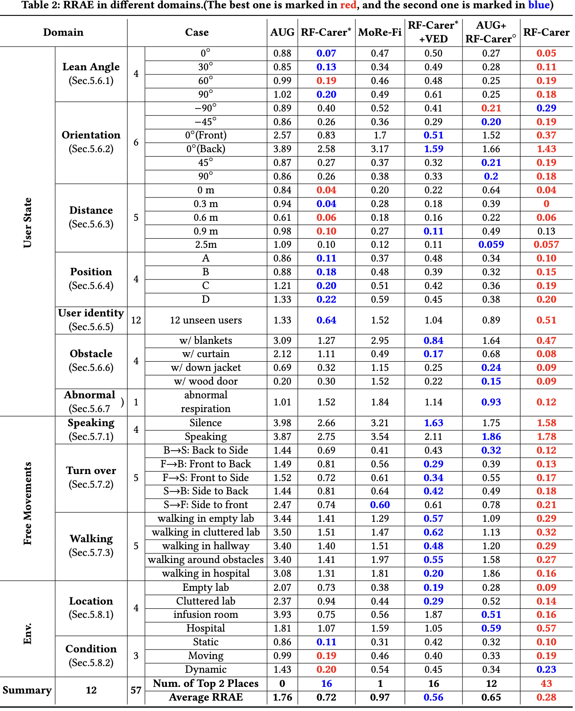
  <figcaption>RF-Carer achieves the best average RRAE across user-state, free-movement, and environment-related domains.</figcaption>
</figure>

## Cosine Similarity Analysis

In the source-domain overall evaluation, RF-Carer reaches **0.9522 average CS**, higher than AUG (0.8453), RF-Carer\* (0.9291), MoRe-Fi (0.912), RF-Carer\* + VED (0.9178), and AUG + RF-Carer model (0.8895). The user-state tests further show robustness to lean angle, orientation, distance, position, user identity, obstacles, and abnormal respiration.

<figure class="markdown-figure">
  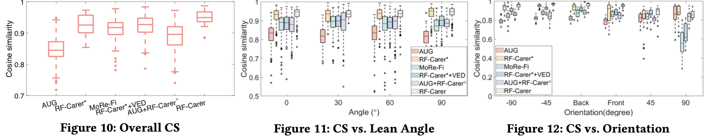
  <figcaption>Overall and posture-related CS results show that RF-Carer keeps high waveform similarity under user-state variation.</figcaption>
</figure>

<figure class="markdown-figure">
  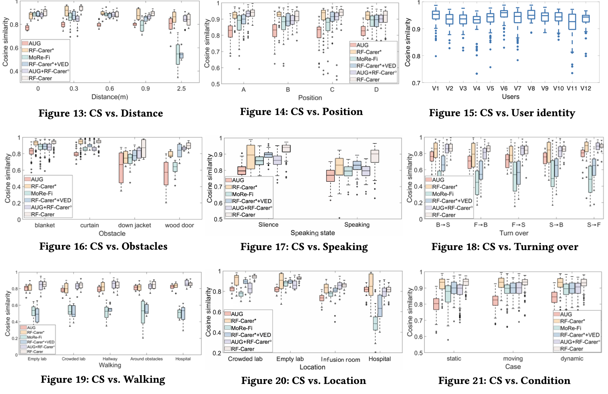
  <figcaption>Additional CS results cover distance, position, users, obstacles, speaking, turning over, walking, locations, and environmental conditions.</figcaption>
</figure>

## Free-Movement Waveforms

RF-Carer is evaluated under challenging free-movement settings, including speaking, turning over, and free walking. The waveform visualizations show that the raw signal can be heavily disturbed, while RF-Carer still recovers respiration curves close to the ground truth.

| Scenario | Reported RF-Carer Finding |
| --- | --- |
| Speaking | 0.8774 CS under voice-command interference |
| Turning over | 0.8572 average CS across five turning actions |
| Walking | 0.8481 average CS across five walking scenarios |
| Location | Best performance in empty lab, cluttered lab, and infusion room |
| Environmental condition | 0.931 average CS across static, moving, and dynamic conditions |

<figure class="markdown-figure">
  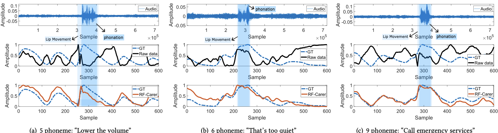
  <figcaption>During speaking interference, RF-Carer suppresses audio and lip-motion disturbances and recovers the respiration waveform.</figcaption>
</figure>

<figure class="markdown-figure">
  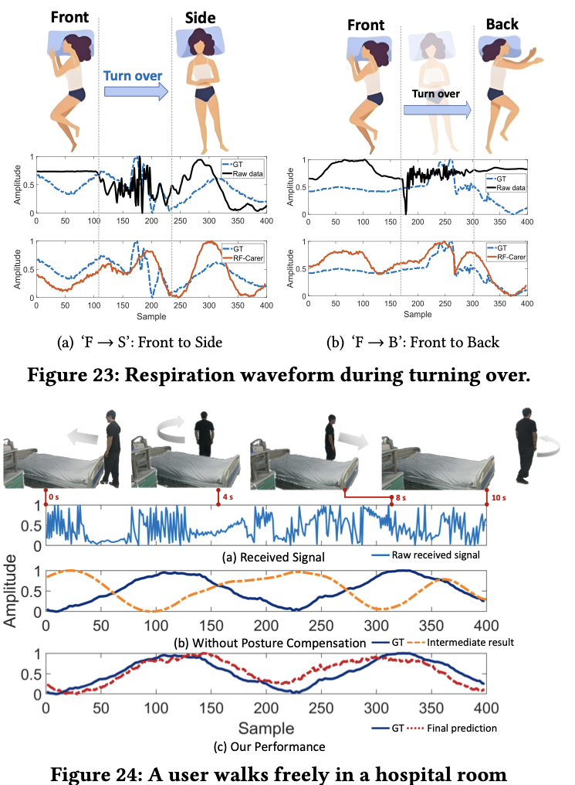
  <figcaption>Turning-over and hospital-walking examples illustrate RF-Carer's robustness under large body motion.</figcaption>
</figure>

## Domain Difference

The paper also measures KL divergence to confirm that the evaluated domains are genuinely different. The average KL divergence within a domain is **0.01956**, while the average KL divergence between domains is **2.7549**, a ratio of **174.33**.

<figure class="markdown-figure">
  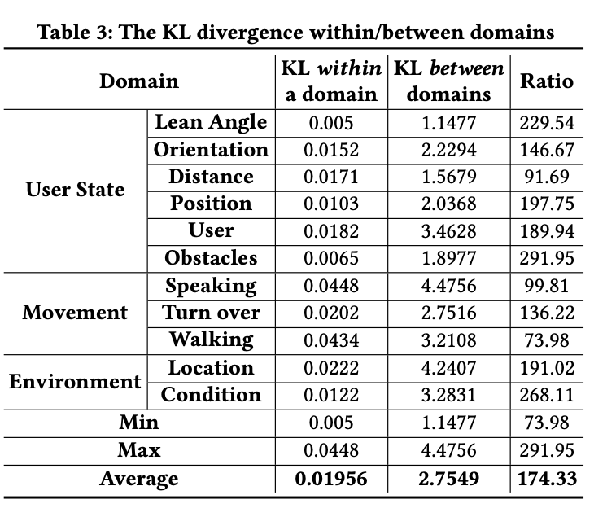
  <figcaption>KL-divergence analysis supports the claim that the evaluation spans strongly shifted domains rather than small perturbations.</figcaption>
</figure>

## Takeaways

- Signal processing is not just preprocessing here; it is the main generalization mechanism that maps heterogeneous UWB data into a more unified form.
- The full system outperforms either signal processing alone or learning alone, suggesting that RF-Carer benefits from both explainable modeling and feature-space alignment.
- The strongest evidence is the breadth of evaluation: 12 domains, 57 cases, 39 volunteers, 56 hours of data, and realistic free-movement settings.
- The method is especially relevant for deployment settings where calibration, recollection, or retraining is too expensive.

## Key Numbers

<div class="markdown-table-wrap">
  <table class="markdown-table">
    <thead>
      <tr>
        <th>Item</th>
        <th>Value</th>
      </tr>
    </thead>
    <tbody>
      <tr>
        <td>Dataset</td>
        <td>56 hours from 39 volunteers</td>
      </tr>
      <tr>
        <td>Evaluation breadth</td>
        <td>12 domains and 57 cases</td>
      </tr>
      <tr>
        <td>Average RRAE</td>
        <td><strong>0.28 rpm</strong></td>
      </tr>
      <tr>
        <td>Top-2 count in Table 2</td>
        <td>43 of 57 cases</td>
      </tr>
      <tr>
        <td>Overall source-domain CS</td>
        <td>0.9522</td>
      </tr>
      <tr>
        <td>Average KL between-domain / within-domain ratio</td>
        <td>174.33</td>
      </tr>
    </tbody>
  </table>
</div>

## Resources

- [Practical situations figure](./assets/fig1-practical-situations.png)
- [Main challenges figure](./assets/fig2-main-challenges.png)
- [System design figure](./assets/fig3-system-design.png)
- [Experiment setup figure](./assets/fig9-experiment-setup.png)
- [RRAE domain table](./assets/table2-rrae-domains.png)
- [ACM Official Page](https://dl.acm.org/doi/10.1145/3774906.3800465)
- [Code and dataset](https://github.com/GeWangXJTU/RF-Carer)

## Citation

```bibtex
@inproceedings{poster-zero-effort-cross-domain-wireless-respiration-monitoring-under-free-body-movement,
  title = {Zero-Effort Cross-Domain Wireless Respiration Monitoring Under Free Movements With Commercial UWB Devices},
  author = {Ge Wang and Jiazheng Chen and Zhe Chen and Fei Wang and Cong Zhao and Jianan Wang and Han Ding and Cui Zhao and Wei Xi and Jinsong Han},
  booktitle = {Proceedings of the ACM/IEEE International Conference on Embedded Artificial Intelligence and Sensing Systems (SenSys '26)},
  year = {2026}
}
```
