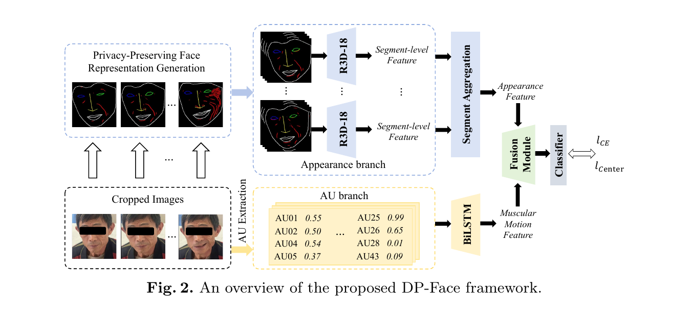
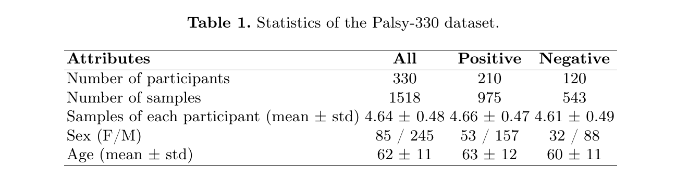
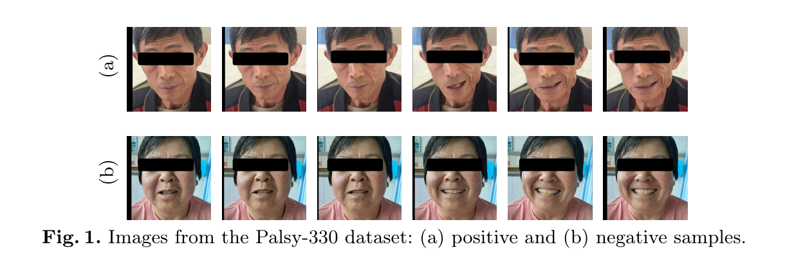
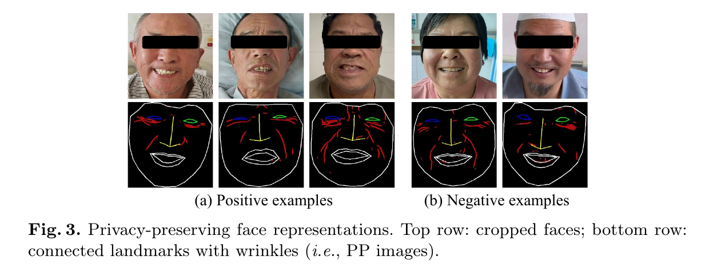
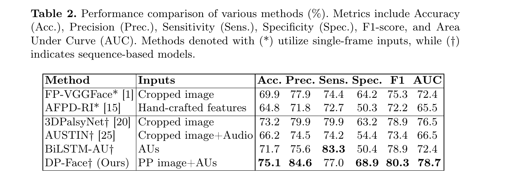
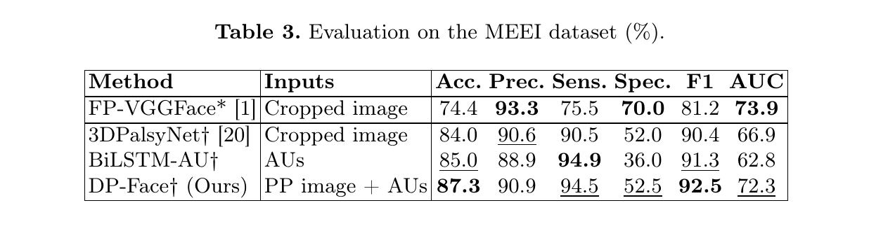
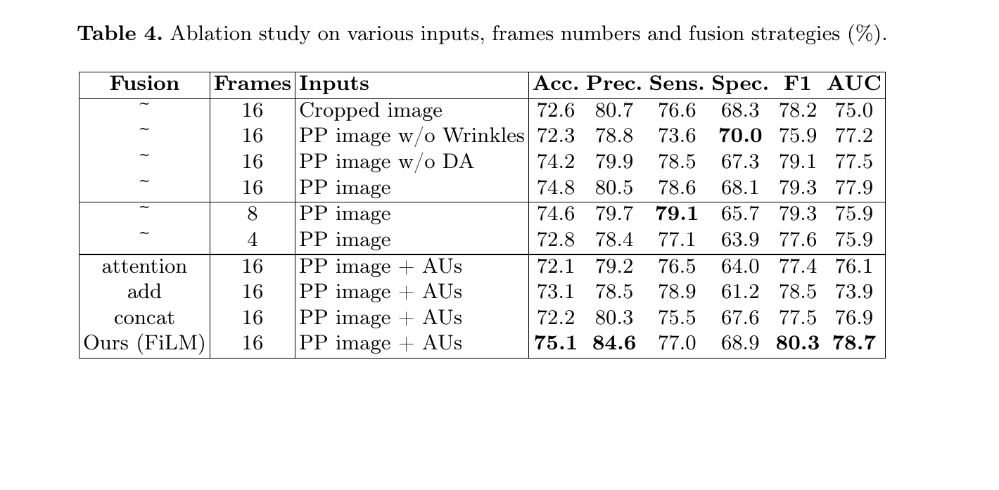

# Overview

Facial palsy is one of the visible cues used in rapid stroke screening protocols such as BEFAST. The core challenge is that automated analysis often needs face videos, but raw facial appearance carries sensitive identity information and is difficult to share as an open benchmark.

This paper introduces **DP-Face**, a video-based framework that recognizes facial palsy from dynamic facial behavior while reducing reliance on raw RGB appearance. Instead of treating the face video as ordinary identity-rich images, DP-Face transforms each frame into a privacy-preserving structural representation built from facial landmarks and wrinkle patterns, then combines that representation with temporal facial Action Unit dynamics.

The work also releases **Palsy-330**, a 330-subject video dataset for facial palsy classification collected from real clinical environments. Together, the dataset and model make the paper especially relevant for reproducible, privacy-aware medical AI research.



## Why It Matters

- **Clinically motivated target.** Facial asymmetry during expressions can support rapid pre-screening when advanced imaging or immediate neurological expertise is unavailable.
- **Privacy-aware input design.** DP-Face moves away from raw identity-heavy facial images and uses structural cues that retain diagnostic motion patterns.
- **Public benchmark value.** Palsy-330 provides a larger public video benchmark for facial palsy classification than prior non-public or small-scale datasets.
- **Dynamic modeling.** The method uses short video sequences and Action Units, rather than relying only on single static images.

This page summarizes the paper for research reading and lab archival purposes. The method should be understood as a screening-support research system, not as a standalone clinical diagnosis tool.

## Palsy-330 Dataset

Palsy-330 contains **330 participants**, including **210 positive** facial palsy subjects and **120 negative** subjects, with **1518 video samples** in total. Each participant performs a standardized clinical show-teeth smile task. The data were collected by physicians and nurses from 10 hospitals in western China, with labels verified by a senior chief physician.



The dataset includes multiple samples per participant, age and gender metadata, and anonymized hospital affiliation. Videos were mostly captured with smartphones, with some professional-camera recordings, across real lighting and clinical environments.

During preprocessing, faces are detected, cropped, and resized. Videos are downsampled to 20 fps, and each model input uses **16 consecutive frames**, chosen to cover the typical duration of a smile expression.



## Privacy-Preserving Representation

DP-Face first converts cropped face frames into **PP images**. The pipeline detects 68 facial landmarks with STAR, connects landmarks into facial contours, and overlays wrinkle patterns extracted from the face. The representation keeps clinically meaningful asymmetry around the mouth, nasolabial folds, eyes, and facial contour while removing much of the raw facial texture.



This representation is central to the paper's privacy argument. The authors also evaluate identity leakage with a person re-identification experiment: RGB images achieve **100% Rank-1** accuracy, while PP-to-RGB retrieval falls to **5.11% Rank-1** on a 100-subject gallery, close to the 1% chance level. This suggests that PP images strongly suppress identity information while preserving task-relevant facial dynamics.

## Dynamic Facial Action Modeling

Facial palsy is not only a static asymmetry problem. It also changes how muscles activate during facial expressions. DP-Face therefore extracts **20 facial Action Units** per frame using Py-Feat, producing continuous AU values between 0 and 1. These signals describe muscle-level behavior such as lip raising and lip corner pulling.

The model has two main branches:

- **Appearance branch.** The PP image sequence is divided into temporal segments. A pretrained ResNet3D-18 extracts segment-level appearance features, and a BiLSTM plus self-attention module aggregates long-range temporal information.
- **AU branch.** AU sequences are processed by a separate BiLSTM to model temporal muscle activation.
- **Fusion module.** The two streams are fused with FiLM, where AU features conditionally scale and shift the appearance representation before final classification.

The training objective combines cross-entropy loss with center loss, encouraging both correct classification and compact class-specific features.

## Evaluation Protocol

The paper uses a patient-independent five-fold cross-validation protocol. All samples from the same participant remain in the same fold, avoiding leakage where a model could memorize subject identity rather than learning palsy-related patterns. In each round, three folds are used for training, one for validation, and one for testing.

Evaluation uses Accuracy, Precision, Sensitivity, Specificity, F1-score, and AUC. Specificity is especially relevant for avoiding false alarms, while sensitivity is important for minimizing missed cases in screening-oriented use.

## Main Results On Palsy-330

DP-Face achieves the strongest overall result among the evaluated baselines. On Palsy-330, it reaches **75.1% Accuracy**, **84.6% Precision**, **80.3% F1-score**, and **78.7% AUC**. It outperforms both single-frame methods such as FP-VGGFace and AFPD-RI, and sequence-based methods such as 3DPalsyNet and BiLSTM-AU.



The result supports two conclusions. First, temporal facial dynamics matter: sequence-based methods generally outperform single-frame baselines. Second, privacy-preserving representations can remain competitive, especially when combined with dynamic Action Unit cues and conditional fusion.

## Cross-Dataset Generalization

The authors also evaluate on the public MEEI facial palsy dataset. MEEI is smaller and more imbalanced than Palsy-330, with substantially fewer normal subjects. Even under this harder setting, DP-Face reports **87.3% Accuracy**, **94.5% Sensitivity**, and **92.5% F1-score**.



The lower specificity on MEEI reflects the dataset imbalance, but the high sensitivity is aligned with the paper's pre-screening motivation, where reducing missed positive cases is especially important.

## Ablation Findings

The ablation study separates the effects of input representation, temporal length, and fusion strategy.



Key findings:

- **Wrinkle cues help.** PP images with wrinkles improve over PP images without wrinkles and over raw cropped images in the reported setting.
- **Temporal context matters.** Using 16 frames gives the best overall performance among the tested 16, 8, and 4 frame settings.
- **FiLM fusion is effective.** AU-conditioned FiLM fusion outperforms attention, addition, and concatenation fusion strategies.

## Takeaways

DP-Face is useful because it connects three needs that often conflict in medical AI: dynamic modeling, privacy protection, and reproducible benchmarking. The paper does not simply blur or anonymize faces after the fact. Instead, it changes the input representation so that the model learns from geometry, wrinkles, and muscle dynamics rather than identity-heavy texture.

For future work, the most natural next steps are broader clinical validation, severity grading rather than binary classification, and more detailed evaluation across camera types, hospitals, ages, and stroke-related clinical subgroups.

## Resources

- [Code and dataset](https://github.com/ChangYuance/DP-Face)

## Citation

```bibtex
@inproceedings{chang2026dpface,
  title = {Privacy-Preserving Video-Based Facial Palsy Recognition via Dynamic Facial Action Modeling},
  author = {Chang, Yuance and Liu, Bang and Ding, Han and Zhao, Cui and Wang, Fei and Wang, Ge and Xi, Wei},
  booktitle = {MICCAI},
  year = {2026}
}
```
