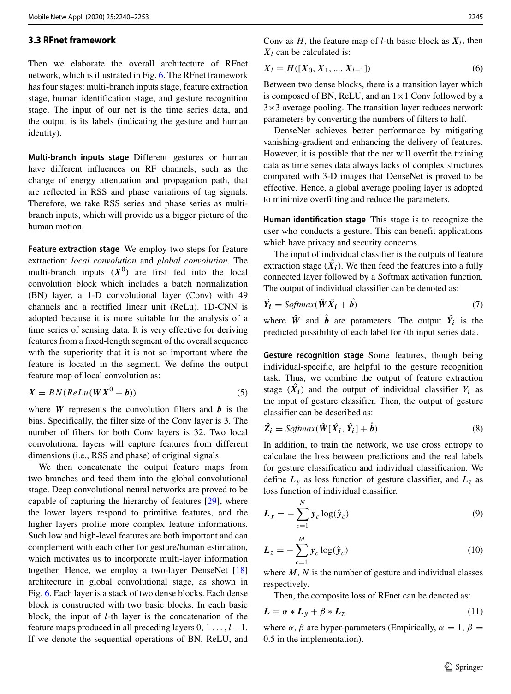
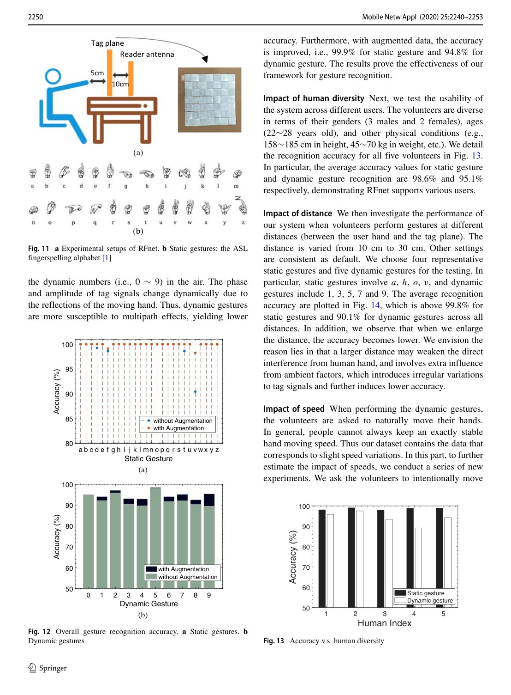
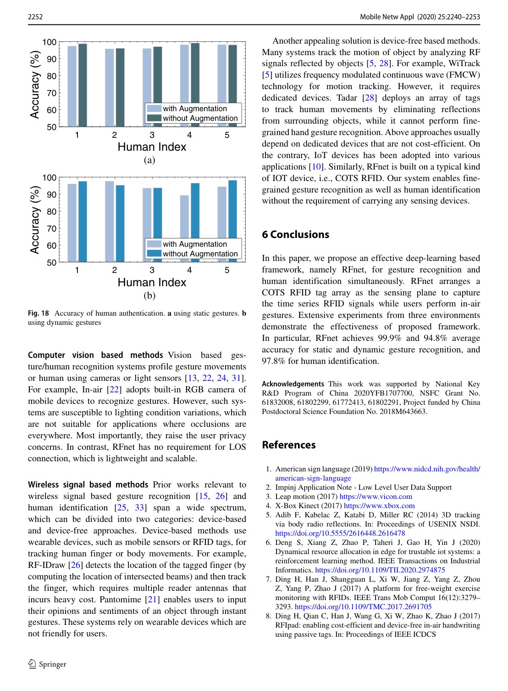

# Overview

Gesture recognition enables touchless human-computer interaction, but cameras depend on lighting and raise privacy concerns, while wearable approaches require users to carry devices. Device-free wireless sensing offers another path, yet many earlier systems rely on heavy handcrafted preprocessing and feature engineering.

RFnet studies whether time-series RFID signals can be used more directly. It arranges a commercial RFID tag array as a sensing plane and uses a multi-branch 1D CNN to recognize gestures and identify users.

## Main Contributions

- Proposes RFnet, a deep-learning framework for time-series RFID sensing.
- Recognizes static gestures, dynamic gestures, and human identity in one framework.
- Uses multi-branch 1D convolution to learn from raw temporal RFID signal fluctuations.
- Reduces the need for handcrafted feature engineering.
- Evaluates the system in three environments.

## Method Design

The RFID tag array captures signal changes as users perform in-air gestures. RFnet processes these time-series signals with multiple convolutional branches, allowing the model to capture patterns at different temporal resolutions and signal channels. The learned representation is then used for gesture classification and identity recognition.

This design is practical for smart homes and interactive systems because the user does not need to wear a sensor or stand in front of a camera.

## Evaluation Highlights

The paper reports 99.9 percent average accuracy for static gesture recognition, 94.8 percent for dynamic gesture recognition, and 97.8 percent for human identification. Experiments across three environments demonstrate that the learned temporal features generalize beyond a single room setup.

## Takeaways

RFnet shows the value of end-to-end temporal learning for RFID sensing. It shifts the burden from manual feature design to representation learning while keeping the sensing setup device-free for the user.

## Paper Screenshots: Method, Principle, And Results

The screenshots below are cropped from the paper PDF and are placed next to the reading notes so the page shows the actual method diagrams, principle illustrations, and result evidence rather than only prose.

<figure class="markdown-figure">
  
  <figcaption>RFnet multi-branch 1D-CNN framework for RFID time series. The screenshot shows the four-stage design from inputs to gesture and identity outputs.</figcaption>
</figure>

<figure class="markdown-figure">
  
  <figcaption>RFnet experimental setup and gesture collection protocol. This page makes the sensing plane and user interaction setup concrete.</figcaption>
</figure>

<figure class="markdown-figure">
  
  <figcaption>Human identification and gesture recognition accuracy analysis. The result page shows robustness under augmentation and user variation.</figcaption>
</figure>

## Resources

- [Official paper / publisher page](https://doi.org/10.1007/s11036-020-01659-4)
- [Cover image](./assets/cover.svg)

## Citation

```bibtex
@inproceedings{rfnet-automatic-gesture-recognition-and-human-identification-using-time-series-rfid-signals,
  title = {RFnet: Automatic gesture recognition and human identification using time series RFID signals},
  author = {H Ding and L Guo and C Zhao and F Wang and G Wang and Z Jiang and W Xi and J Zhao},
  booktitle = {Mobile Networks and Applications 25 (6), 2240-2253, 2020},
  year = {2020}
}
```
