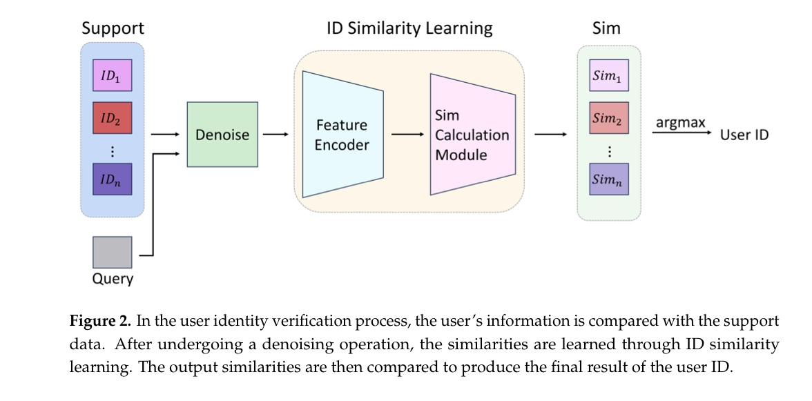
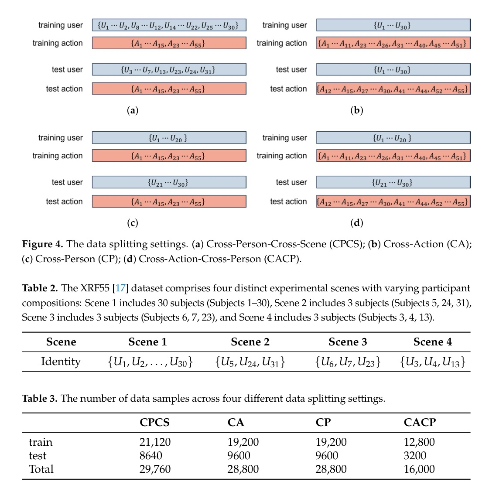
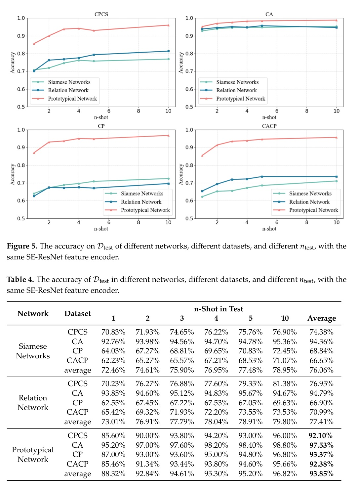
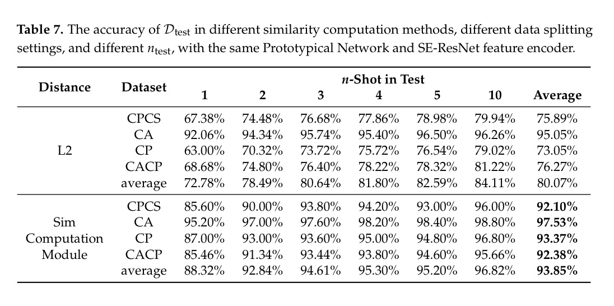
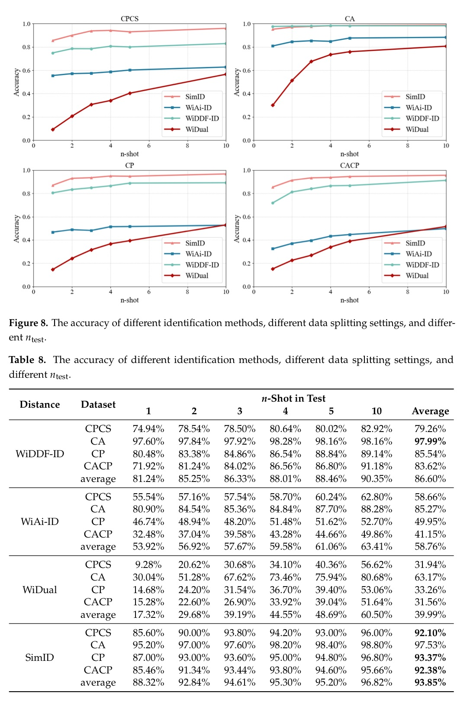

# Overview

SimID targets indoor user recognition with commodity Wi-Fi signals. The motivation is practical: smart-home and IoT services often need to know who is present, but camera-based recognition raises privacy concerns and conventional Wi-Fi classifiers struggle when new users, new actions, or new environments appear after deployment.

The paper reframes Wi-Fi user identification as identity-similarity learning. Instead of training a closed-set classifier tied to a fixed list of users, SimID learns an embedding and similarity function. During deployment, the system stores a small support set of Wi-Fi templates for each enrolled user. A new query sample is compared against those templates, and the identity with the highest similarity is returned. In the strongest few-shot setting, the support set can contain only one sample per user.

<figure class="markdown-figure">
  
  <figcaption>SimID pipeline. Wi-Fi query samples are denoised, encoded, and compared with support templates through an identity-similarity module.</figcaption>
</figure>

## Why It Matters

Behavior-based user identification can make smart environments more personalized without requiring passwords, fingerprints, or face scans. Wi-Fi sensing is especially attractive because it is contactless, privacy-preserving, robust to lighting, and deployable with existing infrastructure.

The hard part is generalization. In a real home, a system may encounter new people, new activities, or a different room layout. A closed-set classifier usually needs new labeled data and retraining. SimID instead makes enrollment template-based: adding a user means adding one or a few support samples rather than rebuilding the classifier.

## Method

SimID first denoises raw CSI with a second-order Butterworth low-pass filter, following the style of prior Wi-Fi identification work. The feature encoder is based on SE-ResNet, adapted to Wi-Fi time-series data by replacing 2D convolutions with 1D convolutions. This reduces the trainable parameter count from 4.94 M in the 2D version to 3.16 M in the 1D version.

Training follows a prototypical-network style procedure. In each iteration, SimID samples a support set and a query set, computes each user's prototype from support features, and compares the query feature with every prototype. The proposed similarity computation module operates on the squared feature difference, then applies batch normalization and a linear layer to produce similarity scores. Cross-entropy over the similarity scores pushes samples from the same user together and separates samples from different users.

## Dataset And Splits

The evaluation uses XRF55, a large multimodal indoor action dataset. For SimID, the paper uses the Wi-Fi CSI modality and removes seven human-human interaction classes so that the task remains single-user identification. The resulting setup covers 31 subjects and 48 action classes. Wi-Fi data are collected with one Intel 5300 transmitter and three Intel 5300 receivers arranged around a 3.1 m x 3.1 m area, producing nine wireless links and 30 OFDM subcarriers per link.

The paper defines four data splits to stress different deployment shifts:

| Split | Deployment question | Train samples | Test samples |
|---|---|---:|---:|
| CPCS | New people in new scenes | 21,120 | 8,640 |
| CA | Known people with unseen actions | 19,200 | 9,600 |
| CP | Unseen people in the same scene | 19,200 | 9,600 |
| CACP | Unseen people performing unseen actions | 12,800 | 3,200 |

<figure class="markdown-figure">
  
  <figcaption>XRF55 split design. SimID is evaluated under cross-scene, cross-action, cross-person, and combined cross-action-cross-person settings.</figcaption>
</figure>

## Few-Shot Recognition Results

The headline result is that SimID remains accurate even when the support set is tiny. With the Prototypical Network plus SE-ResNet10 configuration, average accuracy reaches 97.53 percent for cross-action, 93.37 percent for cross-person, 92.38 percent for cross-action-cross-person, and 92.10 percent for cross-person-cross-scene recognition.

| Split | 1-shot | 2-shot | 5-shot | 10-shot | Average |
|---|---:|---:|---:|---:|---:|
| CPCS | 85.60% | 90.00% | 93.00% | 96.00% | 92.10% |
| CA | 95.20% | 97.00% | 98.40% | 98.80% | 97.53% |
| CP | 87.00% | 93.00% | 94.80% | 96.80% | 93.37% |
| CACP | 85.46% | 91.34% | 94.60% | 95.66% | 92.38% |
| Average | 88.32% | 92.84% | 95.20% | 96.82% | 93.85% |

<figure class="markdown-figure">
  
  <figcaption>Few-shot network comparison. The Prototypical Network is consistently stronger than Siamese and Relation Network alternatives for this Wi-Fi identity-recognition task.</figcaption>
</figure>

## Similarity Module Ablation

A central contribution is the Sim computation module. The paper compares it with the conventional L2 distance used in prototypical networks while keeping the feature encoder and training setup fixed. The gain is largest in low-shot settings, where support templates are scarce and a learned similarity function helps reduce mistakes.

| Similarity method | 1-shot avg. | 2-shot avg. | 10-shot avg. | Overall avg. |
|---|---:|---:|---:|---:|
| L2 distance | 72.78% | 78.49% | 84.11% | 80.07% |
| Sim computation module | 88.32% | 92.84% | 96.82% | 93.85% |

<figure class="markdown-figure">
  
  <figcaption>Similarity computation ablation. Replacing L2 distance with the Sim module substantially improves few-shot identity recognition.</figcaption>
</figure>

## Comparison With Conventional Identification

The paper also compares SimID with conventional CSI-based user-identification systems: WiDDF-ID, WiAi-ID, and WiDual. For settings with unseen users, these baselines require fine-tuning on the few available target samples, while SimID directly performs support-query matching. SimID achieves the best overall average accuracy, especially under cross-person and cross-person-cross-scene shifts.

| Method | CPCS avg. | CA avg. | CP avg. | CACP avg. | Overall avg. |
|---|---:|---:|---:|---:|---:|
| WiDDF-ID | 79.26% | 97.99% | 85.54% | 83.62% | 86.60% |
| WiAi-ID | 58.66% | 85.27% | 49.95% | 41.15% | 58.76% |
| WiDual | 31.94% | 63.17% | 33.26% | 31.56% | 39.99% |
| SimID | 92.10% | 97.53% | 93.37% | 92.38% | 93.85% |

<figure class="markdown-figure">
  
  <figcaption>Comparison with conventional methods. SimID avoids classifier fine-tuning and keeps stronger accuracy under new-user and new-scene shifts.</figcaption>
</figure>

## Takeaways

SimID is a useful template for open-world Wi-Fi identity recognition. Its design separates representation learning from enrollment: the model learns identity similarity once, and later users can be added through support samples. This is closer to how a deployed smart-home system would need to work.

The main limitation is that SimID is still few-shot rather than zero-shot. It needs at least one support template for a new identity, and the working-distance study is tied to the XRF55 3.1 m x 3.1 m setup. The authors identify zero-shot recognition and adaptive template selection as future directions.

## Resources

- [Official paper / publisher page](https://doi.org/10.3390/s25165151)
- [Code repository](https://github.com/FairyStories-wzj/SimID)
- [Cover image](./assets/paper-system.jpg)

## Citation

```bibtex
@article{wang2025simid,
  title = {SimID: Wi-Fi-Based Few-Shot Cross-Domain User Recognition with Identity Similarity Learning},
  author = {Wang, Zhijian and Ouyang, Lei and Chen, Shi and Ding, Han and Wang, Ge and Wang, Fei},
  journal = {Sensors},
  volume = {25},
  number = {16},
  pages = {5151},
  year = {2025},
  doi = {10.3390/s25165151}
}
```
