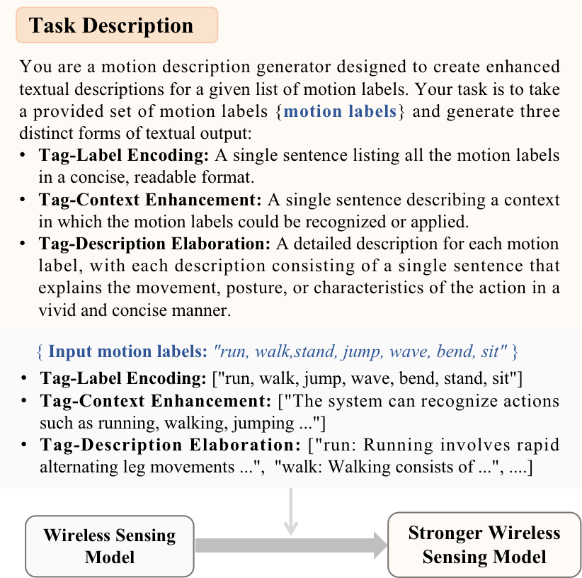
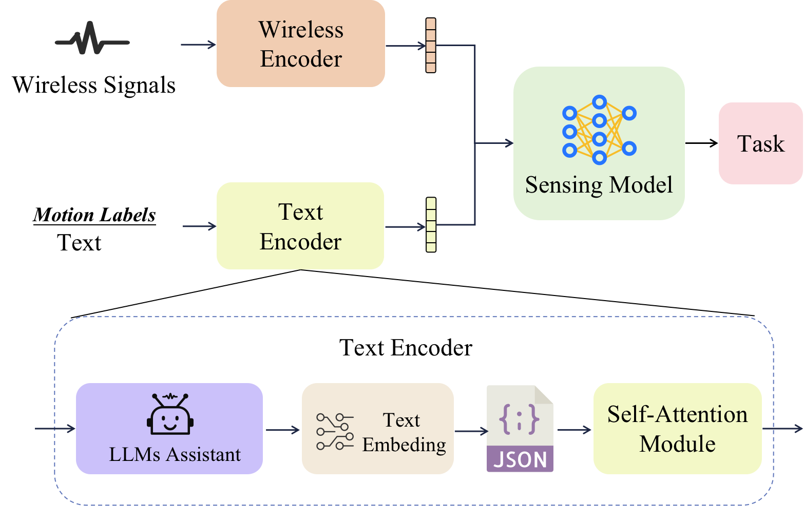
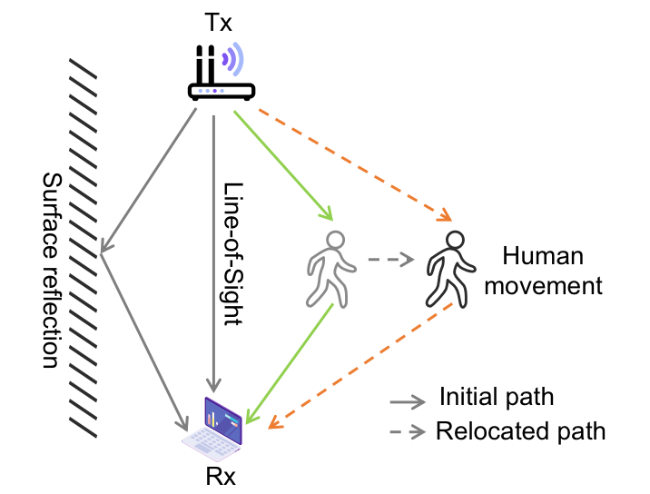
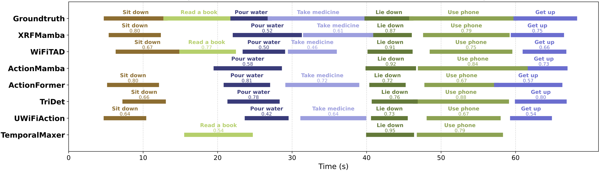
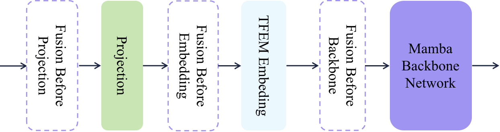

# Overview

Wireless sensing datasets already contain semantic information in their action labels, but most models treat those labels only as class IDs. **WiTalk** asks whether this low-cost text signal can become a useful training and inference modality for wireless sensing. The paper studies WiFi, mmWave radar, and RFID sensing, and uses text prompts to improve human action recognition and temporal action localization.

The central idea is intentionally practical: do not redesign the wireless backbone. Instead, attach a text branch that turns raw action labels into richer semantic embeddings, fuse those embeddings with wireless features, and let the existing sensing model benefit from task-level language knowledge.

<figure class="markdown-figure">
  
  <figcaption>Text prompt construction. WiTalk converts motion labels into hierarchical semantic descriptions, from compact labels to richer action descriptions.</figcaption>
</figure>

## Main Contributions

- Introduces a plug-and-play text-enhanced framework for wireless sensing models.
- Uses three prompt strategies with increasing semantic richness: tag-label encoding, tag-context enhancement, and tag-description elaboration.
- Applies the same text-branch idea to WiFi, RFID, and mmWave action recognition, as well as WiFi temporal action localization.
- Adds only a small overhead to existing models, reported as about **3M parameters** and **0.02 GFLOPs**, roughly **2.5%** of WiFiTAD's parameter size.
- Validates the method on XRF55, WiFiTAL, and XRFV2, showing consistent gains across recognition and localization tasks.

## Method

WiTalk processes wireless features and text features in parallel. The wireless signal is handled by the original sensing encoder. In the text branch, motion labels are expanded by an LLM assistant into prompt descriptions, encoded by a text encoder, stored as static embeddings, refined with self-attention, and fused with wireless features before the sensing task head.

This design has two deployment advantages. First, the text embeddings can be prepared ahead of time and loaded from a JSON-style feature store. Second, the original sensing architecture remains mostly intact, so WiTalk can be attached to existing WiFi, RFID, and mmWave pipelines.

<figure class="markdown-figure">
  
  <figcaption>WiTalk framework. Wireless features are fused with prompt-derived text embeddings before downstream recognition or localization.</figcaption>
</figure>

## Wireless Sensing Scope

The paper covers three representative wireless modalities. WiFi sensing uses CSI changes caused by human-induced multipath effects. RFID sensing uses backscatter signal variation from passive tags. mmWave sensing uses FMCW radar to estimate motion-related range, velocity, and angle information. WiTalk does not depend on a single physical signal type; it treats textual action semantics as an additional source of supervision across modalities.

<figure class="markdown-figure">
  
  <figcaption>WiFi sensing principle. Human motion perturbs multipath propagation, producing CSI variation that can encode actions.</figcaption>
</figure>

## Results

On XRF55, adding text improves action-recognition accuracy for all three tested wireless modalities. WiFi gains **3.90 points**, RFID gains **2.59 points**, and mmWave gains **0.46 points**. The larger WiFi and RFID gains suggest that prompt semantics help most when the signal representation has more ambiguity or weaker task separation.

| Dataset / Task | Baseline | With Text | Gain |
| --- | ---: | ---: | ---: |
| XRF55 WiFi accuracy | 87.26 | 91.16 | +3.90 |
| XRF55 RFID accuracy | 56.82 | 59.41 | +2.59 |
| XRF55 mmWave accuracy | 86.88 | 87.34 | +0.46 |
| WiFiTAL average mAP | 66.31 | 71.29 | +4.98 |

For temporal action localization, WiTalk improves WiFiTAD on WiFiTAL across all reported tIoU thresholds, with gains from **3.81** to **5.88** points and an average gain of **4.98**. On XRFV2, adding text improves multiple temporal localization methods, including TemporalMaxer, ActionFormer, TriDet, WiFiTAD, UWiFiAction, ActionMamba, and XRFMamba.

<figure class="markdown-figure">
  
  <figcaption>XRFV2 localization visualization. Text-enhanced variants better align predicted action segments with the ground truth timeline.</figcaption>
</figure>

The strongest XRFV2 average mAP gains are reported for **TriDet (+13.68)** and **XRFMamba (+13.19)**. These gains support the paper's claim that text is not just metadata; prompt semantics can make wireless temporal localization more discriminative.

| XRFV2 Method | Baseline Avg mAP | With Text Avg mAP | Gain |
| --- | ---: | ---: | ---: |
| TemporalMaxer | 33.78 | 40.10 | +6.32 |
| ActionFormer | 43.14 | 49.95 | +6.81 |
| TriDet | 35.22 | 48.90 | +13.68 |
| WiFiTAD | 51.55 | 56.12 | +4.57 |
| UWiFiAction | 33.37 | 37.39 | +4.02 |
| ActionMamba | 61.88 | 67.29 | +5.42 |
| XRFMamba | 52.61 | 65.80 | +13.19 |

## Prompt And Fusion Findings

The ablation study compares CLIP, Qwen, and LLaMA embeddings under different prompt strategies. CLIP is the most robust overall, and tag-context enhancement performs especially well on WiFiTAL and XRFV2. The paper also reports that weighted fusion with a **0.9 wireless / 0.1 text** balance works best in the WiFiTAD setting, outperforming heavier text weighting.

<figure class="markdown-figure">
  
  <figcaption>Fusion-stage study. The paper evaluates where to inject text features and finds that later weighted fusion can be effective for temporal localization.</figcaption>
</figure>

## Takeaways

WiTalk is useful because it treats text labels as a free semantic resource rather than a bookkeeping artifact. The method is not trying to replace wireless features with language; it uses language to guide feature learning and class separation. The result is a simple recipe for improving existing wireless sensing systems with a small text branch and carefully designed prompts.

## Resources

- [arXiv paper](https://arxiv.org/abs/2504.14621)
- [Code](https://github.com/yangzhenkui/WiTalk)
- [Prompt figure](./assets/paper-prompts.png)
- [Method figure](./assets/paper-method.png)
- [XRFV2 visualization](./assets/paper-xrfv2-visualization.png)

## Citation

```bibtex
@article{yang2025witalk,
  title = {Talk is Not Always Cheap: Promoting Wireless Sensing Models with Text Prompts},
  author = {Yang, Zhenkui and Huang, Zeyi and Wang, Ge and Ding, Han and Han, Tony Xiao and Wang, Fei},
  journal = {arXiv preprint arXiv:2504.14621},
  year = {2025}
}
```
