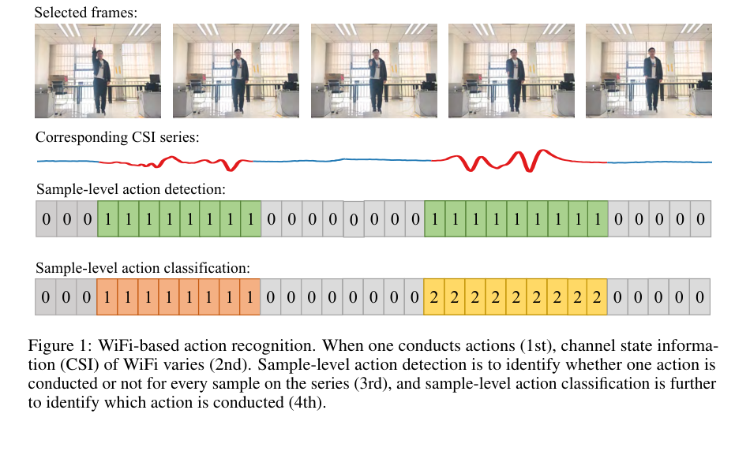
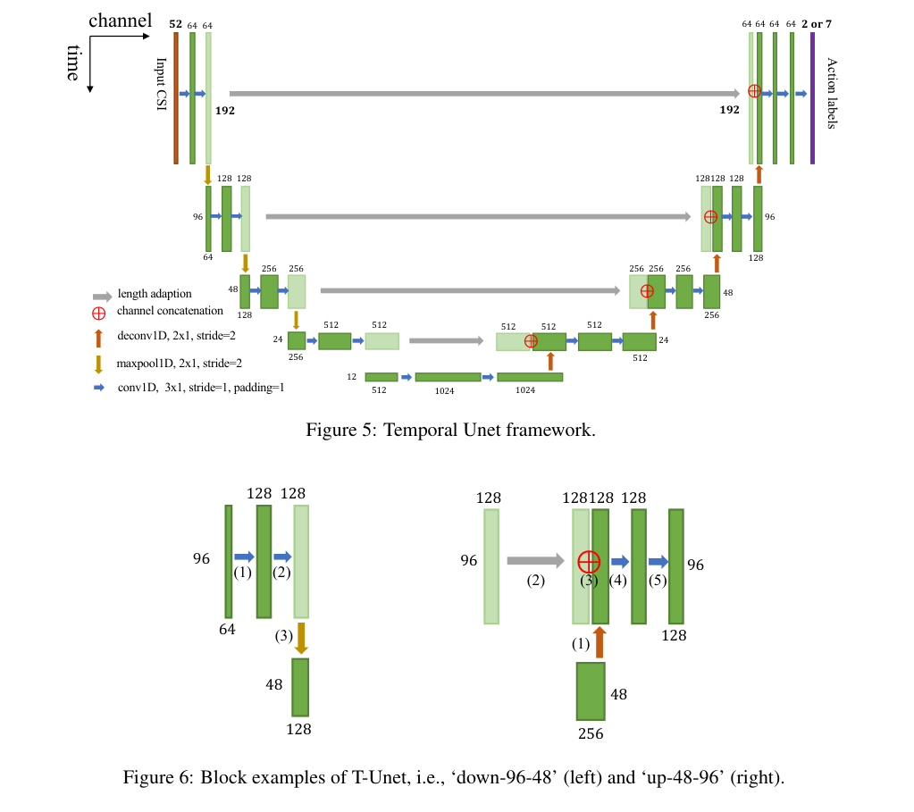
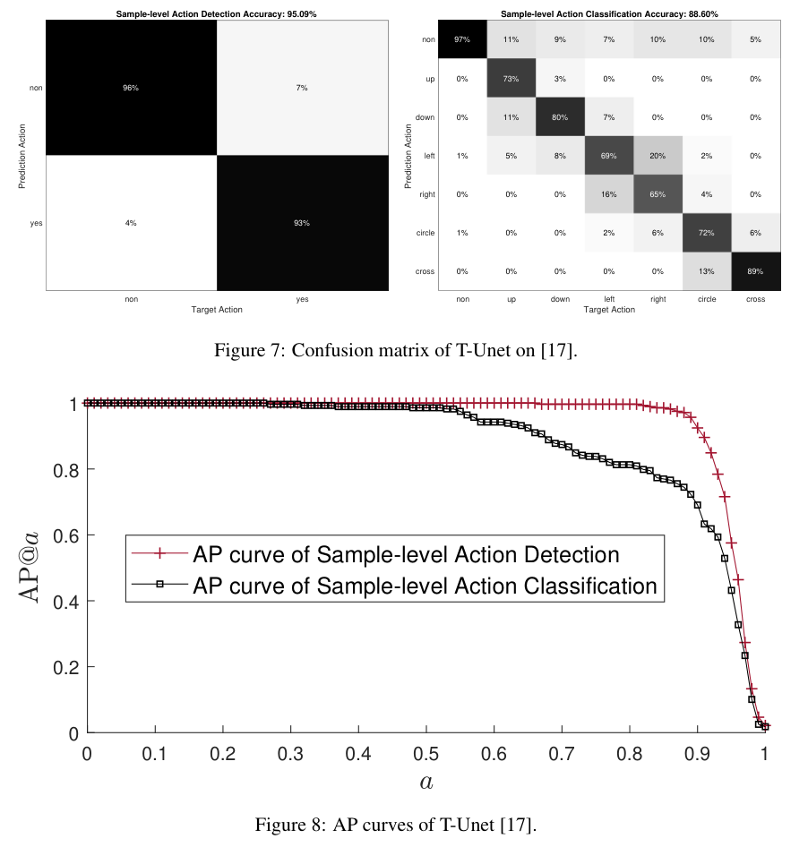
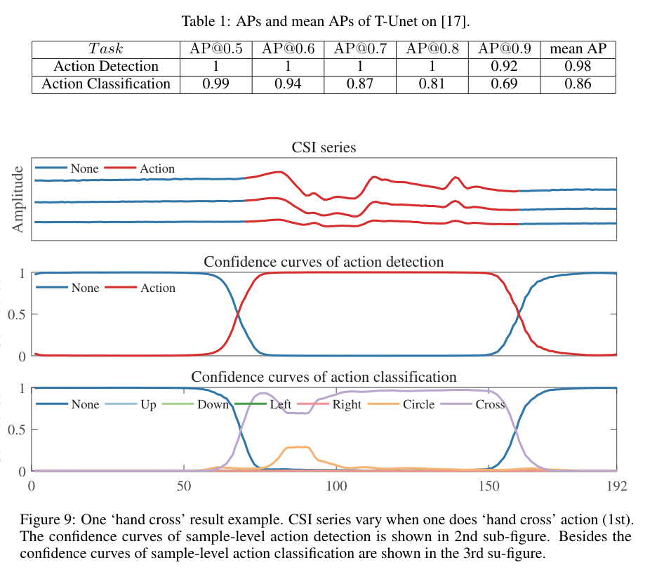

# Overview

Most early Wi-Fi action recognition systems treat a CSI distortion sequence as a single clip: detect the start and end of an action, crop the sequence, and classify the whole segment with one label. **Temporal U-Net** reframes the problem as dense temporal labeling. Instead of asking "what action is in this sequence?", it asks "what is happening at every CSI sample?"

This finer formulation matters for practical sensing. A real deployment may see continuous motion, multiple adjacent actions, transition periods, and uncertain boundaries. Sample-level labels support precise action localization, continuous action segmentation, and real-time recognition because the model can output a decision for every sampling moment.

## Main Contributions

- Introduces **sample-level Wi-Fi action recognition** as a dense sensing task, including both action detection and action classification at each CSI sample.
- Analyzes connections to image semantic segmentation and video frame-level action recognition, then adapts those ideas to CSI time series.
- Proposes **Temporal U-Net**, an encoder-decoder network with 1D temporal convolution, pooling, deconvolution, and shortcut connections.
- Shows that the same architecture can handle binary action/non-action detection and multi-class gesture classification.
- Evaluates on a public CSI gesture dataset and reports 95.09% sample-level detection accuracy and 88.60% sample-level classification accuracy.

## Task Definition

The paper separates sample-level recognition into two tasks. In **sample-level action detection**, each CSI sample is labeled as either non-action or action. In **sample-level action classification**, each sample is assigned one of the gesture classes, with an additional non-action class for background periods.

This is harder than series-level recognition because a single CSI sample is rarely enough to identify a gesture. The model must learn temporal context around the target sample while preserving the output length so every input sample receives a corresponding label.

<figure class="markdown-figure">
  
  <figcaption>Sample-level Wi-Fi action recognition: CSI changes are mapped to dense action/non-action labels and then to fine-grained action classes for each sample.</figcaption>
</figure>

## Design Insights

Temporal U-Net borrows two intuitions from computer vision. From semantic segmentation, it inherits the need for both small and large fields of view: one pixel cannot reveal much alone, and likewise one CSI sample cannot fully identify an action. From video action recognition, it inherits the importance of temporal operations: adjacent frames, or adjacent CSI samples, contain motion cues that should be learned across time.

The resulting design target is compact: learn local CSI variation, aggregate broader temporal context, and return predictions at the original sampling resolution.

## Temporal U-Net Architecture

The model maps a CSI series \(C = {c_i}\) to an action-label series \(A = {a_i}\) with the same temporal length. Its encoder path uses 1D convolution and max pooling along the time axis, allowing deeper layers to capture larger temporal views. Its decoder path uses temporal deconvolution to recover the original sequence length. Shortcut connections concatenate shallow and deep features so the final prediction can use both detailed boundary information and high-level action context.

In the implementation described by the paper, an input CSI sequence has length 192 and 52 OFDM data-carrier channels. The output has either 2 channels for action detection or 7 channels for classification, corresponding to six gestures plus the non-action class.

<figure class="markdown-figure">
  
  <figcaption>Temporal U-Net applies 1D temporal convolution, max pooling, deconvolution, and shortcut concatenation to preserve dense per-sample outputs.</figcaption>
</figure>

## Dataset And Training

The experiments use the CSI gesture dataset released with the earlier joint activity recognition and localization work. The dataset contains six gestures: hand up, hand down, hand left, hand right, hand circle, and hand cross. Each CSI sequence has manually annotated action start and end points.

The training set contains 1116 Wi-Fi series collected from one volunteer across 16 indoor locations, and the test set contains 278 series. Each series is represented as a 192 by 52 CSI matrix. The model is implemented in PyTorch, trained with cross-entropy loss and Adam, and optimized for both binary detection and multi-class classification.

## Results

Temporal U-Net achieves strong sample-level detection performance: 95.09% accuracy for action/non-action labeling. The confusion matrix shows that most non-action and action samples are separated cleanly. Its detection AP remains high even at strict thresholds, with mean AP of 0.98 across AP@0.5 to AP@0.9.

The classification task is harder because the model must distinguish gesture types and handle transition samples near action boundaries. Temporal U-Net reaches 88.60% sample-level classification accuracy and 0.86 mean AP. The main error pattern is confusion between hand right and hand left, plus some transition samples being predicted as non-action.

<figure class="markdown-figure">
  
  <figcaption>Detection is easier than multi-class classification: the model reaches 95.09% detection accuracy and 88.60% classification accuracy.</figcaption>
</figure>

## Result Visualization

The qualitative result on a hand-cross gesture shows why dense labeling is useful. The CSI trace shifts during the action interval, the detection confidence switches from non-action to action near the true boundary, and the classification confidence highlights the cross gesture during the action period. This gives both temporal localization and semantic action identity from one continuous CSI sequence.

<figure class="markdown-figure">
  
  <figcaption>A hand-cross example: Temporal U-Net recovers the action interval and the gesture class through per-sample confidence curves.</figcaption>
</figure>

## Takeaways

Temporal U-Net is valuable less because it is a large model and more because it changes the supervision target. It moves Wi-Fi sensing toward continuous, sample-level understanding, where action boundaries and action categories are inferred jointly rather than handled by separate threshold-based preprocessing.

The page also connects naturally to later Wi-Fi sensing work in continuous action recognition, action localization, and multimodal temporal modeling: once dense labels are available, the sensing system can reason about streams instead of only pre-segmented clips.

## Resources

- [arXiv paper](https://arxiv.org/abs/1904.11953)
- [Code](https://github.com/geekfeiw/WiSLAR)
- [Cover image](./assets/cover.svg)

## Citation

```bibtex
@article{wang2019temporalunet,
  title = {Temporal Unet: Sample Level Human Action Recognition using WiFi},
  author = {Wang, Fei and Song, Yunpeng and Zhang, Jimuyang and Han, Jinsong and Huang, Dong},
  journal = {arXiv preprint arXiv:1904.11953},
  year = {2019}
}
```
