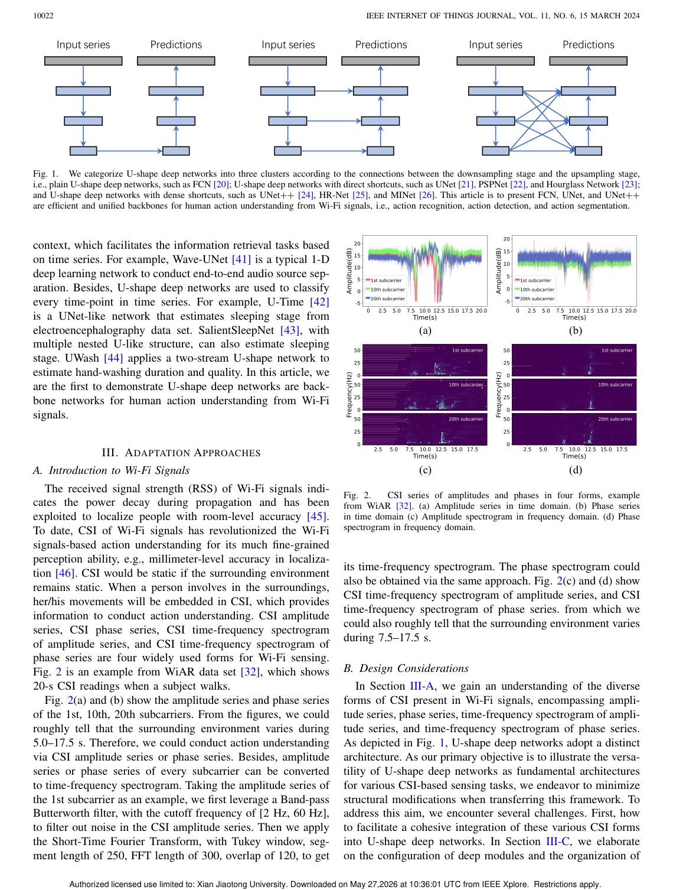
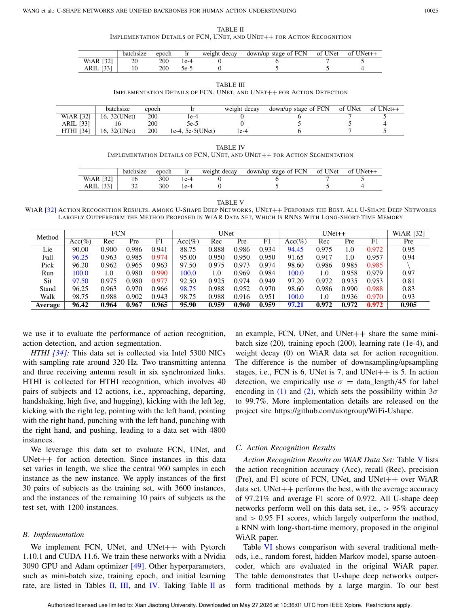
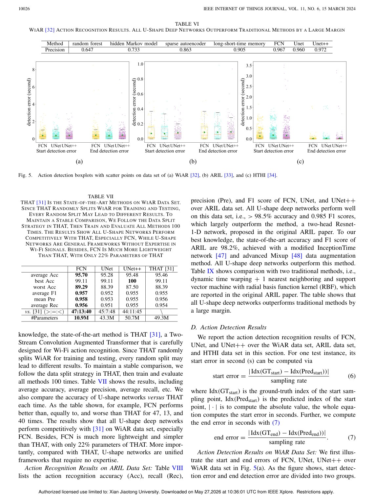

# Overview

Wi-Fi sensing papers often rely on domain-specific signal processing expertise and custom model designs. While this can improve performance, it also makes methods harder to scale, compare, and reuse. This paper asks whether a simpler backbone family can support multiple Wi-Fi human action understanding tasks.

The answer is positive: U-shape deep networks such as FCN, U-Net, and U-Net++ can act as unified backbones for action recognition, action detection, and action segmentation from Wi-Fi signals.

## Motivation

Computer vision advanced partly because reusable backbone networks made model design more systematic. Wi-Fi sensing has not had the same level of architectural standardization. A unified backbone can reduce manual feature engineering and make task-specific heads easier to design.

## Main Contributions

- Studies U-shape networks as general-purpose backbones for Wi-Fi human action understanding.
- Covers three task types: action recognition, action detection, and action segmentation.
- Compares FCN, U-Net, and U-Net++ on public Wi-Fi sensing datasets.
- Shows competitive or superior results compared with original papers and state-of-the-art approaches.
- Reports results above 97 percent recognition accuracy, below 0.5 s detection error, and above 90 percent segmentation accuracy in the evaluated settings.

## Method Design

The networks treat Wi-Fi CSI time series as dense temporal signals. Encoder-decoder paths learn hierarchical representations, while skip connections preserve temporal resolution. This is well aligned with action detection and segmentation, where sample-level or interval-level timing matters. The paper also discusses label encoding, prediction heads, and loss functions for different tasks.

## Evaluation Highlights

The evaluation uses three public datasets covering Wi-Fi activity recognition, action recognition and indoor localization, and human-to-human interaction. The results show that even without heavy signal-specific handcrafted features, U-shape networks can perform strongly across tasks.

## Takeaways

The paper is important because it emphasizes reusable architecture over bespoke expertise. It suggests that Wi-Fi sensing can benefit from backbone thinking, making future systems easier to reproduce and extend.

## Paper Screenshots: Method, Principle, And Results

The screenshots below are cropped from the paper PDF and are placed next to the reading notes so the page shows the actual method diagrams, principle illustrations, and result evidence rather than only prose.

<figure class="markdown-figure">
  
  <figcaption>U-shape backbone families for Wi-Fi action understanding. The figure groups FCN, U-Net, and U-Net++ by skip-connection structure.</figcaption>
</figure>

<figure class="markdown-figure">
  
  <figcaption>Implementation details for recognition, detection, and segmentation. These tables show how the same backbone idea is adapted to multiple Wi-Fi tasks.</figcaption>
</figure>

<figure class="markdown-figure">
  
  <figcaption>Recognition results on public Wi-Fi datasets. The page shows that simple U-shape networks can outperform or match task-specific designs.</figcaption>
</figure>

## Resources

- [Official paper / publisher page](https://doi.org/10.1109/jiot.2023.3324791)
- [Cover image](./assets/cover.svg)

## Citation

```bibtex
@inproceedings{u-shape-networks-are-unified-backbones-for-human-action-understanding-from-wi-fi-signals,
  title = {U-shape Deep Networks are Unified Backbones for Human Action Understanding from Wi-Fi Signals},
  author = {Fei Wang and Yiao Gao and Bo Lan and Han Ding and Jingang Shi# and Jinsong Han#},
  booktitle = {IEEE Internet of Things Journal, 2023},
  year = {2023}
}
```
