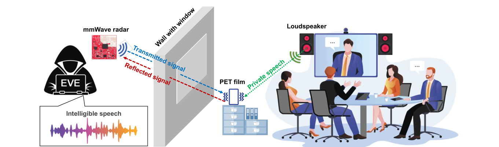
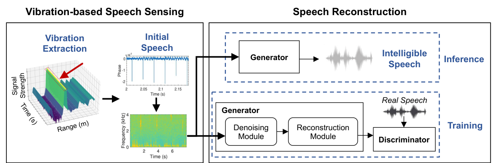
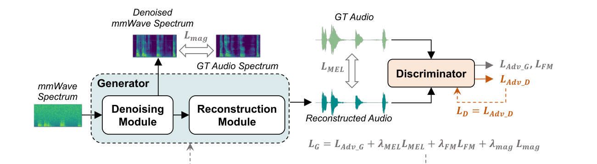
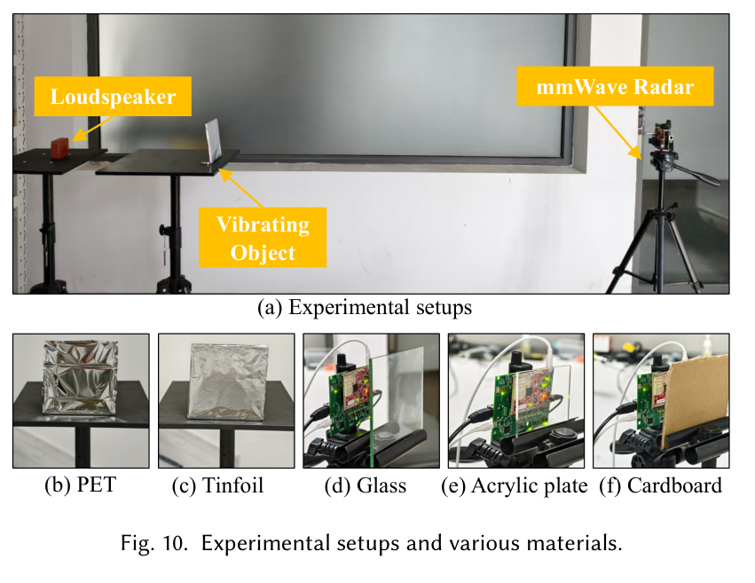
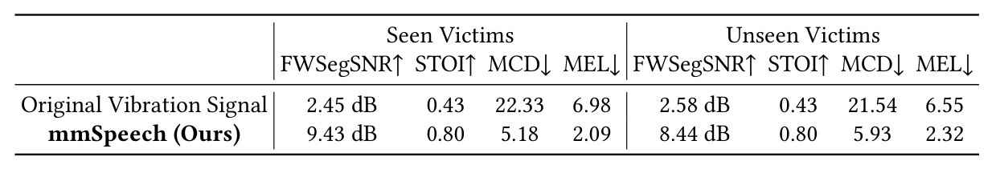
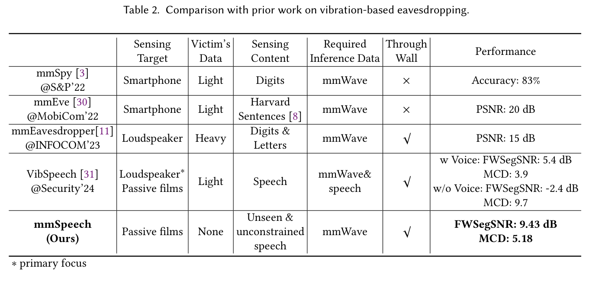
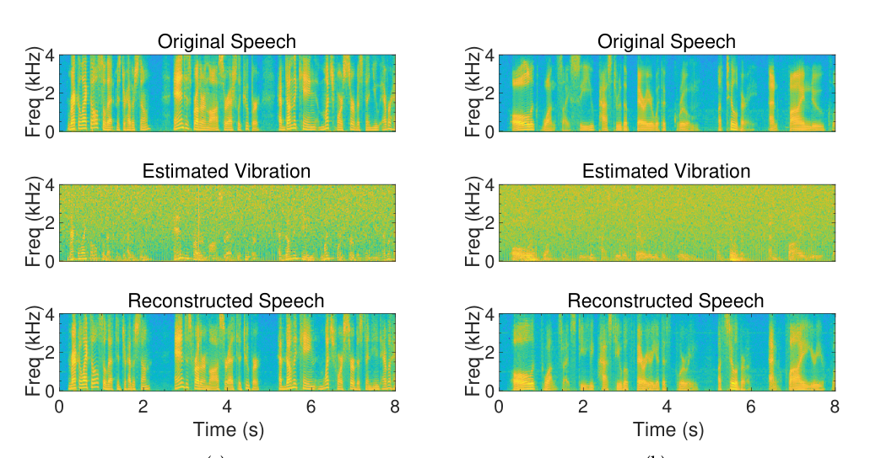
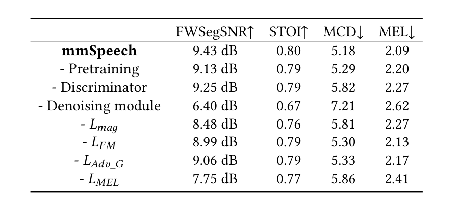

# Overview

Voice-enabled devices and remote meetings make loudspeaker playback common in offices, meeting rooms, and homes. This also introduces a speech privacy risk: acoustic content can induce subtle vibrations in nearby objects. This paper presents **mmSpeech**, an end-to-end mmWave-based system that studies how intelligible speech can be reconstructed from loudspeaker-induced vibration signals.

The work is framed as a privacy and security analysis. Compared with microphone, optical, or contact-sensor based eavesdropping, mmWave sensing can capture micro-vibrations without direct contact and can operate through certain non-metallic barriers. mmSpeech further removes the need for prior recordings of the target speaker, making the threat model more general than earlier mmWave speech-recovery systems.

> mmSpeech shows that mmWave-estimated vibration signals can be converted into intelligible speech, even under through-wall settings and unseen-speaker conditions.

<figure class="markdown-figure">
  
  <figcaption>Figure 1 from the paper. A portable mmWave radar captures loudspeaker-induced vibrations from a passive film and reconstructs private speech, including through-wall scenarios.</figcaption>
</figure>

## Main Contributions

- Introduces **mmSpeech**, an end-to-end mmWave speech reconstruction pipeline based on playback-induced vibrations.
- Studies sensing design choices such as vibrating materials, radar sampling rate, sensing distance, angle, and blockage materials.
- Designs a DNN pipeline that reconstructs speech from noisy mmWave spectrograms, combining denoising, reconstruction, and adversarial refinement.
- Uses synthetic mmWave-like vibration data and selective ASR encoder fine-tuning to improve downstream speech understanding.
- Demonstrates strong reconstruction quality on seen and unseen speakers, with reported seen-victim metrics of **FWSegSNR 9.43 dB**, **STOI 0.80**, **MCD 5.18**, and **MEL 2.09**.

## Threat Model and System Overview

The paper considers a setting where people are speaking through a loudspeaker in a room, such as an online meeting. A passive vibrating material is near the loudspeaker, and a portable mmWave radar captures the sound-induced vibrations either from inside the room or through a barrier such as glass. The attacker is assumed to have no prior knowledge of the speaker's identity, speech characteristics, or utterance content.

mmSpeech has two main stages:

- **mmWave-based vibration sensing** extracts vibration signals and produces an initial speech estimate from radar measurements.
- **DNN-based speech reconstruction** denoises the initial estimate, restores missing frequency components, and generates more intelligible speech.

<figure class="markdown-figure">
  
  <figcaption>Figure 2 from the paper. mmSpeech combines mmWave-based vibration sensing with DNN-based speech reconstruction.</figcaption>
</figure>

## Speech Reconstruction Model

The reconstruction model is GAN-inspired. The generator first suppresses noise in the mmWave spectrogram, then reconstructs a speech waveform from the denoised representation. A discriminator provides perceptual feedback so the generated speech becomes more natural and intelligible.

The model uses a **Spectrum Denoising module** and a **Speech Reconstruction module**. The denoising component includes TS-ConvFlash blocks to model temporal and frequency dependencies efficiently. To compensate for limited real mmWave speech data, the paper also synthesizes mmWave-like signals by mixing clean speech with purple and Gaussian noise, then fine-tunes on real measurements.

<figure class="markdown-figure">
  
  <figcaption>Figure 6 from the paper. The DNN reconstructs speech from mmWave spectrograms with denoising, reconstruction, and adversarial learning losses.</figcaption>
</figure>

## Experimental Setup and Dataset

The implementation uses a commercial **TI IWR6843ISK mmWave radar** with **DCA1000EVM**. The radar operates with a `1T4R` configuration, `4 GHz` bandwidth, and an `8000 Hz` vibration sampling rate. The default sensing setup places the passive film about `0.5 m` from the loudspeaker and about `1.5 m` from the radar.

The dataset includes `2,400` collected speech clips from LibriSpeech playback, covering `47` speakers with different genders, ages, and accents. The paper constructs three datasets: a synthetic pretraining set from LibriSpeech, a seen-victim set, and an unseen-victim set for evaluating generalization to speakers not used during training.

<figure class="markdown-figure">
  
  <figcaption>Figure 10 from the paper. Experimental setup and tested materials, including PET, tinfoil, glass, acrylic plate, and cardboard.</figcaption>
</figure>

## Evaluation Highlights

mmSpeech substantially improves reconstructed speech quality over the raw vibration signal. On the seen-victim dataset, it improves FWSegSNR from `2.45 dB` to `9.43 dB` and reduces MCD from `22.33` to `5.18`. On unseen victims, it still achieves `8.44 dB` FWSegSNR, `0.80` STOI, `5.93` MCD, and `2.32` MEL.

<figure class="markdown-figure">
  
  <figcaption>Table 1 from the paper. Overall reconstruction quality on seen and unseen victims.</figcaption>
</figure>

The comparison table emphasizes the difference from prior vibration-based eavesdropping systems. Earlier systems either focus on digits/letters, require victim speech data, or do not support the same through-wall and unconstrained-speech setting. mmSpeech works with mmWave-only inference data and no victim voice prior.

<figure class="markdown-figure">
  
  <figcaption>Table 2 from the paper. mmSpeech is compared with mmSpy, mmEve, mmEavesdropper, and VibSpeech.</figcaption>
</figure>

<figure class="markdown-figure">
  
  <figcaption>Figure 11 from the paper. Spectrogram examples show original speech, mmWave-estimated vibration, and reconstructed speech.</figcaption>
</figure>

## Ablation and Limitations

The ablation study shows that the denoising module is especially important: removing it drops FWSegSNR from `9.43 dB` to `6.40 dB` and increases MCD from `5.18` to `7.21`. Pretraining, discriminator feedback, and the spectral losses also contribute to final quality.

The paper also notes several practical limits. Performance depends on the relative position between radar and vibrating material; reliable recovery is reported within about `4.5 m` and below roughly `45°`. Through-wall performance also depends on wall material and thickness, so heavier or more absorptive barriers can reduce effectiveness.

<figure class="markdown-figure">
  
  <figcaption>Table 7 from the paper. Ablation results for pretraining, discriminator, denoising module, and loss terms.</figcaption>
</figure>

## Resources

- [ACM DOI](https://doi.org/10.1145/3770708)
- [ACM Official Page](https://dl.acm.org/doi/10.1145/3770708)
- [Threat scenario figure](./assets/figure-1-threat-scenario.png)
- [System overview figure](./assets/figure-2-system-overview.png)
- [Overall performance table](./assets/table-1-overall-performance.png)

## Citation

```bibtex
@article{han2025mmspeech,
  title = {We Can Hear You with mmWave Radar! An End-to-End Eavesdropping System},
  author = {Han, Dachao and Huang, Teng and Ding, Han and Zhao, Cui and Wang, Fei and Wang, Ge and Xi, Wei},
  journal = {Proceedings of the ACM on Interactive, Mobile, Wearable and Ubiquitous Technologies},
  volume = {9},
  number = {4},
  article = {179},
  year = {2025},
  doi = {10.1145/3770708}
}
```
