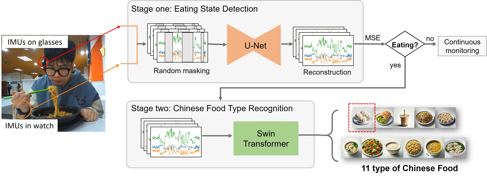
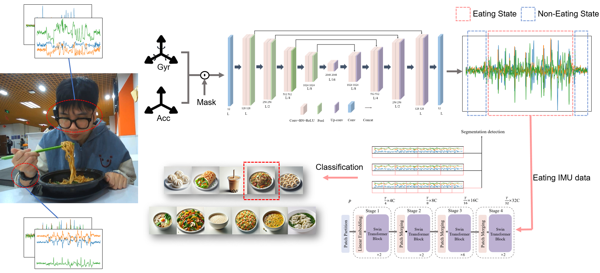
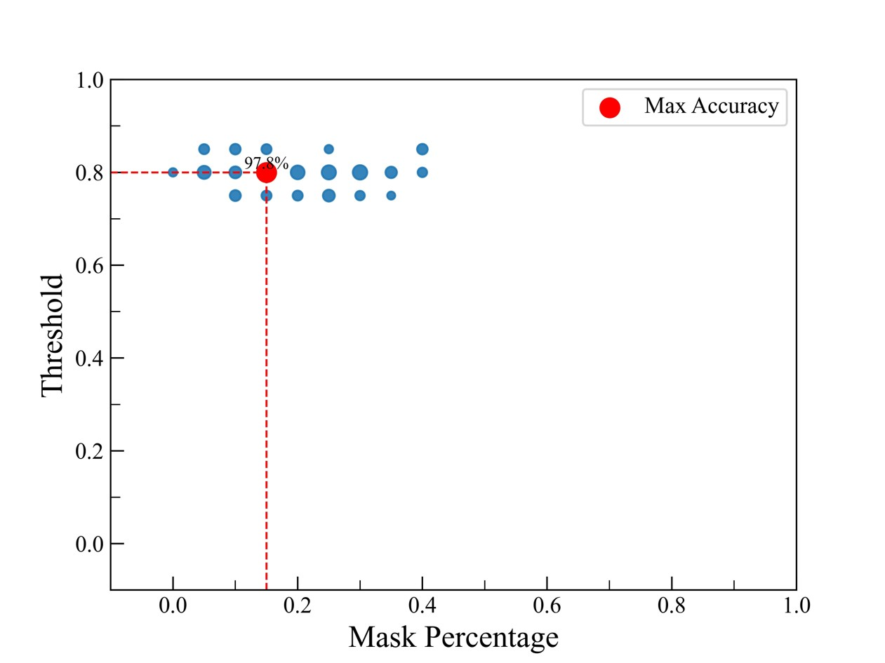
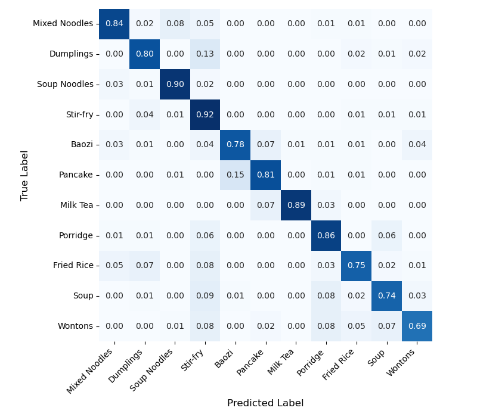

# Overview

Diet monitoring is useful for health management, but self-reporting is burdensome and camera-based food logging raises privacy concerns. **CuisineSense** takes a wearable sensing route: it uses IMUs in a smartwatch and smart glasses to infer whether a person is eating and, if so, which Chinese food category is being consumed.

The paper focuses on a practical gap in prior wearable food-intake systems. Many earlier datasets and classifiers cover a small set of Western foods, while Chinese cuisine involves diverse utensils, textures, and eating motions. CuisineSense addresses this with a two-stage pipeline that first filters non-eating activity, then performs fine-grained food classification.

<figure class="markdown-figure">
  
  <figcaption>CuisineSense pipeline. Smartwatch IMUs capture hand and utensil motion, smart-glasses IMUs capture head and jaw dynamics, and the two-stage model turns those signals into eating-state and food-category predictions.</figcaption>
</figure>

## Main Contributions

- Proposes a wearable Chinese cuisine intake recognition system using smartwatch and smart-glasses IMU signals.
- Uses a two-stage hierarchy: eating-state detection first, followed by 11-class Chinese food type recognition.
- Frames the first stage as reconstruction-based anomaly detection, reducing dependence on exhaustive non-eating activity collection.
- Builds a 27.5-hour dataset from 10 participants across 11 Chinese food categories and three utensil styles.
- Reports strong performance with lightweight 1D backbones: U-Net for eating detection and Swin Transformer for food classification.

## Method

CuisineSense combines complementary motion cues. The smartwatch records hand movements such as chopstick, spoon, and hand-to-mouth motions at 50 Hz. The smart glasses record head and chewing-related motion at 10 Hz. Each sample contains synchronized six-axis IMU streams from both devices.

The first module, M1, detects eating states. Instead of treating the problem as ordinary binary classification, it trains a 1D U-Net to reconstruct masked eating-motion sequences. At inference time, low reconstruction error indicates an eating event, while high reconstruction error flags likely non-eating behavior. This is useful because non-eating actions are broad and difficult to enumerate completely.

The second module, M2, classifies the food type after an eating segment is detected. It uses a 1D Swin Transformer to model local and long-range temporal dependencies in the IMU sequence and outputs probabilities over 11 Chinese food categories.

<figure class="markdown-figure">
  
  <figcaption>System overview. The method separates robust intake segmentation from fine-grained food recognition, which helps avoid forcing daily non-eating activities into food labels.</figcaption>
</figure>

## Dataset

The dataset contains **27.5 hours** of IMU recordings from **10 volunteers**. Participants wore a Samsung Gear Sport smartwatch on the dominant hand and smart glasses with an IMU. The food set covers **11 Chinese food categories**: mixed noodles, dumplings, noodle soup, stir-fry, baozi, pancake, milk tea, congee, fried rice, soup, and wontons.

The study covers three utensil patterns: chopsticks, spoon, and hand. Each participant contributed about 15 minutes per food category. The paper segments the streams into **10.24-second windows**, using a **2.56-second sliding window** with 50% overlap. After segmentation, the dataset includes **16,625 eating** and **22,013 non-eating** sequences.

## Results

CuisineSense reports **97.94%** accuracy for eating-state detection with the U-Net reconstruction model. A standard autoencoder baseline reaches **83.39%**, showing the benefit of the masked U-Net reconstruction design for filtering non-eating activities.

<figure class="markdown-figure">
  
  <figcaption>Eating-state detection search. The best reported setting uses a 0.15 mask ratio and an 80th-percentile reconstruction-error threshold.</figcaption>
</figure>

For food type recognition, U-Net plus Swin Transformer reaches **88.44%** accuracy, outperforming the U-Net plus ResNet variant at **80.31%**. The reported inference time is **2.16 plus/minus 0.02 ms** for each 10.24-second window, supporting real-time use.

| Module / Setting | Accuracy |
| --- | ---: |
| Eating detection, autoencoder baseline | 83.39% |
| Eating detection, U-Net reconstruction | 97.94% |
| Food recognition, U-Net + ResNet | 80.31% |
| Food recognition, U-Net + Swin Transformer | 88.44% |

<figure class="markdown-figure">
  
  <figcaption>Food recognition confusion matrix. Stir-fry and soup noodles are among the strongest classes, while wontons are more often confused with spoon-based foods such as congee, fried rice, and soup.</figcaption>
</figure>

## Ablation

The two-stage design is important. When the first-stage eating detector is removed and the food classifier's confidence threshold is used to distinguish eating from non-eating activity, the best reported accuracy across thresholds is only **52.43%**. This drop shows that a dedicated intake-state detector is necessary before fine-grained food classification.

| Confidence Threshold | 0.1 | 0.2 | 0.3 | 0.4 | 0.5 | 0.6 | 0.7 | 0.8 | 0.9 |
| --- | ---: | ---: | ---: | ---: | ---: | ---: | ---: | ---: | ---: |
| Accuracy without M1 | 45.88 | 45.88 | 45.88 | 46.07 | 45.54 | 47.76 | 49.29 | 50.61 | 52.43 |

## Takeaways

CuisineSense is a clean example of privacy-preserving dietary sensing: it avoids cameras, keeps the sensing hardware realistic, and separates broad intake detection from fine-grained cuisine classification. The strongest lesson is architectural rather than heavyweight: a simple hierarchy can make wearable food logging more reliable when non-eating activities would otherwise create many false positives.

## Resources

- [arXiv paper](https://arxiv.org/abs/2511.05292)
- [Code](https://github.com/joeeeeyin/CuisineSense)
- [Framework figure](./assets/paper-framework.jpg)
- [System overview](./assets/paper-system.png)
- [Confusion matrix](./assets/paper-confusion-matrix.png)

## Citation

```bibtex
@article{yin2025cuisinesense,
  title = {What's on Your Plate? Inferring Chinese Cuisine Intake from Wearable IMUs},
  author = {Yin, Jiaxi and Wang, Pengcheng and Ding, Han and Wang, Fei},
  journal = {arXiv preprint arXiv:2511.05292},
  year = {2025}
}
```
