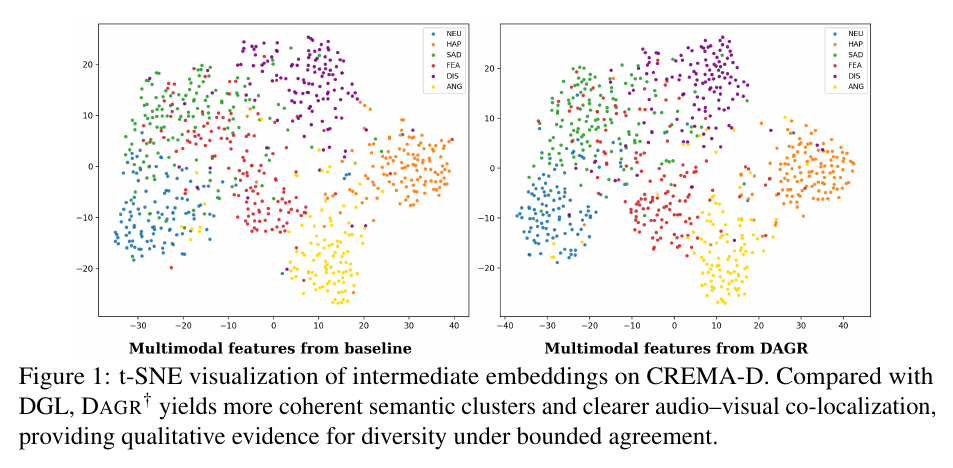
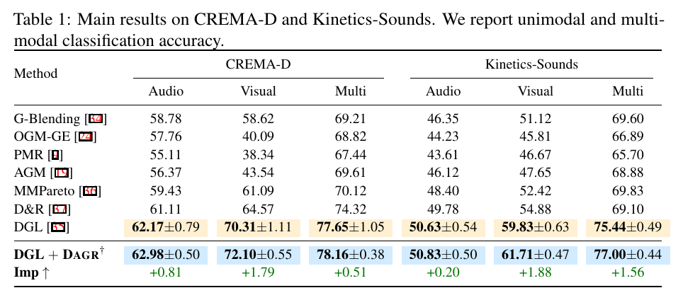
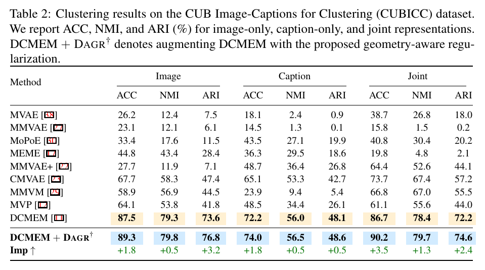
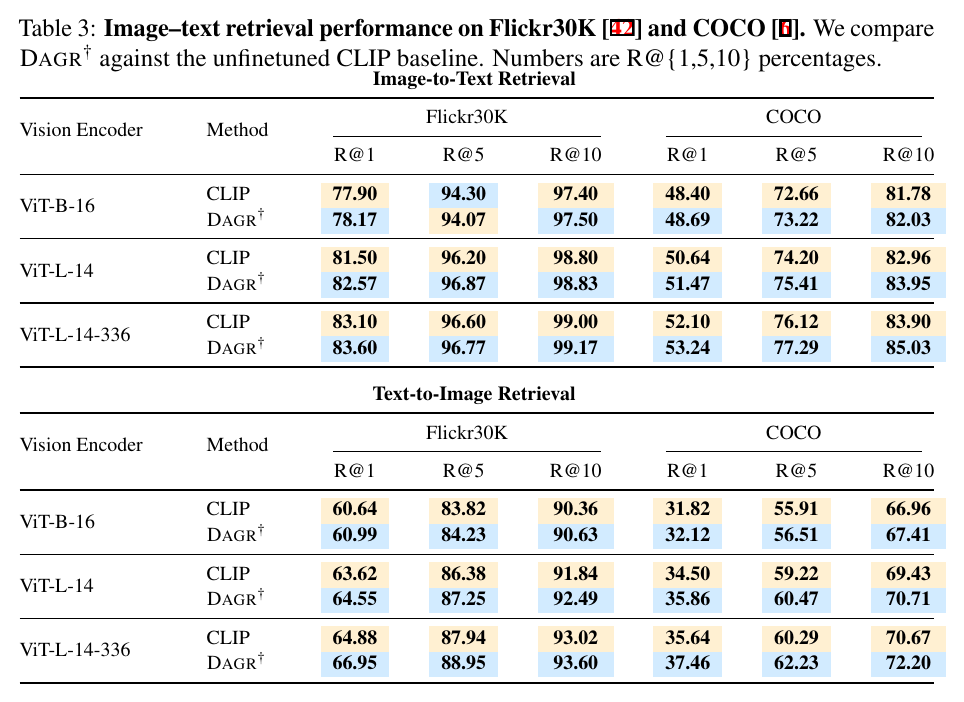
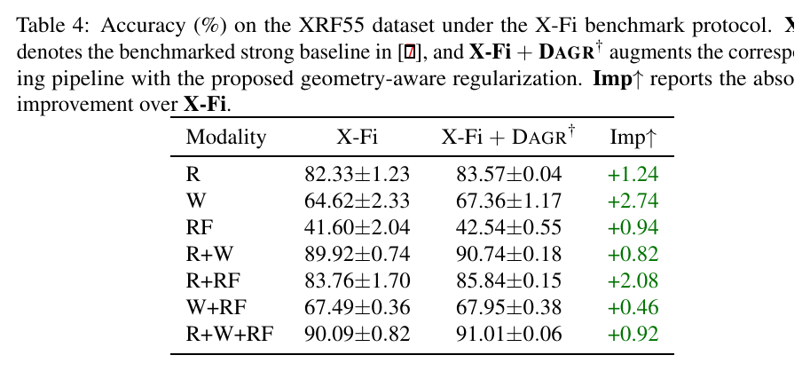
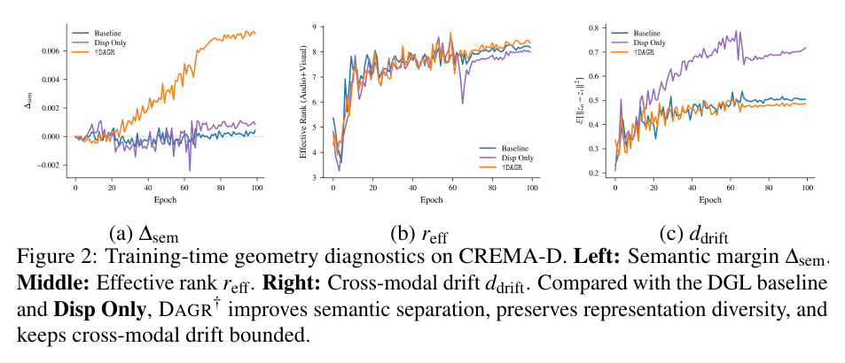
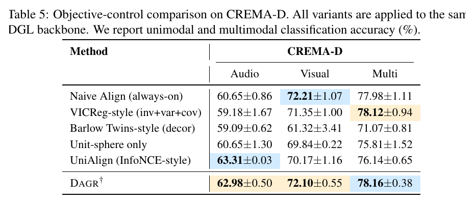
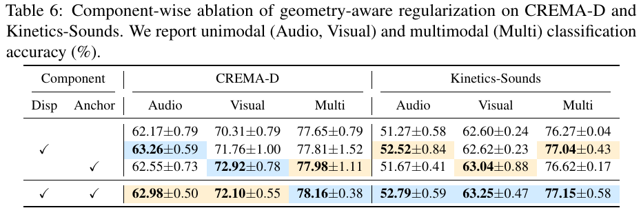

# Overview

Multimodal fusion is often optimized by balancing gradients across modalities. This paper argues that balanced gradients are not enough: even when the task loss is well optimized, the intermediate representation geometry can still be underdetermined. Embeddings may collapse within a modality, or paired samples from different modalities may drift too far apart.

**DAGR** introduces a training-time geometric regularizer for multimodal learning. It encourages each modality to maintain its own representation diversity while keeping paired cross-modal samples inside a bounded agreement band. The attached arXiv v3 PDF uses the title *Diverse via bounded Agreement: Geometric Regularization for Multimodal Fusion*; this page keeps the title used in the site publication list.

> Core idea: make multimodal representation geometry explicit - diverse within each modality, but bounded across paired modalities.

<figure class="markdown-figure">
  
  <figcaption>Figure 1 from the paper. DAGR produces more coherent semantic clusters and clearer audio-visual co-localization on CREMA-D.</figcaption>
</figure>

## Main Contributions

- Identifies **geometry underdetermination** as a failure mode in supervised multimodal fusion.
- Characterizes two representation-level issues: **intra-modal collapse** and **sample-level cross-modal drift**.
- Proposes **DAGR**, a lightweight objective that combines modality-wise dispersion and agreement-band anchoring.
- Demonstrates consistent improvements across audio-visual recognition, image-text clustering and retrieval, and RF-based multimodal perception.
- Keeps deployment simple: DAGR adds no trainable inference module and no inference-time latency.

## Method at a Glance

DAGR is applied to normalized intermediate embeddings during training and removed at inference. It contains two complementary terms:

- **Dispersion** spreads embeddings within each modality, reducing low-rank collapse and increasing effective representation diversity.
- **Agreement-band anchoring** penalizes paired cross-modal embeddings only when their distance exceeds a tolerance radius, avoiding rigid always-on alignment.

This design differs from methods that simply force all modalities to align. DAGR keeps modality-specific information useful while preventing paired observations from becoming geometrically inconsistent.

## Quantitative Results

The paper evaluates DAGR on six benchmarks: CREMA-D, Kinetics-Sounds, CUB Image-Captions for Clustering, Flickr30K, COCO, and XRF55. The following figures and tables are cropped directly from the PDF.

<figure class="markdown-figure">
  
  <figcaption>Table 1. On CREMA-D and Kinetics-Sounds, adding DAGR to DGL improves multimodal accuracy and strengthens most unimodal branches.</figcaption>
</figure>

For image-text clustering, DAGR improves the joint CUBICC clustering score while also improving image-only and caption-only representations. This suggests that the regularizer improves semantic organization, not only the final fused output.

<figure class="markdown-figure">
  
  <figcaption>Table 2. DAGR improves CUBICC clustering metrics over DCMEM across image-only, caption-only, and joint representations.</figcaption>
</figure>

For CLIP-based retrieval, DAGR produces consistent gains across Flickr30K and COCO on ViT-B/16, ViT-L/14, and ViT-L/14-336 backbones.

<figure class="markdown-figure">
  
  <figcaption>Table 3. DAGR improves most image-to-text and text-to-image Recall@1/5/10 metrics on Flickr30K and COCO.</figcaption>
</figure>

The XRF55 experiment connects this paper to RF-based human perception. Under the X-Fi benchmark protocol, DAGR improves every evaluated modality setting, including radar-only and multimodal fusion inputs.

<figure class="markdown-figure">
  
  <figcaption>Table 4. On XRF55, DAGR improves RGB, Wi-Fi, RF, and multimodal combinations under the X-Fi protocol.</figcaption>
</figure>

## Geometry Diagnostics and Ablations

The paper also checks whether the gains come from the intended geometry rather than from generic normalization or alignment. On CREMA-D, DAGR improves semantic margin, preserves effective rank, and keeps cross-modal drift bounded.

<figure class="markdown-figure">
  
  <figcaption>Figure 2. Geometry diagnostics show the role of DAGR in improving semantic separation while avoiding excessive cross-modal drift.</figcaption>
</figure>

DAGR is compared with objective controls including always-on alignment, VICReg-style regularization, Barlow Twins-style decorrelation, unit-sphere normalization, and UniAlign-style contrastive alignment.

<figure class="markdown-figure">
  
  <figcaption>Table 5. Bounded agreement is not reproduced by normalization, rigid alignment, or generic invariance objectives alone.</figcaption>
</figure>

The component ablation confirms that dispersion and anchoring play complementary roles. Dispersion alone improves representation diversity, while anchoring controls the cross-modal drift that pure dispersion can increase.

<figure class="markdown-figure">
  
  <figcaption>Table 6. The full DAGR objective gives the strongest multimodal performance when dispersion and agreement-band anchoring are used together.</figcaption>
</figure>

## Takeaways

- Gradient-level balancing does not fully determine representation geometry.
- DAGR makes geometry an explicit training objective for multimodal learning.
- The method is plug-and-play and incurs no inference-time cost.
- The same bounded-agreement principle transfers across audio-visual, image-text, and RF-based wireless sensing benchmarks.

## Resources

- [arXiv paper](https://arxiv.org/abs/2601.21670)
- [Figure 1: t-SNE visualization](./assets/figure-1-tsne-cremad.png)
- [Table 1: audio-visual classification](./assets/table-1-audio-visual-results.png)
- [Table 2: CUBICC clustering](./assets/table-2-cubicc-clustering.png)
- [Table 3: image-text retrieval](./assets/table-3-image-text-retrieval.png)
- [Table 4: XRF55 results](./assets/table-4-xrf55-results.png)
- [Figure 2: geometry diagnostics](./assets/figure-2-geometry-diagnostics.png)
- [Table 5: objective controls](./assets/table-5-objective-controls.png)
- [Table 6: component ablation](./assets/table-6-component-ablation.png)

## Citation

```bibtex
@article{xia2026gradient,
  title = {When Gradient Optimization Is Not Enough: Dispersive and Anchoring Geometric Regularizer for Multimodal Learning},
  author = {Xia, Zixuan and Wang, Hao and Weng, Pengcheng and Qian, Yanyu and Xu, Yangxin and Dan, William and Wang, Fei},
  journal = {arXiv preprint arXiv:2601.21670},
  year = {2026}
}
```
