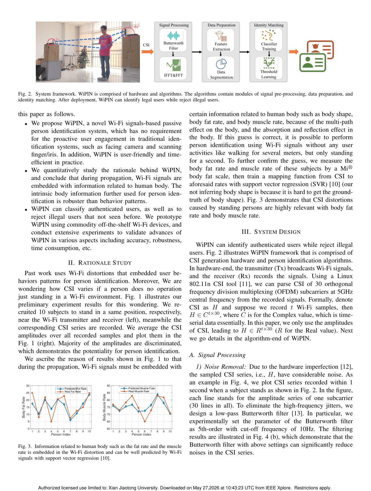
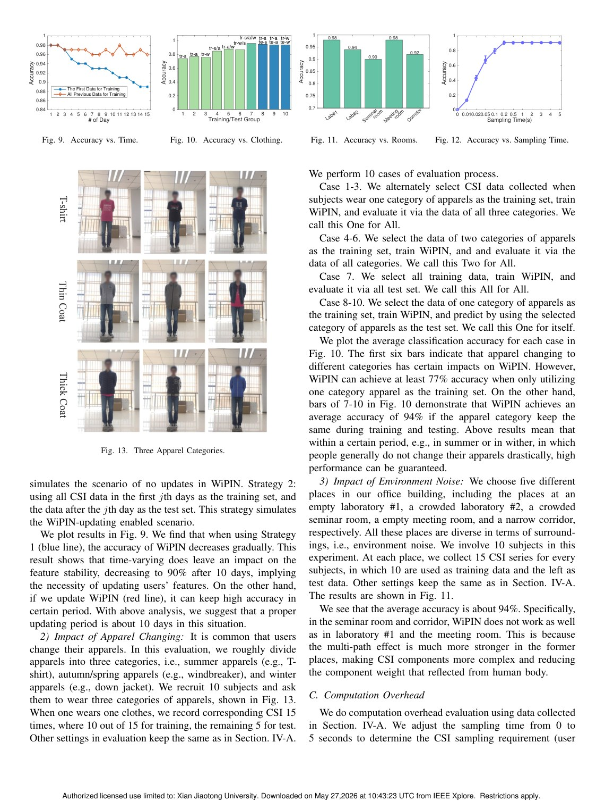
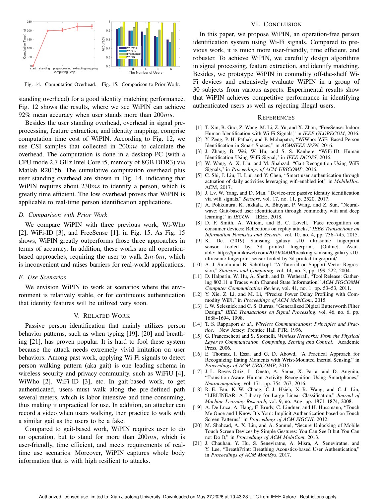

# Overview

Earlier Wi-Fi person identification methods often relied on gait. Users had to walk along a predefined path for several meters so the system could capture walking-induced CSI distortions. This requirement increases time overhead, demands cooperation, and limits real deployment.

WiPIN removes this requirement. It is based on the observation that Wi-Fi signals carry body-related information when propagating through or around a person. Features such as body shape, fat rate, and muscle rate can influence CSI patterns, allowing identity recognition without a prescribed action.

## Main Contributions

- Introduces operation-free passive person identification using commodity Wi-Fi.
- Uses body-induced Wi-Fi distortions rather than gait along predefined paths.
- Designs signal preprocessing, feature extraction, and identity matching algorithms.
- Achieves low identifying time overhead below 300 ms.
- Reports 92 percent identification accuracy over 30 users and robustness across experimental settings.

## System Design

WiPIN first preprocesses CSI measurements to reduce noise and isolate useful signal variation. It then extracts identity-related features from amplitude patterns and performs matching against enrolled users. The design is deliberately lightweight and passive: the person does not need to carry a device or perform a special gesture.

## Evaluation Highlights

The Globecom paper evaluates WiPIN with 30 users and multiple experimental settings. The results show that operation-free identification can be both accurate and fast. The paper also compares with gait-based approaches, emphasizing that WiPIN lowers user burden and broadens possible scenarios.

## Why Only This Version Is Kept

This page keeps the IEEE GLOBECOM version of WiPIN, which is the formal publication and best-paper-award version. The separate arXiv page has been removed from the publications list to avoid duplicate entries for the same core work.

## Takeaways

WiPIN is a milestone in passive Wi-Fi identity sensing. Its central contribution is the shift from action-induced identity cues to body-induced identity cues, making person identification more natural for IoT environments.

## Paper Screenshots: Method, Principle, And Results

The screenshots below are cropped from the paper PDF and are placed next to the reading notes so the page shows the actual method diagrams, principle illustrations, and result evidence rather than only prose.

<figure class="markdown-figure">
  
  <figcaption>WiPIN signal processing, segmentation, feature extraction, and identity matching framework. The screenshot is the core system diagram for operation-free identification.</figcaption>
</figure>

<figure class="markdown-figure">
  
  <figcaption>Robustness across days, training groups, and experimental settings. These plots show whether passive body-induced features remain stable.</figcaption>
</figure>

<figure class="markdown-figure">
  
  <figcaption>Computation overhead and comparison with prior Wi-Fi identification methods. The result page supports the low-latency and low-collaboration claims.</figcaption>
</figure>

## Resources

- [Official paper / publisher page](https://doi.org/10.1109/globecom38437.2019.9014226)
- [Cover image](./assets/cover.svg)

## Citation

```bibtex
@inproceedings{wipin-operation-free-passive-person-identification-using-wi-fi-signals,
  title = {WiPIN: Operation-free Passive Person Identification Using Wi-Fi Signals},
  author = {Fei Wang and Jinsong Han and Feng Lin# and Kui Ren},
  booktitle = {IEEE Globecom 2019 (Best Paper Award)},
  year = {2019}
}
```
